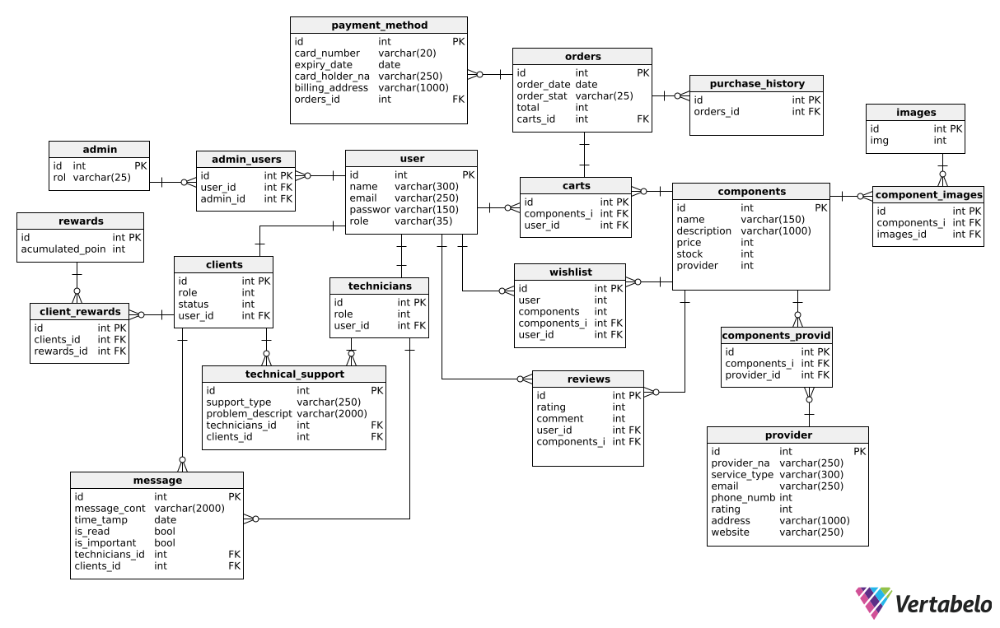

<p align="center">
    
</p>

# Universidad Peruana de Ciencias Aplicadas

### Ingeniería de Software

### Ciclo 2024-02

### APLICACIONES WEB

### Sección: WS51

### **Docente:** Hugo Allan Mori Paiva

#### TP REPORT

### Startup: TechMinds

### Producto: PCMaster

**Grupo 2**

## **Team Members:**

| Alumno | Código |
|:------:|:------:|
| Aranda Vallejos, Oscar Gabriel | U202218167 |
| Cantoral Sedamano, Alexander Alberto | U20181b152 |
| Chirinos Zúñiga, Rodrigo Manuel | U202217804 |
| Soriano Medrano, Diego | U202114793 |

## Setiembre Ciclo 2024-02

<br>

# REGISTRO DE VERSIONES DEL INFORME

| Versión | Fecha      | Autor                                                    | Descripción                                                                                       |
|---------|------------|----------------------------------------------------------|---------------------------------------------------------------------------------------------------|
| 1.0     | 26/08/2024 | - Aranda Vallejos, Oscar Gabriel<br>- Chirinos Zúñiga, Rodrigo Manuel<br>- Alexander Alberto Cantoral Sedamano| - Se redactó la descripción de la startup, los antecedentes y la problemática. Además, se desarrolló el Lean UX Process y se delimitó el segmento objetivo.<br>- Desarrollo del User Journey Mapping y Empathy Mapping.<br> - Adición de las primeras entrevistas de segmentos objetivos.|
| 1.2     | 05/09/2024 |- Aranda Vallejos, Oscar Gabriel<br>- Chirinos Zúñiga, Rodrigo Manuel<br>- Alexander Alberto Cantoral Sedamano<br>-Soriano Medrano, Diego<br>-Tello Murga, Javier Oswaldo | - Desarrollo completo del capítulo 2.<br>- Cumplimiento de lo establecido a llegar con el capítulo 3.<br>- Capítulo 4 establecido y logrado.<br>- Avance del Sprint 1 (Primera versión de la Landing Page). |
| 1.4     | 27/09/2024 | - Aranda Vallejos, Oscar Gabriel<br>- Chirinos Zúñiga, Rodrigo Manuel<br>- Alexander Alberto Cantoral Sedamano<br>-Soriano Medrano, Diego| -Culminación del Sprint 1 (Mejora de la Landing Page) <br>- Avance del Sprint 2 (Primera versión del Frontend Desplegado) | 
| 1.6     | 03/11/2024 |Aranda Vallejos, Oscar Gabriel<br>- Chirinos Zúñiga, Rodrigo Manuel<br>- Alexander Alberto Cantoral Sedamano<br>-Soriano Medrano, Diego  | - Segundo versión del Frontend<br> - Primera versión del Backend |
| 1.8     | xx/11/2024 | Apellido, Nombre | ... |
| 2.0     | xx/11/2024 | Apellido, Nombre | ... |

<br>

***

# CONTENIDO

[REGISTRO DE VERSIONES DEL INFORME](#registro-de-versiones-del-informe)

[PROJECT REPORT COLLABORATION INSIGHTS](#project-report-collaboration-insights)

[STUDENT OUTCOME](#student-outcome)

1. [**Capítulo I: Introducción**](#capítulo-i-introducción) <br>
1.1. [***Startup Profile***](#11-startup-profile) <br>
1.1.1. [Descripción del startup](#111-descripción-del-startup) <br>
1.1.2.[Perfiles de los integrantes del equipo](#112-perfiles-de-los-integrantes-del-equipo) <br>
1.2. [***Solution Profile***](#12-solution-profile) <br>
1.2.1. [Antecedentes y Problemática](#121-antecedentes-y-problemática) <br>
1.2.2. [Lean UX Process](#122-lean-ux-process) <br>
1.2.2.1. [.Lean UX Problem Statements](#1221-lean-ux-problem-statements) <br>
1.2.2.2. [Lean UX Assumptions](#1222-lean-ux-assumptions) <br>
1.2.2.3. [Lean UX Hypothesis Statements](#1223-lean-ux-hypothesis-statements) <br>
1.2.2.4. [1.2.2.4. Lean UX Canvas](#1224-lean-ux-canvas) <br>
1.3. [***1.3. Segmentos objetivo***](#13-segmentos-objetivo) <br> <br>

2. [**2. Capítulo II: Requirements Elicitation & Analysis**](#capítulo-ii-requirements-elicitation-&-analysis) <br>
2.1. [***Competidores***](#21-competidores) <br>
2.1.1. [Análisis competitivo](#211-análisis-competitivo) <br>
2.1.2. [Estrategias y tácticas frente a competidores](#212-estrategias-y-tácticas-frente-a-competidores) <br>
2.2. [***Entrevistas***](#22-entrevistas) <br>
2.2.1. [Diseño de entrevistas](#221-diseño-de-entrevistas) <br>
2.2.2. [Registro de entrevistas](#222-registro-de-entrevistas) <br>
2.2.3. [Análisis de entrevistas](#223-análisis-de-entrevistas) <br>
2.3. [***Needfinding***](#23-needfinding) <br>
2.3.1. [User Personas](#231-user-personas) <br>
2.3.2. [User Task Matrix](#232-user-task-matrix) <br>
2.3.3. [User Journey Mapping](#233-user-journey-mapping) <br>
2.3.4. [Empathy Mapping](#234-empathy-mapping) <br>
2.3.5. [As-is Scenario Mapping](#235-as-is-scenario-mapping) <br>
2.4. [***Ubiquitous Language***](#24-ubiquitous-Language) <br>

3. [**Capítulo III: Requirements Specification**](#capítulo-iii-requirements-specification) <br>
3.1. [***To-Be Scenario Mapping***](#31-to-be-scenario-mapping) <br>
3.2. [***User Stories***](#32-user-stories) <br>
3.3. [***Impact Mapping***](#33-impact-mapping) <br>
3.4. [***Product Backlog***](#34-product-backlog) <br> <br>

4. [**Capítulo IV: Product Design**](#capítulo-iv-product-design) <br>
4.1. [***Style Guidelines***](#41-style-guidelines) <br>
4.1.1. [General Style Guidelines](#411-general-style-guidelines) <br>
4.1.2. [Web Style Guidelines](#412-web-style-guidelines) <br>
4.2. [***Information Architecture***](#42-information-architecture) <br>
4.2.1. [Organization Systems](#421-organization-systems) <br>
4.2.2. [Labeling Systems](#422-labeling-systems) <br>
4.2.3. [SEO Tags and Meta Tags](#423-seo-tags-and-meta-tags) <br>
4.2.4. [Searching Systems](#424-searching-systems) <br>
4.2.5. [Navigation Systems](#425-navigation-systems) <br>
4.3. [***Landing Page UI Design***](#43-landing-page-ui-design) <br>
4.3.1. [Landing Page Wireframe](#431-landing-page-wireframe) <br>
4.3.2. [Landing Page Mock-up](#432-landing-page-mock-up) <br>
4.4. [***Web Applications UX/UI Design***](#44-web-applications-uxui-design) <br>
4.4.1. [Web Applications Wireframes](#441-web-applications-wireframes) <br>
4.4.2. [Web Applications Wireflow Diagrams](#442-web-applications-wireflow-diagrams) <br>
4.4.3. [Web Applications Mock-ups](#443-web-applications-mock-ups) <br>
4.4.4. [Web Applications User Flow Diagrams](#444-web-applications-user-flow-diagrams) <br>
4.5. [***Web Applications Prototyping***](#45-web-applications-prototyping) <br>
4.6. [***Domain-Driven Software Architecture***](#46-domain-driven-software-architecture) <br>
4.6.1. [Software Architecture Context Diagram](#461-software-architecture-context-diagram) <br>
4.6.2. [Software Architecture Container Diagrams](#462-software-architecture-container-diagrams) <br>
4.6.3. [Software Architecture Components Diagrams](#463-software-architecture-components-diagrams) <br>
4.7. [***Software Object-Oriented Design***](#47-software-object-oriented-design) <br>
4.7.1. [Class Diagrams](#471-class-diagrams) <br>
4.7.2. [Class Dictionary](#472-class-dictionary) <br>
4.8. [***Database Design***](#48-database-design) <br>
4.8.1. [Database Diagram](#481-database-diagram) <br> <br>

5. [**Capítulo V: Product Implementation, Validation & Deployment**](#capítulo-v-product-implementation-validation-&-deployment) <br>
5.1. [***Software Configuration Management***](#51-software-configuration-management) <br>
5.1.1. [Software Development Environment Configuration](#511-software-development-environment-configuration) <br>
5.1.2. [Source Code Management](#512-source-code-management) <br>
5.1.3. [Source Code Style Guide & Conventions](#513-source-code-style-guide-&-conventions) <br>
5.1.4. [Software Deployment Configuration](#514-software-deployment-configuration) <br>
5.2. [***Landing Page, Services & Applications Implementation***](#52-landing-page-services-&-applications-implementation) <br>
5.2.1. [Sprint 1](#521-sprint-1) <br>
5.2.1.1. [Sprint Planning 1](#5211-sprint-planning-1) <br>
5.2.1.2. [Sprint Backlog 1](#5212-sprint-backlog-1) <br>
5.2.1.3. [Development Evidence for Sprint Review](#5213-development-evidence-for-sprint-review) <br>
5.2.1.4. [Testing Suite Evidence for Sprint Review](#5214-testing-suite-evidence-for-sprint-review) <br>
5.2.1.5. [Execution Evidence for Sprint Review](#5215-execution-evidence-for-sprint-review) <br>
5.2.1.6. [Services Documentation Evidence for Sprint Review](#5216-services-documentation-evidence-for-sprint-review) <br>
5.2.1.7. [Software Deployment Evidence for Sprint Review](#5217-software-deployment-evidence-for-sprint-review) <br>
5.2.1.8. [Team Collaboration Insights during Sprint](#5218-team-collaboration-insights-during-sprint) <br>
5.3. [***Validation Interviews***](#53-validation-interviews) <br>
5.3.1.[Diseño de Entrevistas](#531-diseño-de-entrevistas) <br>
5.3.2.[Registro de Entrevistas](#532-registro-de-entrevistas) <br>
5.3.3.[Evaluaciones según Heurísticas](#533-evaluaciones-según-heurísticas) <br>
5.4. [***Video About-the-Product***](#54-video-about-the-product) <br>
6. [**Conclusiones**](#conclusiones) <br>
7. [**Bibliografía**](#bibliografía) <br>
8. [**Anexos**](#anexos)

<br>

# PROJECT REPORT COLLABORATION INSIGHTS

#### 1. URL del Repositorio en GitHub

| Repositorio del Informe en GitHub |
|-----------------------------------|
| https://github.com/orgs/SI730-WS51-PC-MASTER/repositories |

<br>

#### 2. Actividades de Elaboración del Informe

| Actividad                           | Descripción                                                                                          |
|-------------------------------------|------------------------------------------------------------------------------------------------------|
| Entrevistas            | Para está actividad se pidió a cada miembro que busque entre conocidos a personas que su perfil se asemeje al de los segmentos objetivos para poder conseguir entrevistas necesarias para el capítulo 2.              |
| Needfinding           | Para está sección del informe se dispuso de un tiempo para debatir y establecer el enfoque que tendríamos que darle a la aplicación para poder satisfacer nuestros segmentos objetivos encontrados en las entrevistas.           |
| Requirements Specification           | Para el capitulo 3 se discutió las historias de usuarioa a desarrollar para los 4 sprints, que enfoque tendría la aplicación en base a como monetizarla y como esta interactuaría con el usuario final en el front.              |
|  Product Design            | Se discutío el estilo de la Landing Page, colores de la misma y como sería, de forma básica, la aplicación web usando figma como "borrador". |
| Product Implementation, Validation & Deployment-Sprint 1            | Para esta sección se dispuso de repartir responsabilidades referentes a este sprint, al ser el más rápido a desarrollar, se planteó que cada uno tenía un rol menor en la LP para que todas puedan colaborar su grano de arena al ser algo que ya todos dominamos.             |


#### 2. Actividades de Elaboración del Informe

| Actividad                           | Descripción                                                                                          |
|-------------------------------------|------------------------------------------------------------------------------------------------------|
| Comunicación de avances            | Se realizaron reuniones virtuales donde se comentaban los avances de cada integrante del equipo para garantizar un trabajo sincronizado y tener conocimiento de cada modificación.                                |
| Delegación de responsabilidades    | Se organizaron pequeñas reuniones para la delegación de tareas y se enfatizó la importancia de revisar cuidadosamente el enunciado del proyecto para evitar irregularidades futuras.                              |
| Revisión de ortografía             | Se mantuvo un control exhaustivo de la redacción del informe y se enfatizó la importancia de revisar en todo momento las nomenclaturas utilizadas, respetando las convenciones y el uso de buenas prácticas.                                                        |
| Recopilación de datos              | Se obtuvieron datos mediante entrevistas y referencias bibliográficas, los cuales se utilizaron para sustentar los argumentos expuestos en el informe.                                                          |
| Desarrollo del informe              | Se completaron las diferentes secciones del informe, empleando las herramientas y metodologías apropiadas de acuerdo a las indicaciones del proyecto.                                                         |

<br>

#### 3. Capturas de Imagen de los Analíticos de Colaboración y Commits en GitHub

| Métrica                         | Descripción                                                                                          |
|---------------------------------|------------------------------------------------------------------------------------------------------|
| Número de commits por autor     |  |
| Historial de cambios            | |
| Historial de cambios            | [](https://postimg.cc/zby5YxTP)<br> [](https://postimg.cc/8F6Qy7Gq)<br>[](https://postimg.cc/rK0JRx9X)|
| Distribución de trabajo         | [](https://postimg.cc/crtN4t2c)|


<br>

#### 4. Participación de Todos los Miembros del Equipo

| Evidencia                       | Descripción                                                                                          |
|---------------------------------|------------------------------------------------------------------------------------------------------|
| Contribuciones en GitHub       | Todos los participantes subieron sus responsabilidades a github y a su vez ayudaron a revisar las de los demás. |
| Discusiones y actividades      | Se prepararon reuniones virtuales para comunicar los avances, dudas y problemas que surjan con el desarrollo de cada actividad. |
| Exposiciones anticipadas       | Realizamos reuniones para exponer cada actividad desarrollada y prepararanos para la presentación final. |


<div style="text-align:justify">

<br>

# STUDENT OUTCOME

| Criterio específico| Acciones realizadas   | Conclusiones |
|-------------------|------------------------|--------------|
| **Trabaja en equipo para proporcionar <br> liderazgo en forma conjunta** | **Aranda Vallejos, Oscar Gabriel** <br> *TB1* <br> Identificó entornos de desarrollo colaborativo para poder trabajar de manera remota, manteniendo un seguimiento del avance. Para ello, se realizó el diseño de los wireframes y mockups en la herramienta Figma. <br> *TP*<br> Utilizó las historias de usuario desarrolladas por el equipo para iniciar el desarrollo del front end y la adhesión de la vista de los técnicos mejor valorados. <br> *TB2* <br> Realizó el avance del back end del bounded context "technical support", hizo el merge de las ramas para el back end y comunicó los cambios y errores a considerar para el siguiente sprint. <br><br> **Cantoral Sedamano, Alexander Alberto** <br> *TB1* <br> Empleó herramientas como Lucid Chart para los diagramas de clases y organizó la estructura del proyecto para guiar al equipo, así como la repartición de responsabilidades y plazos de acorde a la disponibilidad de cada miembro. <br> *TP*<br> Se puso la manta de líder para poder diseñar y repartir los bounded context, separando estos en feats para un simple entendimiento para los miembros del equipo. <br> *TB2* <br> Realizó el avance del back end del bounded context "components" e identificó las technical stories relacionadas. <br><br> **Chirinos Zúñiga, Rodrigo Manuel** <br> *TB1* <br> Trabajó los gráficos del needfinding de manera colaborativa en UXPressia y colaboró con la redacción e identificación de criterios de aceptación. <br> *TP* <br> Se planificaron y colocaron las historias de usuario a desarrollar para este segundo sprint en la herramienta colaborativa Trello. <br> *TB2* <br> Realizó el avance del back end del bounded context "interaction" y participó activamente en la resolución de conflictos e incompatibilidades durante el merge de ramas para el back end. <br><br> **Soriano Medrano, Diego Martin** <br> *TB1* <br> Elaboró el deployment de la landing page y el modelado de la base de datos. <br> *TP* <br> Para el desarrollo de esta sección del trabajo, todos los miembros del equipo se organizaron de manera efectiva con el fin de cumplir los objetivos establecidos, contribuyendo cada uno desde su propia perspectiva. <br> *TB2* <br> Realizó el avance del back end del bounded context "orders" y mejoró el diseño del home y el desarrollo de su bounded context para el frontend. <br><br> **Tello Murga, Javier Oswaldo** <br> *TB1* <br> Empleó herramientas como Microsoft Visual Studio para la arquitectura de software y ayudó a que todos los integrantes del grupo puedan analizar y criticar lo trabajado. <br><br>  |<br>El equipo mostró un alto nivel de colaboración y liderazgo compartido, utilizando diversas herramientas digitales para el desarrollo del proyecto de manera remota. La organización y distribución de tareas fue clave para el avance eficiente, aprovechando plataformas como Figma y Lucid Chart para el diseño y la planificación. Los miembros también destacaron en áreas técnicas como la implementación gráfica, la redacción de criterios de aceptación y la creación de la arquitectura de software, asegurando que todos los aspectos del proyecto estuvieran bien estructurados y revisados por el equipo. En conjunto, el trabajo en equipo permitió que cada miembro contribuyera a su área de especialización, promoviendo un entorno de colaboración y revisión crítica para el éxito del proyecto.<br><br> |
| **Crea un entorno colaborativo e <br> inclusivo, establece metas, <br> planifica tareas y cumple <br> objetivos** | **Aranda Vallejos, Oscar Gabriel** <br> *TB1* <br> Se estableció un plan de desarrollo para la realización de tareas por sprint, siguiendo los principios del Agile Development y la metodología Scrum. <br> *TP* <br> Utilizó Trello para comunicar los avances del frontend, la implementación satisfactoria de determinadas funcionalidades y la cancelación de aquellas que no fueron seleccionadas para el sprint. <br> *TB2* <br> Gestionó el avance del back end, asegurando la integración y supervisando el merge de las ramas. <br><br> **Cantoral Sedamano, Alexander Alberto** <br> *TB1* <br> Siguiendo lo enseñado en Diseño de Patrones de Software, consiguió que se desarrollara de manera exitosa el Sprint número 1 liderando al equipo y estableciendo metas realistas. <br> *TP*<br> Propuso el uso de Trello para repartir las tareas y responsabilidades del sprint 2; ante tareas adicionales, promovió que fueran tomadas por quien terminara primero sus asignaciones. <br> *TB2* <br> Lideró el desarrollo y asignación de tareas en el contexto de componentes, motivando la toma de decisiones colaborativas para el avance del proyecto. <br><br> **Chirinos Zúñiga, Rodrigo Manuel** <br> *TB1* <br> Se comunicaron los detalles de las historias de usuario y sus cambios para implementaciones relacionadas. <br> *TP* <br> Se comunicaron las historias de usuario que se van a implementar para el bounded context definido. Se planificaron las metas para el sprint número 2. Además, se utilizó GitHub para las diferentes versiones del front-end. <br> *TB2* <br> Colaboró en la integración de módulos y gestionó los conflictos de merge, promoviendo un entorno inclusivo y abierto a la retroalimentación. <br><br> **Soriano Medrano, Diego Martin** <br> *TB1* <br> Estableció objetivos y reuniones estratégicas para cada avance relacionado a los capítulos de desarrollo. <br> *TP* <br> Para el desarrollo de esta sección del trabajo, todos los miembros del equipo cumplieron con las metas y tareas establecidas de manera efectiva. <br> *TB2* <br> Contribuyó al desarrollo del back end y mejoró la interfaz del home, facilitando el trabajo en equipo y la integración de sus componentes. <br><br> **Tello Murga, Javier Oswaldo** <br> *TB1* <br> Se diseñó un plan de desarrollo para llevar a cabo las tareas, basándose en los principios clave del Desarrollo Ágil y la metodología Scrum.<br><br>  |<br>Se puede concluir que el trabajo en equipo y la coordinación para los tiempos de los entregables es clave para presentar un buen trabajo. Además, el equipo logró crear un entorno colaborativo e inclusivo siguiendo los principios del Desarrollo Ágil y la metodología Scrum. Se establecieron metas claras y realistas, planificando las tareas de manera efectiva y cumpliendo con los objetivos propuestos. La comunicación constante sobre las historias de usuario y sus cambios, junto con reuniones estratégicas para coordinar los avances, fueron esenciales para el éxito del proyecto. En conjunto, el enfoque estructurado y la coordinación eficiente en los tiempos de entrega permitieron que el trabajo se desarrollara de manera fluida y organizada.<br><br> |


# Capítulo I: Introducción 

## 1.1. Startup Profile

En esta sección presentamos el nombre de la organización del proyecto y el producto software que es ideado como propuesta de solución.

<br>

### 1.1.1. Descripción de la Startup 

TechMinds es una startup dedicada a guiar personas con conocimientos poco concretos acerca de componentes de hardware para un determinado computador. A través de nosotros, recomendaciones personalizadas serán ofrecidas y permitiremos que el usuario localice el proveedor con los mejores componentes a un precio ideal, basándonos en sus necesidades y presupuesto. Trabajaremos en conjunto con tiendas y marcas locales para asegurar la transparencia y datos actualizados. Además, proporcionaremos información básica sobre componentes de computadoras y medios para contactar con un servicio técnico.

- Misión: Orientar y conectar usuarios con el hardware ideal para su contexto, respaldados por la transparencia y la educación.

- Visión: Ser líderes referentes en el Perú sobre asesoramiento y elección de hardware para equipos de informática.

<br>

### 1.1.2. Perfiles de integrantes del equipo

| **Integrante** | **Descripción** |
|----------------|---------------|
|  | **Aranda Vallejos, Oscar Gabriel** <br> Código: U202218167 <br>  Tengo 19 años y soy estudiante de la carrera de Ingeniería de Software, poseo conocimientos básicos en Unity, C++ y diseño web. Me considero una persona preparada y perseverante en cumplir con los objetivos del proyecto; además, siempre estoy dispuesto a aprender nuevos conceptos. |
|  | **Cantoral Sedamano, Alexander Alberto** <br> Código: U20181b152 <br>  Estudiante de Ingeniería de Software con conocimientos técnicos de programación en C++, PHP, Python. Conocimientos intermedios de frontend en HTML. Usuario frecuente tanto de Visual Studio como Visual Studio Code. Habilidades mixtas en otros programas usuales para el desarrollo de trabajos universitarios. Además, mis habilidades blandas van desde saber trabajar en equipo, tener una tendencia a ser ordenado y ser comprometido con todas las entregas.  |
|  | **Chirinos Zúñiga, Rodrigo Manuel** <br> Código: U202217804 <br>  Tengo 20 años, soy un estudiante de la carrera de Ingeniería de Software, considero que soy una persona responsable y de escucha activa. Estoy comprometido con mis compañeros en realizar un buen trabajo y así aprender todos en el proceso. También tengo conocimientos en programación en C++, HTML, CSS y JavaScript.  |
|  | **Soriano Medrano, Diego** <br> Código: U202114793 <br>  Estudio la carrera de ingeniería de software. Me considero una persona creativa y paciente. Tengo conocimiento en el uso de diferentes herramientas informáticas y lenguajes de programación. que ayudan a realizar distintos tipos de trabajo y a resolver problemas. Parte de mis habilidades blandas es siempre tomar en cuenta la opinión de mis compañeros, lo cual me facilita el poder trabajar en equipo, para agilizar diferentes actividades.  |
| <a href='https://postimg.cc/jn20jBbr' target='_blank'></a> | **Tello Murga, Javier Oswaldo** <br> Código: U202218387 <br> Tengo 21 años y estudio Ingeniería de Software. Me considero una persona empática y con la capacidad de aprender sobre diversas áreas. Estoy comprometido con mis compañeros para lograr un buen trabajo en conjunto y aprender durante el proceso. Además, tengo conocimientos en programación en C++, HTML y CSS.  |

<br>

## 1.2. Solution Profile 

### 1.2.1 Antecedentes y problemática 

Actualizar los componentes de una PC o acoplarlos desde cero es una tarea desconcertante para gran variedad usuarios. Según una encuesta realizada en Buenos Aires por Microsoft (2016), por lo menos un 40% de jóvenes muestra indicios de no conocer el funcionamiento de un computador. Este tipo de factores, sumados a la amplia gama de opciones de hardware disponibles en el mercado, pueden resultar en una experiencia abrumadora y en la adquisición de piezas incompatibles que provocan un desperdicio de tiempo y dinero. 

Nuestro objetivo principal es reducir la carga del usuario y simplificar este proceso, permitiendo a los usuarios encontrar de manera eficiente los componentes que necesitan para ensamblar su PC o mejorarla. Se busca que los usuarios no solo indiquen su presupuesto, sino que también especifiquen los programas y tareas que realizarán de manera cotidiana. De esta manera, a partir de la información que el usuario proporcione, podremos recomendar los componentes más adecuados para cada caso específico.

Para lograr ello, se empleará la técnica del Web Scraping con el fin de extraer productos y precios de diversas tiendas en línea de hardware para PC. Dicha información se organizará por categorías, permitiendo ofrecer recomendaciones personalizadas en función de las necesidades del usuario, la disponibilidad y el precio de los productos.

<br>

**Las 5Ws y 2Hs**

#### What (Qué): ¿Cuál es el problema?
---
> El problema consiste en la dificultad de emsamblar y actualizar componentes de hardware para uso diario, lo cual podría generar frustración en el usuario y añadir limitaciones que perjudiquen la capacidad de su computadora.
---

#### When (Cuándo):
---
> ¿Cuándo sucede el problema?
>
> El problema se presenta cuando los usuarios intentan realizar un cambio de hardware en su computadora para mejorar su rendimiento o reemplazar componentes en un estado ineficiente.
>
> ¿Cuándo utiliza el cliente el producto?
>
> Los clientes utilizan PCMaster cuando desean ensamblar, mejorar o actualizar su equipo para que cumplan con sus necesidades y demandas de rendimiento. 
---

#### Where (Dónde):
---
> ¿Dónde está el cliente cuando usa el producto?
>
> Los clientes cuando utilizan el producto se encuentran dentro de una red con acesso a internet para acceder en línea a nuestro producto. Por lo tanto, el cliente usa el producto desde la comodidad de su hogar y en ambientes con red wi-fi como centros comerciales.
>
> ¿Dónde surge el problema?
>
> El problema surge en el vasto mercado de componentes individuales de hardware y en el proceso de acoplarlos en un sistema.
---

#### Who (Quién):
---
> ¿Quiénes están involucrados?
>
> Los involucrados son toda persona que quiera optimizar su experiencia y eficiencia al momento de utilizar su computador. Asimismo, los componentes de hardware disponibles y los especialistas capaces de dar soporte técnico juegan un rol importante.
>
> ¿A quiénes les sucede el problema?
>
> El problema de la complejidad y la falta de orientación en la selección de componentes de PC afecta a usuarios que enfrentan problemas o no poseen conocimiento suficiente sobre un componente de hardware en particular.
>
> ¿Quién la utilizará?
>
> PCMaster está diseñado para ser utilizado por entusiastas de la informática que buscan la configuración ideal para sus necesidades, usuarios que desean optimizar su PC para un rendimiento máximo en determinadas tareas, personas que quieren verificar la compatibilidad de los componentes antes de realizar una compra y cualquiera que desee mejorar o seleccionar el hardware de una PC sin necesidad de experiencia técnica previa.
---

#### Why (Por qué):
---       
> ¿Cuál es la causa del problema?
>
> La causa del problema es la falta de orientación y la complejidad del mercado de componentes de PC, así como la falta de conocimiento técnico de algunos usuarios. Esto lleva a la elección de componentes inadecuados o incompatibles.
---

#### HOW (Cómo):·       
---
> ¿En qué condiciones los clientes usan nuestro producto?
>
> Los clientes usan nuestro producto cuando se encuentran en condiciones de incertidumbre, presupuesto ajustado y con poca disponiblidad de tiempo.
>
> ¿Qué llevó a la persona a llegar a esta situación?
>
> La persona llega a esta situación debido a la necesidad de mejorar el rendimiento de su equipo para satisfacer nuevas demandas y la falta de información clara sobre cómo hacerlo sin invertir demasiado tiempo y dinero, lo cual radica en el deseo de obtener la mejor relación calidad-precio del mercado.
---

#### HOW MUCH (Cuánto)
---
> ¿Qué tan extendido está este problema?
>
> Este problema es frecuente entre los usuarios que buscan mejorar sus sistemas. La complejidad y la falta de orientación sobre qué componentes son necesarios junto a la falta de información sobre dónde y cómo ensamblarlos en tu equipo afecta a millones de personas alrededor del mundo. Sobre ello, mediante un estudio realizado por Microsoft(2016) en América Latina, se informó que el 70% de jóvenes comparten nociones erradas sobre el sistema y los componentes que conforman un computador. Por ello, nuestra solución busca abordar este problema de manera efectiva y ayudar a esta amplia audiencia de usuarios.  
---

<br>

### 1.2.2 Lean UX Process

#### 1.2.2.1. Lean UX Problem Statements

- **Problema 1:** PCMaster se enfrenta al desafío de guiar a personas con poco o nulo conocimiento sobre los componentes internos de una computadora. Muchas veces, al comprar, estos usuarios adquieren componentes caros e innecesarios para sus necesidades o, por el contrario, compran partes que no les resultan útiles. Esto se debe a la falta de comprensión del propósito y la función de los diferentes componentes de una computadora.

- **Impacto:** Esto genera insatisfacción y frustración en los usuarios, quienes se enfrentan a una gran cantidad de información diversa y compleja en internet. Para abordar este problema, nuestra aplicación debe ofrecer una plataforma intuitiva y organizada que proporcione información clara y concisa sobre los componentes de una computadora. El objetivo es que los usuarios puedan tomar decisiones informadas y encontrar la información que necesitan de manera fácil y ordenada.

- **Problema 2:** PCMaster ha identificado que muchos usuarios, especialmente aquellos sin conocimientos técnicos, se sienten abrumados al tratar de entender las especificaciones técnicas y el rendimiento de los componentes de una computadora. A menudo, estos usuarios no pueden traducir esas especificaciones en términos de cómo impactarán su experiencia de uso diario, lo que les impide tomar decisiones informadas al comprar o actualizar su equipo.

- **Impacto:** Esta falta de comprensión técnica puede llevar a una experiencia insatisfactoria, ya que los usuarios pueden terminar con un equipo que no cumple con sus expectativas o que es innecesariamente costoso. Para solucionar este problema, nuestra aplicación necesita ofrecer explicaciones claras y visuales sobre cómo las especificaciones técnicas de los componentes se traducen en beneficios concretos para diferentes tipos de uso, ayudando a los usuarios a elegir los componentes que mejor se adapten a sus necesidades.

- **Problema 3:** PCMaster ha identificado que muchos técnicos de hardware, especialmente aquellos que están comenzando o que operan de manera independiente, enfrentan dificultades para hacerse conocidos y demostrar su experiencia a un público más amplio. A menudo, estos técnicos tienen el conocimiento y las habilidades necesarias, pero carecen de las herramientas o la plataforma adecuada para promocionar sus servicios y llegar a potenciales clientes.

- **Impacto:** Esta falta de visibilidad puede limitar las oportunidades de trabajo para los técnicos, quienes podrían perder potenciales clientes que necesitan asistencia pero no saben a quién acudir. Para solucionar este problema, nuestra aplicación debería incluir una sección dedicada a conectar a usuarios con técnicos locales, permitiendo a los técnicos ofrecer sus servicios de manera más visible y accesible.

#### 1.2.2.2. Lean UX Assumptions

**Business Assumptions**

1. **Tendremos éxito cuando** logremos crear una plataforma que facilite a los usuarios sin conocimientos técnicos el proceso de búsqueda y comparación de componentes de hardware de forma sencilla y eficiente.
   - **Es importante resaltar que** la plataforma debe ofrecer una navegación intuitiva y herramientas avanzadas de personalización que permitan a los usuarios encontrar rápidamente el componente que mejor se adapte a sus necesidades.

2. **Tendremos éxito cuando** nuestra plataforma sea reconocida como la fuente más confiable y utilizada por entusiastas de la informática para obtener recomendaciones de hardware.
   - **Es importante resaltar que** la plataforma debe personalizar las recomendaciones según las necesidades y preferencias individuales de los usuarios, asegurando que siempre reciban la información más relevante.

3. **Tendremos éxito cuando** establezcamos una base de usuarios leales que confíen en nuestra plataforma para tomar decisiones informadas sobre la compra de componentes de hardware.
   - **Es importante resaltar que** la plataforma debe garantizar transparencia y precisión en la información ofrecida, para que los usuarios puedan confiar plenamente en las recomendaciones proporcionadas.

4. **Tendremos éxito cuando** demostremos que nuestra plataforma mejora la eficiencia y reduce significativamente el tiempo necesario para que los usuarios encuentren los componentes adecuados para sus necesidades.
   - **Es importante resaltar que** la plataforma debe permitir una búsqueda y comparación rápidas, proporcionando resultados precisos en un tiempo mínimo.

5. **Tendremos éxito cuando** podamos establecer asociaciones sólidas con fabricantes y distribuidores de hardware, lo que nos permitirá ampliar nuestra base de datos y ofrecer una mayor variedad de productos a nuestros usuarios.
   - **Es importante resaltar que** la diversidad y calidad de las opciones disponibles en nuestra plataforma serán claves para atraer y retener a los usuarios, brindándoles acceso a productos exclusivos y de alta demanda.

**User Assumptions**

1. **Tendremos éxito cuando** los usuarios perciban nuestra plataforma como una herramienta confiable y útil para encontrar componentes de hardware que se adapten a sus necesidades específicas.
   - **Es importante resaltar la** confiabilidad y precisión de las recomendaciones, así como la claridad en la presentación de la información técnica y precios.

2. **Tendremos éxito cuando** los usuarios puedan reducir el tiempo y esfuerzo necesarios para encontrar y comparar componentes de hardware utilizando las herramientas de nuestra plataforma.
   - **Es importante resaltar** la eficiencia de los filtros de búsqueda y la facilidad de uso de la interfaz, que permiten a los usuarios encontrar rápidamente los productos que buscan.

3. **Tendremos éxito cuando** los usuarios disfruten de una experiencia personalizada en nuestra plataforma, con recomendaciones y opciones de búsqueda adaptadas a sus conocimientos y necesidades.
   - **Es importante resaltar** la capacidad de la plataforma para ajustarse a diferentes niveles de experiencia del usuario, desde principiantes hasta entusiastas avanzados.

4. **Tendremos éxito cuando** los usuarios experimenten un alto nivel de satisfacción al recibir recomendaciones precisas que les ayuden a tomar decisiones informadas sobre la compra de hardware.
   - **Es importante resaltar** la calidad y relevancia de las recomendaciones, así como la facilidad para evaluar y comparar diferentes productos.

5. **Tendremos éxito cuando** los usuarios recomienden nuestra plataforma a amigos y familiares como una herramienta confiable y eficiente para la búsqueda y compra de componentes de hardware.
   - **Es importante resaltar** la satisfacción general de los usuarios y su disposición a compartir sus experiencias positivas con otros, fortaleciendo la reputación de nuestra plataforma. 

#### 1.2.2.3. Lean UX Hypothesis Statements

1. **Creemos que** colaborar con tiendas locales de hardware para ofrecer descuentos exclusivos atraerá a más usuarios y aumentará la credibilidad de la plataforma. **Sabremos que esto es cierto** cuando observemos un incremento en las visitas a la página del 15%.

2. **Creemos que** ofrecer filtros eficaces permitirá a los usuarios encontrar rápidamente lo que buscan sin sentirse abrumados. **Sabremos que esto es cierto** cuando observemos un aumento del 5% en el número de reseñas possitivas a la plataforma relacionadas.

3. **Creemos que** implementar un sistema de puntos y recompensas básicas incentivará a los usuarios a participar más en la plataforma. **Sabremos que esto es cierto** cuando observemos un incremento del 10% en el número de usuarios concurrentes.

#### 1.2.2.4. Lean UX Canvas

<table>
  <tr>
    <td style="vertical-align: top;">
    1. Business problem
    <br><br>
    - Gran variedad de personas, especialmente aquellas con poco conocimiento sobre el funcionamiento de una computadora, enfrentan dificultades para entender sus componentes y especificaciones, lo que lleva a decisiones de compra incorrectas o insatisfactorias.
    <br><br>
    - Técnicos de hardware independientes o nuevos en el mercado enfrentan problemas de visibilidad y promoción de sus servicios, lo que limita su capacidad de alcanzar nuevos clientes.
    </td>
    <td rowspan="2" style="vertical-align: top;">
    5. Solution ideas
    <br><br>
    - Implementar una plataforma orientada a brindar recomendaciones selectivas de hardware
    <br><br>
    - Implementar una plataforma con un sistema de filtros basados en el presupuestos y otras características
    <br><br>
    - Implementar una sección de asesorías técnicas especializadas para el usuario y un entorno virtual de comunicación
    </td>
    <td style="vertical-align: top;">
    2. Business outcomes
    <br><br>
    - Crear una plataforma que facilite a los usuarios sin conocimientos técnicos el proceso de búsqueda y comparación de componentes de hardware de forma sencilla y eficiente. 
    <br><br>
    - Volvernos la fuente más utilizada por entusiastas de la informática para obtener recomendaciones de hardware de manera confiable y transparente.
    <br><br>
    - Establecer una base de usuarios leales que confíen en nuestra plataforma para tomar decisiones informadas sobre la compra de componentes de hardware.
    <br><br>
    - Establecer asociaciones sólidas con fabricantes y distribuidores de hardware, lo que nos permitirá ampliar nuestra alcance.
    </td>
  </tr>
  <tr>
    <td style="vertical-align: top;">
    3. User and customers
    <br><br>
    - Compradores
    <br><br>
    - Técnicos especializados en hardware
    <br><br>
    - Tiendas y marcas de tecnología
    </td>
    <td style="vertical-align: top;">
    4. User benefits
    <br><br>
    - Tarjetas de descuentos canjeables según puntos acumulados por el usuario al usar la aplicación
    <br><br>
    - Interfaz de comunicación directa con un técnico que atenderá consultas simples
    <br><br>
    - Servicio técnico a domicilio si el usuario lo solicita
    </td>
  </tr>
  <tr>
    <td style="vertical-align: top;">
    6. Hypotheses
    <br><br>
    - Creemos que colaborar con tiendas locales de hardware para ofrecer descuentos exclusivos atraerá a más usuarios y aumentará la credibilidad de la plataforma. Sabremos que esto es cierto cuando observemos un incremento en las visitas a la página del 15%.
    <br><br>
    -Creemos que ofrecer filtros eficaces permitirá a los usuarios encontrar rápidamente lo que buscan sin sentirse abrumados. Sabremos que esto es cierto cuando observemos un aumento del 5% en el número de reseñas possitivas a la plataforma relacionadas.
    <br><br>
    - Creemos que implementar un sistema de puntos y recompensas básicas incentivará a los usuarios a participar más en la plataforma. Sabremos que esto es cierto cuando observemos un incremento del 10% en el número de usuarios concurrentes.
    </td>
    <td style="vertical-align: top;">
    7. What's the most important thing we need to learn first?
    <br><br>
    - Aprender a filtrar información de productos relevante y mostrar información precisa al usuario para demostrar la transparencia de nuestro servicio
    <br><br>
    - Aprender a fomentar la participación del usuario en la aplicación
    <br><br>
    - Aprender a recopilar feedback de manera efectiva por parte de nuestros usuarios para tomar en cuenta posibles servicios y cambios en la aplicación
    </td>
    <td style="vertical-align: top;">
    8. What's the least amount of work we need to do to learn the next most important thing?
    <br><br>
    - Dominar las herramientas, lenguajes y entornos de desarrollo que serán utilizados durante el proyecto
    <br><br>
    - Investigar y conocer a nuestro público objetivo
    <br><br>
    - Realizar entrevistas a nuestros segmentos objetivos identificados
    <br><br>
    - Documentar historias de usuario y analizar su nivel de riesgo, complejidad y repetición. 
    <br><br>
    - Construir una base de datos sólida que se conecte a nuestros servicios.
    <br><br>
    - Realizar prototipos para el sitio web de la aplicación y de los servicios que esta tendrá.
    </td>
  </tr>
</table>

<br>

## 1.3. Segmentos objetivo

**Segmento 1: Clientes que desean componentes de hardware**
- Aspectos Demográficos:
    - Sexo: Masculino y Femenino
    - Edad: Desde jóvenes de 15 años hasta adultos mayores de 65 años
    - Nivel Socioeconómico (NSE): Desde clase media a media-alta (D, C y B)
- Aspectos Geográficos:
    - País de residencia: Perú
    - Tipo de zona geográfica en la que vive: Urbana
    - Departamento: Lima, Ica, Arequipa, entre otros.
- Aspectos Psicográficos:
    - Sienten inseguridad o desconfianza al tomar decisiones relacionadas con la tecnología por sí mismos y valoran las recomendaciones y guías.
    - Son cautelosos con la inversión y buscan el mejor producto de valor a un precio asequible para evitar hacer compras impulsivas debido a no tener conocimientos sólidos.
    - Poseen un enfoque elevado en el rendimiento del hardware. Además, valoran la durabilidad y eficiencia de este debido a las nuevas demandas que se les presentan.

**Segmento 2: Técnicos de computadoras**
- Aspectos Demográficos:
    - Sexo: Masculino y Femenino
    - Edad: Entre los 20 y 50 años
    - Nivel Socioeconómico (NSE): Medio (D, C)
- Aspectos Geográficos:
    - País de residencia: Perú
    - Tipo de zona geográfica en la que vive: Urbana
    - Departamento: Lima, Ica, Arequipa, entre otros.
- Aspectos Psicográficos:
    - Están dispuestos a ofrecerle servicio técnico al usuario que lo solicite y asistirlo en sus dudas.
    - Valoran la satisfacción del cliente y buscan construir una relación de confianza a través de un servicio eficiente y de calidad.

<br><br>

## Capítulo II: Requirements Elicitation & Analysis

### 2.1 Competidores
En el competitivo mercado de asistencia para la selección de componentes de hardware y la optimización de configuraciones, TechMinds enfrenta competidores originarios de varias empresas y soluciones. Los más destacados son los siguientes:

- GeForce Experience: Un producto de NVIDIA dirigido a jugadores que ofrece recomendaciones para la optimización de configuraciones relacianadas a tarjetas gráficas NVIDIA y el performance del equipo; sin embargo, como se puede deducir, su enfoque principal es la optimización de videojuegos y creación de contenido. En consecuencia, no ofrece recomendaciones completas para otros componentes.

<div style="text-align: center">
    
</div><br>

- Spartan Geek: Una plataforma que proporciona una variedad de servicios como mantenimiento de equipos informáticos y la venta de computadoras. Ofrecen una amplia gama de productos y un servicio personalizado para encontrar tu computadora ideal, asegurando una excelente experiencia para la selección de periféricos y entre otros elementos indispensables.

<div style="text-align: center">
    
</div><br>

- PCPartPicker: Una plataforma en línea donde el usuario puede seleccionar componentes desde un extenso catálogo que cuenta con una herramienta que permite comparar precios. A pesar de ello, carece de funcionalidades que permitan ofrecer recomendaciones específicas y personalizadas.

<div style="text-align: center">
    
</div><br>

#### 2.1.1 Análisis Competitivo:

<table>
    <thead>
        <tr>
            <th colspan="6" style="text-align: center">Competitive Analysis Landscape</th>
        </tr>
        <tr>
            <th rowspan="2">¿Por qué llevar a cabo este análisis?</th>
            <th colspan="5">¿Qué es lo que les falta a mis competidores para implementarlo?</th>
        </tr>
        <tr>
            <th colspan="5">¿Qué debo tomar como ejemplo de mis competidores?</th>
        </tr>
        <tr>
            <th colspan="2">Empresa / APP</th>
            <th>PCMaster</th>
            <th>GeForce Experience</th>
            <th>Spartan Geek</th>
            <th>PCPartPicker</th>
        </tr>
    </thead>
    <tbody>
        <tr>
            <th rowspan="3">Perfil</th>
            <tr>
                <td>Overview</td>
                <td>Plataforma que ofrece un servicio personalizado que cuenta con múltiples recomendaciones de hardware según las necesidades y presupuesto del usuario. </td>
                <td>Programa que guía al usuario en el proceso de optimizar tarjetas gráficas, ofreciendo configuraciones que involucran el rendimiento de la computadora. </td>
                <td>Portal enfocado en el mantenimiento y personalización de computadoras que son armadas según tu presupuesto a modo de recomendación. </td>
                <td>Plataforma destinada a la creación de PCs a partir de componentes seleccionados.</td>
            </tr>
            <tr>
                <td>Ventaja competitiva ¿Qué valor ofrece a los clientes?</td>
                <td>Conexión directa con espcialistas mediante un entorno virtual y servicio técnico adicional a las recomendaciones de hardware</td>
                <td>Recomendaciones explosivas para un mejor uso y rendimiento del computador y un entorno de optimización de componentes NVIDIA</td>
                <td>Guía personalizada sobre el componente ideal para el criterio que seleccione el usuario</td>
                <td>Gran variedad de herramientas para la comparación de hardware</td>
            </tr>
        </tr>
        <tr>
            <th rowspan="3">Perfil de Marketing</th>
            <tr>
                <td>Mercado objetivo</td>
                <td>Personas que no dispongan de mucho conocimiento en hardware y que estén interesadas en comprar una buena computadora según sus propias necesidades y presupuestos</td>
                <td>Usuarios cuyos equipos tengan tarjetas gráficas de la marca NVIDIA y busquen optimizar su rendimiento</td>
                <td>Usuarios que deseen tener las mejores recomendaciones para la compra de computadoras en el país de México</td>
                <td>Usuarios que deseen adquirir una computadora con componentes específicos</td>
            </tr>
            <tr>
                <td>Estrategias de marketing</td>
                <td>Publicidad en redes sociales como Tiktok, Instagram y Youtube Shorts</td>
                <td>Publicidad en plataformas de videojuegos y páginas asociadas a NVIDIA</td>
                <td>Videos promocionales y anuncios en Youtube</td>
                <td>Anuncios en diversas tiendas digitales</td>
            </tr>
        </tr>
        <tr>
            <th rowspan="4">Perfil de Producto</th>
            <tr>
                <td>Productos & Servicios</td>
                <td>Recomendaciones en base a criterios seleccionados por el usuario y herramientas de comparación de hardware</td>
                <td>Optimizaciones de hardware NVIDIA y recomendaciones de uso</td>
                <td>Recomendaciones de computadoras en base a presupuestos y necesidades</td>
                <td>Herramienta online para armar PCS en base a componentes personalizados según precio y rendimiento</td>
            </tr>
            <tr>
                <td>Precios y Costos</td>
                <td>Planes de suscripción: gratuito o premium</td>
                <td>Requiere hardware de la marca NVIDIA</td>
                <td>Gratuito</td>
                <td>Gratuito</td>
            </tr>
            <tr>
                <td>Canales de distribución (Web y/o Móvil)</td>
                <td>Plataforma web</td>
                <td>Software instalable</td>
                <td>Plataforma web</td>
                <td>Plataforma web</td>
            </tr>
        </tr>        
    </tbody>
</table>

<br>
    
<table>
    <tbody>
        <tr>
            <th rowspan=10>Análisis SWOT</th>
            <td colspan=2>Realice esto para su startup y sus competidores. Sus fortalezas deberían apoyar sus oportunidades y contribuir a lo que ustedes definen como su posible ventaja competitiva.</td>
            <tr>
                <th>Fortalezas</th>
                <td>
                    <ul>
                        <li>Experiencia de usuario personalizada para la selección de un determinado componente</li>
                        <li>Herramientas de búsqueda en base a criterios específicos como el presupuesto, rendimiento, tipo de tarea destinada a su uso, etc</li>
                        <li>Opción para realizar la solicitud de un servicio técnico</li>
                        <li>Conexión directa con un especialista en hardware para resolver las dudas del usuario</li>
                    </ul>
                </td>
            </tr>
            <tr>
                <th>Debilidades</th>
                <td>
                    <ul>
                        <li>El negocio está inspirado en otros servicios disponibles.</li>
                        <li>Tiene un alcance limitado a Perú.</li>
                        <li>Al ser una empresa emergente, no cuenta con grandes asociaciones que lo apoyen.</li>
                    </ul>
                </td>
            </tr>
            <tr>
                <th>Oportunidades</th>
                <td>
                    <ul>
                        <li>Existen oportunidades de atraer usuarios debido a la creciente demanda de nuevas soluciones que sean rápidas y eficaces para la atención y el cumplimiento del servicio de guía técnica al cliente.</li>
                        <li>Existen oportunidades de ampliar nuestro número de usuarios al expandir nuestra solución a otros dispositivos usados frecuentemente como los celulares.</li>
                        <li>Existen oportunidades de establecer alianzas estratégicas con fabricantes de hardware y software para ofrecer promociones exclusivas y aumentar la credibilidad del servicio.</li>
                        <li>Existen oportunidades de aplicar técnicas como el web scraping para recolectar y mostrar información realista y precisa.</li>
                    </ul>
                </td>
            </tr>
            <tr>
                <th>Amenazas</th>
                <td>
                    <ul>
                        <li>Amenazas de ciberseguridad y fuerte competencia con empresas consolidadas</li>
                        <li>Variaciones en las preferencias del usuario y aparación de nuevas tecnologías.</li>
                        <li>Regulaciones gubernamentales que podrían limitar o complicar la operación del negocio en el sector tecnológico.</li>
                        <li>Dependencia de proveedores externos y de la participación de especialistas que estén disponibles para brindar guía y servicio técnico en todo momento y cuando el usuario lo solicite.</li>
                    </ul>
                </td>
            </tr>
        </tr>
    </tbody>
</table>

<br>

#### 2.1.2. Estrategias y tácticas frente a competidores:

Para poder destacar ante nuestros competidores y ofrecer un producto de valor notable, hemos planteado las siguientes tácticas:

- Colaboración con fabricantes de componentes: Iniciar colaboraciones con tiendas de hardware para ofrecer descuentos exclusivos o promociones especiales a los usuarios de la plataforma.

- Gamificación del servicio: Implementar un sistema de puntos que serán canjeables por tarjetas de descuentos para una tienda determinada. Con ello podremos fomentar el uso constante de la aplicación.

- Comunicación y atención: Incorporar un entorno virtual donde el usuario corriente y el técnico puedan interactuar de manera fluida sin necesidad de estar físicamente en el mismo lugar. De esta manera el usuario, cuando desee realizar una consulta, puede unirse a la sesión y un técnico lo atenderá en un lapso predeterminado.

- Servicio de intervención técnica: Permitir la opción de solicitar un servicio técnico a domicilio. Para ello, el cliente tiene que indicar su dni, ubicación y motivo de la solicitud. Además, la solicitud solo podría ser presentada por una persona que haya cumplido la mayoría de edad.

<br>

### 2.2. Entrevistas

#### 2.2.1 Diseño de entrevistas:

<p> En esta sección del reporte se presentará las preguntas de las entrevistas y el análisis relacionado de cada entrevista. </p>

**Segmento 1: Clientes que desean componentes de hardware**
Preguntas principales:
1. ¿Cuentas con un ordenador de escritorio personal?
2. ¿Con qué frecuencia lo utilizas?
3. ¿Qué usos le das a dicho ordenador? Videojuegos, edición, arquitectura u otro
4. ¿Qué dispositivos utilizas aparte del mismo y que navegadores usas en dichos dispositivos?
5. ¿Crees que necesitas mejorar o cambiar tu computadora por una mejor para realizas tus tareas diarias de manera más eficiente?
6. ¿Qué tan informado estás sobre los componentes de tu computadora y como estos influyen en la misma?
7. ¿Has tratado de solucionar los problemas de tu computadora por tu cuenta?
8. ¿Te gustaría entender más sobre estos temas? y/o ¿Recibir soporte técnico de manera conveniente?
9. Si en caso desearás modificar o mejorar tu computadora ¿Te gustaría usar una aplicación que te ayude con esta tarea?
10. ¿Qué caracterísitas adicionales consideras necesarias para una aplicación de este estilo?

**Segmento 2: Técnicos de computadoras**
Preguntas principales:
1. ¿Cuál es tu experiencia en el mantenimiento y reparación de computadoras?
2. ¿Trabajas de manera independiente o para una empresa?
3. ¿Qué tipo de servicios ofreces regularmente a tus clientes?
4. ¿Cuál consideras que es el mayor desafío que enfrentas al atender a clientes que saben poco sobre hardware y software?
5. ¿Qué herramientas o aplicaciones utilizas actualmente para diagnosticar problemas o recomendar soluciones a tus clientes?
6. ¿Te gustaría contar con una plataforma que facilite la recomendación de componentes y configuraciones de hardware personalizadas para tus clientes?
7. ¿Estarías dispuesto a aliarte con una aplicación web que te permita ofrecer servicios técnicos a un público más amplio, brindándote visibilidad y conexión con potenciales clientes?
8. ¿Qué características o funcionalidades considerarías esenciales en una plataforma que busque conectar técnicos con usuarios finales que necesitan soporte en hardware?
9. ¿Cómo crees que una alianza con una plataforma de este tipo podría beneficiar a tu negocio o a la empresa para la que trabajas?
10. ¿Tienes alguna experiencia previa utilizando aplicaciones o plataformas que conecten técnicos con clientes? Si es así, ¿Cómo ha sido tu experiencia?

<br>

#### 2.2.2 Registro de entrevistas:

##### Segmento 1 - Entrevista 1

[](https://postimg.cc/hQsJC6F3) 
| Nombres | Apellidos | Edad | Inicio | Duración |
|---------|-----------|------|--------|----------|
| Alfredo | Medina | 23 | 0:00 | 3:13 |

Descripción: Alfredo Medina, un joven de 23 años, es usuario habitual de una PC de escritorio que utiliza principalmente para tareas de programación, lo cual está relacionado con su carrera universitaria. También emplea su computadora para videojuegos de gama media a alta y para edición de videos de forma ocasional. Aparte de esta PC, Alfredo usa otro ordenador exclusivo para el trabajo y prefiere Google Chrome como navegador principal, utilizando Microsoft Edge en raras ocasiones.

Alfredo considera que su computadora actual es suficiente para sus necesidades, aunque cree que podría beneficiarse de una mejora en el futuro. Se siente bien informado sobre los componentes de su computadora y ha intentado resolver problemas por su cuenta con éxito. No obstante, estaría interesado en recibir soporte técnico para problemas más graves y aprender más sobre el funcionamiento de su equipo. Alfredo muestra un interés particular en una aplicación que no solo le ayude a identificar los componentes más adecuados para mejorar su computadora, sino que también le ofrezca soporte técnico eficiente. Considera fundamental que dicha aplicación cuente con un amplio repertorio de marcas y modelos de componentes, además de proporcionar información detallada sobre el rendimiento y las especificaciones de cada pieza.

#### Segmento 1 - Entrevista 2

[](https://postimg.cc/qzxmHxHs)
| Nombres | Apellidos | Edad | Inicio | Duración |
|---------|-----------|------|--------|----------|
| Diego | Chirinos | 21 | 3:14 | 3:20 |

Descripción: Diego, de 21 años, es un usuario diario de un ordenador de escritorio que emplea tanto para su trabajo como para actividades personales, entre las que se incluyen la navegación por internet y los videojuegos. Utiliza Google Chrome y Opera como sus navegadores principales en su computadora y en su teléfono móvil.

Diego tiene un conocimiento básico sobre los componentes de su computadora, como el procesador, la tarjeta gráfica y la memoria RAM. Aunque ha intentado resolver algunos problemas de su computadora por su cuenta, en ocasiones ha requerido ayuda externa. Le interesa aprender más sobre los componentes y cómo optimizar el rendimiento de su computadora. Diego también expresa un fuerte interés en una aplicación que le facilite la tarea de mejorar o actualizar su computadora, especialmente si esta ofrece recomendaciones personalizadas basadas en su sistema actual. Además, sugiere que la aplicación podría incluir características como tutoriales paso a paso y diagnósticos en tiempo real para mejorar la experiencia del usuario.

#### Segmento 1 - Entrevista 3

[](https://postimg.cc/RWfwzMHj)
| Nombres | Apellidos | Edad | Inicio | Duración |
|---------|-----------|------|--------|----------|
| Diego Estefano | Alvarez Castillo | 19 | 6:32 | 7:52 |

Descripción: Diego Estefano Álvarez Castillo, de 19 años, es un estudiante universitario de la Universidad Católica del Perú, especializado en Ingeniería Informática. Utiliza una laptop que adquirió para sus estudios, la cual emplea diariamente para sus tareas académicas y ocasionalmente para jugar videojuegos y escuchar música mientras estudia.

Diego considera que su laptop actual es adecuada para sus estudios, pero anticipa que en el futuro podría necesitar un equipo más potente, especialmente a medida que avanza en su carrera y necesita instalar software más avanzado. Aunque tiene conocimientos básicos sobre los componentes de su laptop, como el procesador y la memoria RAM, le gustaría aprender más sobre estos temas. Diego ha solucionado pequeños problemas de software por su cuenta, pero no ha tenido mayores fallos que requieran intervención técnica. Manifiesta un interés en una aplicación que le ayude a seleccionar el hardware más adecuado para sus necesidades futuras, y destaca la importancia de que dicha aplicación ofrezca un soporte técnico eficiente y oportuno, ya que ha tenido experiencias negativas con servicios que tardan mucho en responder.

#### Segmento 2 - Entrevista 1

[](https://postimg.cc/5YzhBQYs)
| Nombres | Apellidos | Edad | Inicio | Duración |
|---------|-----------|------|--------|----------|
| Ramon Felipe | Tomaya Parco | 45 | 14:24 | 3:13 |

Descripción: Ramón Felipe Tomaya Parco, de 45 años, es un técnico con 10 años de experiencia en el mantenimiento y reparación de computadoras, trabajando para una empresa. Sus principales actividades incluyen el mantenimiento de PCs, laptops y impresoras. Ramón destaca como uno de los mayores desafíos en su trabajo la necesidad de educar a sus clientes sobre cómo manejar problemas básicos de hardware y software por sí mismos, para que puedan ser más autosuficientes.

En cuanto a las herramientas que utiliza, Ramón menciona un sistema de tickets con una base de conocimientos limitada, que emplea para registrar y gestionar incidentes anteriores. Estaría muy interesado en una plataforma en la nube que facilite la recomendación de componentes y configuraciones de hardware personalizadas, y que permita al usuario resolver problemas de manera más autónoma. Ramón también sugiere que esta plataforma podría incorporar inteligencia artificial para mejorar la eficiencia en la resolución de problemas. Ve esta herramienta como un medio para reducir los tiempos de intervención y mejorar la satisfacción del cliente.


#### Segmento 2 - Entrevista 2

[](https://postimg.cc/Z0VGrmCt)
| Nombres | Apellidos | Edad | Inicio | Duración |
|---------|-----------|------|--------|----------|
| Adrian | Torre | - | 17:37 | 4:40 |

Descripción: Adrián Torre, tiene una experiencia básica en el mantenimiento y reparación de computadoras, centrada principalmente en la instalación de software y la resolución de problemas simples. Aunque no trabaja actualmente para una empresa ni de manera independiente, se encuentra en una etapa de aprendizaje y búsqueda de nuevas oportunidades para expandir sus conocimientos.

Adrián identifica como uno de los principales desafíos la dificultad de comunicar conceptos técnicos a clientes que no tienen conocimientos de hardware y software, lo que complica la explicación de los procedimientos técnicos que realiza. Actualmente, usa herramientas básicas como las notificaciones del sistema operativo y el antivirus para diagnosticar problemas. A pesar de su experiencia limitada, estaría interesado en una plataforma que le permita ofrecer servicios técnicos a un público más amplio, y que le facilite la recomendación de componentes y configuraciones de hardware personalizadas. Ve esto como una oportunidad para mejorar sus habilidades y obtener mejores resultados en su trabajo.

#### Segmento 2 - Entrevista 3

[](https://postimg.cc/G927nyhV)
| Nombres | Apellidos | Edad | Inicio | Duración |
|---------|-----------|------|--------|----------|
| Paul Steven | Medina Sanchez | 40 | 22:01 | 5:26 |

Descripción: Paul Steven Medina Sánchez, de 40 años, tiene 10 años de experiencia trabajando para una empresa en el área de mantenimiento y reparación de computadoras. Sus actividades incluyen el mantenimiento de equipos en una sala de control que gestiona procesos complejos. Paul identifica como un desafío que los clientes a menudo no describen correctamente los problemas que enfrentan, lo que dificulta el diagnóstico y la intervención rápida.

En su empresa, utilizan un sistema de tickets para registrar los problemas que reportan los clientes, lo cual permite programar intervenciones. Sin embargo, Paul considera que este sistema es limitado y no muy práctico, ya que requiere que el equipo técnico lea los tickets y determine cuándo intervenir. Estaría interesado en una plataforma que no solo facilite la recomendación de componentes y configuraciones de hardware, sino que también ayude a los clientes a diagnosticar sus problemas con mayor precisión, reduciendo así los tiempos de intervención. Paul cree que una alianza con una plataforma de este tipo podría beneficiar a la empresa al mejorar la eficiencia del equipo técnico y la satisfacción del cliente.


### Link de entrevistas: https://acortar.link/LWUrOB

#### 2.2.3. Análisis de entrevistas.

#### Segmento 1: Clientes que desean componentes de hardware

**1. Uso de la computadora:**
   - **Frecuencia de uso:** El 100% de los entrevistados (3/3) utiliza su computadora de forma diaria o interdiaria, lo que indica un uso frecuente y necesario.
   - **Principales usos:** Todos los entrevistados (3/3) utilizan su computadora para tareas relacionadas con el trabajo o estudio, y dos de ellos (66.7%) también la usan para videojuegos. Esto sugiere que, además de necesidades funcionales, hay un interés significativo en el rendimiento de la computadora para entretenimiento.

**2. Conocimiento de componentes:**
   - **Nivel de conocimiento:** El 66.7% (2/3) de los entrevistados tiene un conocimiento básico o suficiente sobre los componentes de su computadora y cómo estos afectan el rendimiento. Solo uno de los entrevistados (33.3%) expresó tener un conocimiento limitado.
   - **Interés en aprender más:** Todos los entrevistados (100%) manifestaron interés en aprender más sobre los componentes de su computadora, lo que muestra una necesidad educativa y de soporte en este segmento.

**3. Solución de problemas:**
   - **Solución independiente:** El 100% (3/3) de los entrevistados ha intentado resolver problemas de su computadora por su cuenta antes de buscar ayuda externa, demostrando una actitud proactiva.
   - **Necesidad de soporte técnico:** Todos los entrevistados (100%) también estarían interesados en recibir soporte técnico para problemas más complejos, lo que resalta una demanda latente de servicios de asistencia.

**4. Interés en mejorar la computadora:**
   - **Interés en mejoras:** Dos de los tres entrevistados (66.7%) consideran que podrían mejorar su computadora para un mejor rendimiento, especialmente para tareas de entretenimiento y software más avanzado.
   - **Uso de una aplicación de soporte:** El 100% de los entrevistados estaría dispuesto a utilizar una aplicación que les ayude a mejorar su computadora, destacando la importancia de herramientas digitales que faciliten el proceso de selección y mejora de componentes.

**5. Características adicionales deseadas:**
   - **Funcionalidades de la aplicación:** Los entrevistados sugirieron varias funcionalidades para una aplicación de soporte, incluyendo tutoriales, diagnósticos en tiempo real, y una amplia base de datos sobre componentes. Estas sugerencias apuntan a la necesidad de una aplicación que no solo oriente en la selección de componentes, sino que también ofrezca educación y soporte continuo.
---

#### Segmento 2: Técnicos de computadoras

**1. Experiencia profesional:**
   - **Años de experiencia:** El 66.7% (2/3) de los entrevistados tiene 10 años de experiencia en mantenimiento y reparación de computadoras, lo que sugiere un segmento con un alto nivel de especialización y conocimiento práctico.
   - **Tipo de trabajo:** Dos de los tres entrevistados (66.7%) trabajan para empresas, mientras que uno se encuentra en proceso de aprendizaje y búsqueda de oportunidades laborales. Esto indica una mezcla entre técnicos experimentados y aquellos en etapas iniciales de su carrera.

**2. Desafíos comunes:**
   - **Educación del cliente:** Todos los entrevistados (100%) coinciden en que uno de los mayores desafíos es la falta de conocimiento de los clientes sobre hardware y software, lo que dificulta la comunicación y el diagnóstico de problemas.
   - **Necesidad de una plataforma educativa:** El 100% de los entrevistados expresó la necesidad de herramientas o plataformas que puedan educar a los clientes y facilitar el diagnóstico de problemas, lo que podría mejorar tanto la eficiencia de su trabajo como la satisfacción del cliente.

**3. Herramientas y aplicaciones actuales:**
   - **Uso de sistemas de tickets:** Dos de los tres entrevistados (66.7%) mencionaron el uso de sistemas de tickets para gestionar problemas, aunque consideran que estas herramientas son limitadas y poco prácticas.
   - **Interés en nuevas plataformas:** Todos los entrevistados (100%) estarían interesados en una nueva plataforma que facilite la recomendación de componentes y configuraciones de hardware, especialmente si incluye inteligencia artificial o una base de conocimientos amplia.

**4. Alianzas y colaboración:**
   - **Disposición a aliarse con una plataforma:** El 100% de los entrevistados manifestó disposición a aliarse con una plataforma que les permita ofrecer servicios a un público más amplio y mejorar su visibilidad profesional. Ven en esto una oportunidad para optimizar su tiempo y ampliar su negocio.

**5. Características esenciales de la plataforma:**
   - **Funcionalidades clave:** Los entrevistados sugirieron que la plataforma debería incluir una base de conocimientos robusta, soporte técnico eficiente, y herramientas que permitan a los usuarios diagnosticar problemas de manera autónoma. Estas características serían clave para mejorar la experiencia tanto de los técnicos como de los clientes.
---

#### Conclusión general:
Ambos segmentos muestran una alta disposición a utilizar nuevas tecnologías para mejorar tanto su experiencia de usuario como su eficiencia laboral. Mientras que los clientes de hardware buscan orientación y soporte para mejorar sus computadoras, los técnicos buscan herramientas que les permitan optimizar su trabajo y educar a sus clientes. Estos insights son fundamentales para desarrollar arquetipos que representen las necesidades y expectativas de cada segmento, y para diseñar una plataforma que responda adecuadamente a estas demandas.

## 2.3. Needfinding.
#### 2.3.1. User Personas.

En esta sección se presentarán las user personas para cada segmento objetivo.

Segmento 1: Clientes que desean componentes de hardware

[](https://postimg.cc/JGxC5cvT)

Segmento 2: Técnicos de computadoras

[](https://postimg.cc/v4D81NT7)

#### 2.3.2. User Task Matrix.

En esta sección se presenta la **User Task Matrix** que agrupa las tareas clave que cada **User Persona** realiza para alcanzar sus objetivos. Se han considerado dos segmentos de usuarios: **Carlos Medina**, un estudiante de Ingeniería Informática con conocimientos en hardware, y **Ramon Tomaya Parco**, un técnico de computadoras independiente con años de experiencia. Las tareas enumeradas reflejan actividades que ambos segmentos realizan independientemente de la existencia de una solución de software específica. 

A continuación, se presenta la matriz, donde se evalúa la frecuencia y la importancia de cada tarea para ambos perfiles.

| **Tareas**                                               | **Carlos Medina**         | **Frecuencia** | **Importancia** | **Ramon Felipe Tomaya Parco** | **Frecuencia** | **Importancia** |
|----------------------------------------------------------|---------------------------|----------------|-----------------|--------------------------------|----------------|-----------------|
| **1. Investigación de hardware y componentes**           | Carlos Medina             | Alta           | Alta            | Ramon Felipe Tomaya Parco      | Media          | Alta            |
| **2. Comparación de precios y especificaciones**         | Carlos Medina             | Alta           | Alta            | Ramon Felipe Tomaya Parco      | Media          | Alta            |
| **3. Configuración de sistemas operativos**              | Carlos Medina             | Baja           | Media           | Ramon Felipe Tomaya Parco      | Alta           | Alta            |
| **4. Diagnóstico y reparación de hardware**              | Carlos Medina             | Baja           | Media           | Ramon Felipe Tomaya Parco      | Alta           | Alta            |
| **5. Asesoramiento a terceros sobre compra de hardware** | Carlos Medina             | Media          | Alta            | Ramon Felipe Tomaya Parco      | Media          | Alta            |
| **6. Seguimiento de tendencias y actualizaciones**       | Carlos Medina             | Alta           | Alta            | Ramon Felipe Tomaya Parco      | Alta           | Alta            |
| **7. Interacción con comunidades técnicas**              | Carlos Medina             | Alta           | Media           | Ramon Felipe Tomaya Parco      | Media          | Media           |
| **8. Gestión de clientes y proyectos**                   | Carlos Medina             | Baja           | Baja            | Ramon Felipe Tomaya Parco      | Alta           | Alta            |
| **9. Participación en foros y redes sociales**           | Carlos Medina             | Media          | Media           | Ramon Felipe Tomaya Parco      | Media          | Media           |

**Tareas con Mayor Frecuencia e Importancia**

- **Investigación de hardware y componentes:** Tanto **Carlos** como **Ramon** consideran esta tarea crucial para cumplir con sus objetivos. Sin embargo, mientras que Carlos realiza esta tarea con alta frecuencia, Ramon lo hace de manera moderada, dado su nivel de experiencia y conocimiento previo.
  
- **Seguimiento de tendencias y actualizaciones:** Esta tarea es igualmente importante para ambos segmentos y es realizada frecuentemente, lo que demuestra la necesidad de mantenerse al día con las últimas innovaciones y tecnologías emergentes en el campo del hardware.

- **Diagnóstico y reparación de hardware:** Es una tarea crítica para Ramon debido a su trabajo como técnico de computadoras, realizándola frecuentemente. En el caso de Carlos, aunque es una tarea menos frecuente, también es valorada como importante.

- **Configuración de sistemas operativos:** Ramon realiza esta tarea frecuentemente como parte de sus actividades profesionales, mientras que para Carlos, la frecuencia es baja pero con un nivel de importancia medio.

**Principales Diferencias y Coincidencias**

- **Gestión de clientes y proyectos** es una tarea clave para Ramon debido a su perfil profesional, mientras que Carlos, siendo un estudiante, no considera esta tarea como relevante.
  
- Ambos perfiles coinciden en la **comparación de precios y especificaciones**, aunque la frecuencia con que lo hacen varía, siendo más común en Carlos debido a su enfoque en optimizar sus adquisiciones de hardware.

- La **interacción con comunidades técnicas** y la **participación en foros y redes sociales** son tareas que ambos realizan, aunque con diferentes frecuencias e importancias, reflejando la diferencia en la experiencia y los roles de cada uno.

#### 2.3.3. User Journey Mapping.
Segmento 1: Clientes que desean componentes de hardware

[](https://postimg.cc/PPHM4f34)

Segmento 2: Técnicos de computadoras

[](https://postimg.cc/yDQXsmVQ)


#### 2.3.4. Empathy Mapping.
Segmento 1: Clientes que desean componentes de hardware

[](https://postimg.cc/vcFKwz4Q)

Segmento 2: Técnicos de computadoras

[](https://postimg.cc/yD7rk8ht)
#### 2.3.5. As-is Scenario Mapping.

Segmento 1: Clientes que desean componentes de hardware

[](https://postimg.cc/Q9Hx4TKB)

Segmento 2: Técnicos de computadoras

[](https://postimg.cc/t1XgPg3c)

### 2.4. Ubiquitous Language.

| **Término (Inglés)**            | **Término (Español)**               | **Definición**                                                                                                                                               |
|---------------------------------|-------------------------------------|--------------------------------------------------------------------------------------------------------------------------------------------------------------|
| **Budget**                      | Presupuesto                        | La cantidad de dinero que un usuario está dispuesto o puede gastar en la compra de componentes de hardware para su PC.                                        |
| **Compatibility Issues**        | Problemas de Compatibilidad         | Desafíos que surgen cuando los componentes de hardware seleccionados no funcionan bien juntos o no son compatibles entre sí.                                  |
| **Customer Education**          | Educación al Cliente                | Proceso de informar y capacitar a los usuarios sobre los componentes de hardware, sus características y cómo afectan el rendimiento de su equipo.             |
| **Customer Satisfaction**       | Satisfacción del Cliente            | Grado en que un producto o servicio cumple o supera las expectativas del usuario.                                                                             |
| **Hardware Guidance**           | Asesoramiento de Hardware           | Servicio de orientación para ayudar a los usuarios a elegir los componentes de hardware que mejor se adapten a sus necesidades y presupuesto.                |
| **Local Providers**             | Proveedores Locales                 | Tiendas y marcas en el Perú que ofrecen componentes de hardware y con quienes TechMinds colabora para ofrecer las mejores opciones a los usuarios.           |
| **Market Trends**               | Tendencias de Mercado               | Cambios y patrones en las preferencias y comportamientos de los consumidores dentro del mercado de hardware para PC.                                          |
| **PC Assembly**                 | Ensamblaje de PC                    | El proceso de reunir y conectar los componentes de hardware para construir una computadora personalizada según las necesidades del usuario.                  |
| **Personalized Recommendations**| Recomendaciones Personalizadas      | Sugerencias específicas de componentes de hardware que se ajustan a las necesidades particulares del usuario, considerando su contexto y presupuesto.         |
| **Price Optimization**          | Optimización de Precios             | Estrategia de TechMinds para ayudar a los usuarios a encontrar la mejor relación calidad-precio en los componentes de hardware disponibles en el mercado local. |
| **Price Sensitivity**           | Sensibilidad al Precio              | Grado en que el precio de un producto influye en las decisiones de compra del usuario.                                                                         |
| **Product Recommendations**     | Recomendaciones de Productos        | Sugerencias de componentes específicos basadas en las necesidades, presupuesto y preferencias del usuario.                                                    |
| **Technical Service Contact**   | Contacto de Servicio Técnico        | Información y medios proporcionados por TechMinds para que los usuarios puedan contactar con servicios técnicos especializados en caso de necesitar asistencia. |
| **User Context**                | Contexto del Usuario                | Las circunstancias específicas y el entorno en el que el usuario utiliza su computadora, que influyen en las recomendaciones de hardware que se le ofrecen.    |

# Capítulo III: Requirements Specification

## 3.1. To-Be Scenario Mapping.

Segmento 1: Clientes que desean componentes de hardware

[](https://postimg.cc/f3QK6Ck6)

Segmento 2: Técnicos de computadoras

[](https://postimg.cc/6T8vfRpR)

## 3.2. User Stories.

| Epic / Story ID | Título | Descripción | Criterios de Aceptación | Relacionado con (Epic ID) |
|-----------------|--------|-------------|--------------------------|--------------------------|
| EPIC001 | Creación de la Landing Page | Como usuario quiero ver una web para conocer toda la información | - | - |
| US001 | Página "Inicio" | Como usuario quiero ver un apartado inicial del servicio para conocer lo más relevante. | **Escenario 1: Puede ver el inicio de manera exitosa** **Dado que** el usuario accede al servicio por primera vez, **Cuando** el usuario llega a la pantalla inicial, **Entonces** debe ver un apartado claramente visible que muestre los elementos más relevantes del servicio.  **Escenario 2: No puede ver el inicio de manera exitosa**  **Dado que** el usuario accede al servicio por primera vez, **Cuando** el usuario llega a la pantalla inicial, **Entonces** no ve un apartado porque el servicio se ha caído. | EPIC001 |
| US002 | Página "Nosotros" | Como usuario quiero conocer la misión y visión del proyecto para tener un poco más de confianza | **Escenario 1: Observa el apartado “Nosotros”** **Dado que** el usuario accede a la sección "Nosotros" del servicio, **Cuando** el usuario visualiza la página, **Entonces** debe ver la misión y visión de la startup. **Escenario 2: No observa el apartado “Nosotros”** **Dado que** el usuario accede a la sección "Nosotros" del servicio, **Cuando** el usuario intenta visualizar la página, **Entonces** observa un mensaje de error o una página vacía que indica que la información no está disponible en este momento | EPIC001 |
| US003 | Página "Contacto" | Como usuario quiero saber como puedo contactar a las personas que están detrás del servicio para comunicarme. | **Escenario 1: Observa el apartado “Contacto”** **Dado que** el usuario accede a la sección "Contacto" del servicio, **Cuando** el usuario visualiza la página, **Entonces** debe ver información clara y accesible sobre las formas de contactar a las personas que están detrás del servicio, que puede incluir direcciones de correo electrónico, etc. **Escenario 2: No observa el apartado “Contacto”** **Dado que** el usuario accede a la sección "Contacto" del servicio, **Cuando** el usuario visualizar la página, **Entonces** observa un mensaje de error o una página vacía que indica que la información no está disponible en este momento | EPIC001 |
| US004 | Página "Ayuda" | Como usuario quiero tener un apartado de ayuda para resolver posibles dudas. | **Escenario 1: Observa el apartado "Ayuda"** **Dado que** el usuario está en la página principal del sitio web, **Cuando** el usuario hace clic en "Ayuda", **Entonces** debe ser dirigido a la sección de ayuda que contiene una lista de preguntas frecuentes (FAQ). **Escenario 2: No observa el apartado "Ayuda"** **Dado que** el usuario está en la página principal del sitio web, **Cuando** el usuario hace clic en "Ayuda", **Entonces** observa un mensaje de error o una página vacía que indica que la información no está disponible en este momento. | EPIC001 |
| EPIC002 | Gestión de usuarios | Como usuario quiero crear un usuario para disfrutar de las herramientas de la página web. | - | - |
| US005 | Registro de usuario | Como usuario quiero registrarme en la página web para usar sus funcionalidades | **Escenario 1: Hay un registro de usuario exitoso** **Dado que** un usuario no registrado está en la página de registro, **Cuando** el usuario ingresa una dirección de correo electrónico válida, una contraseña segura y confirma la contraseña, **Entonces** el sistema debería registrar al usuario, mostrar un mensaje de confirmación y enviar un correo electrónico de verificación al usuario para completar el registro. **Escenario 2: Error al registrar** **Dado que** un usuario no registrado está en la página de registro, **Cuando** el usuario ingresa una dirección de correo electrónico ya registrada o una contraseña que no cumple con los requisitos de seguridad (por ejemplo, menor a 8 caracteres), **Entonces** el sistema debería mostrar un mensaje de error especificando el problema (como "La dirección de correo electrónico ya está en uso" o "La contraseña no cumple con los requisitos de seguridad") y no registrar al usuario hasta que se corrija el error.  | EPIC002 |
| US006 | Iniciar Sesión | Como usuario quiero iniciar sesión en la página web para hacer uso del servicio. | **Escenario 1: Hay un inicio de sesión exitoso** **Dado que** un usuario registrado está en la página de inicio de sesión, **Cuando** el usuario ingresa su dirección de correo electrónico y contraseña correctos, **Entonces** el sistema debe autenticar al usuario, redirigirlo a su página de inicio personal, y mostrar un mensaje de bienvenida. **Escenario 2: Error al iniciar sesión**  **Dado que** un usuario registrado está en la página de inicio de sesión, **Cuando** el usuario ingresa una dirección de correo electrónico o contraseña incorrectos, **Entonces** el sistema debe mostrar un mensaje de error indicando que las credenciales son incorrectas y permitir al usuario intentar nuevamente. | EPIC002 |
| US007 | Editar perfil de usuario | Como usuario quiero editar mi perfil para mantener mi información de mi cuenta actualizada. | **Escenario 1: Se edita el perfil de manera exitosa** **Dado que** un usuario autenticado está en la página de edición de perfil, **Cuando** el usuario actualiza su información y guarda los cambios, **Entonces** el sistema debe actualizar la información en el perfil del usuario, mostrar un mensaje de confirmación. **Escenario 2: Error al editar el perfil** **Dado que** un usuario autenticado está en la página de edición de perfil, **Cuando** el usuario intenta actualizar su información con datos inválidos o incompletos, **Entonces** el sistema debe mostrar un mensaje de error indicando los problemas específicos con los datos ingresados y no guarda ningún proceso. | EPIC002 |
| US008 | Eliminar usuario | Como administrador del sistema quiero eliminar un usuario de la plataforma para que pueda mantener la base de datos actualizada | **Escenario 1: Se elimina correctamente el usuario** **Dado que** un administrador autenticado está en la página de gestión de usuarios, **Cuando** el administrador selecciona un usuario específico y elige la opción de eliminar, confirma la acción en un cuadro de diálogo de confirmación, **Entonces** el sistema debe eliminar el usuario de la base de datos y mostrar un mensaje de confirmación. **Escenario 2: Error al eliminar un usuario** **Dado que** un administrador autenticado está en la página de gestión de usuarios, **Cuando** el administrador intenta eliminar un usuario pero la acción falla debido a un problema en la base de datos o a permisos insuficientes **Entonces** el sistema debe mostrar un mensaje de error explicando la razón de la falla. **Escenario 3: Se elimina al usuario** **Dado que** un usuario autenticado está en la página de ajustes, **Cuando** selecciona su cuenta y elige la opción de eliminar, confirma la acción en un cuadro de diálogo de confirmación, **Entonces** el sistema debe eliminar al usuario de la base de datos y mostrar un mensaje de confirmación. | EPIC002 |
| EPIC003 | Selección y Recomendación de Componentes | Como usuario quiero conocer como puedo contactar a las personas que están detrás del servicio para comunicarme. | - | - |
| US009 | Selección de Componentes de PC | Como usuario, quiero que la aplicación me ayude a seleccionar componentes de PC adecuados para mis necesidades y presupuesto. | **Escenario 1: Muestra una selección correcta** **Dado que** el usuario ha ingresado sus necesidades y presupuesto **Cuando** solicita recomendaciones de componentes, **Entonces** la aplicación debe mostrar una lista de componentes de PC que se ajusten a lo ingresado. **Escenario 2: Muestra una selección de manera errónea** **Dado que** el usuario ha ingresado sus necesidades y presupuesto **Cuando** solicita recomendaciones de componentes **Entonces** la aplicación muestra una lista de componentes que no cumplen con los requisitos o están fuera del presupuesto.| EPIC003 |
| US010 | Filtro de búsqueda de componentes | Como usuario, quiero poder especificar las tareas, programas, presupuesto y entre otros filtros para recibir recomendaciones específicas para mis necesidades. | **Escenario 1: Filtros aplicados correctamente y resultados precisos** **Dado que** un usuario ha especificado tareas, programas y presupuesto en la seción de filtros, **Cuando** aplica estos filtros para buscar recomendaciones de componentes **Entonces** la aplicación debe mostrar una lista de componentes que cumplen con los criterios establecidos. **Escenario 2: Filtros aplicados sin resultados adecaudos** **Dado que** un usuario ha especificado tareas, programas y presupuesto en la sección de filtros de búsqueda de componentes, **Cuando** el usuario aplica estos filtros para buscar recomendaciones, **Entonces** la aplicación muestra una lista de componentes que no cumplen con los filtros especificados o presenta una lista vacía.| EPIC003 |
| US011 | Palabras clave para selección de componentes | Como usuario quiero buscar componentes específicos usando palabras clave para encontrar exactamente lo que necesito. | **Escenario 1: Palabras clave generan resultados precisos** **Dado que** un usuario ingresa una palabra clave específica en la barra de búsqueda, **Cuando** el usuario realiza la búsqueda, **Entonces** la aplicación muestra una lista de componentes que coinciden con la palabra clave ingresada, incluyendo especificaciones y precios. **Escenario 2: Palabras clave no generan resultados relevantes** **Dado que** un usuario ingresa una palabra clave específica (como "procesador i7 10ª generación") en la barra de búsqueda de componentes, **Cuando** el usuario realiza la búsqueda, **Entonces** la aplicación muestra una lista de componentes que no coinciden con la palabra clave ingresada o muestra una lista vacía. | EPIC003 |
| US012 | Carrito de compras | Como usuario quiero agregar componentes a un carrito de compras para revisarlos antes de realizar la compra. | **Escenario 1: Componentes se agregan al carrito y se pueden revisar** **Dado que** un usuario ha seleccionado varios componentes y los ha agregado al carrito de compras, **Cuando** el usuario accede al carrito de compras, **Entonces** la aplicación muestra una lista de los componentes agregados, con detalles como nombre, cantidad, precio y subtotal, permitiendo al usuario revisar y editar los artículos antes de proceder a la compra. **Escenario 2: Componentes no se agregan correctamente al carrito o no se pueden revisar** **Dado que** un usuario ha intentado agregar varios componentes al carrito de compras, **Cuando** el usuario accede al carrito de compras, **Entonces** la aplicación muestra que los componentes no han sido añadidos al carrito o presenta una lista incorrecta y no le permite editar o revisar. | EPIC003 |
| US013 | Listas de Deseos | Como usuario quiero guardar componentes en una lista de deseos para considerarlos en futuras compras. | **Escenario 1: Componentes se guardan correctamente en la lista de deseos** **Dado que** el usuario ha seleccionado varios componentes y ha optado por guardarlos en su lista de deseos, **Cuando** el usuario accede a su lista de deseos **Entonces** la aplicación muestra todos los componentes guardados con detalles relevantes **Escenario 2: Componentes no se guardan correctamente en la lista de deseos** **Dado que** el usuario ha intentado guardar varios componentes en su lista de deseos, **Cuando** el usuario accede a su lista de deseos, **Entonces** la aplicación muestra que los componentes no han sido guardados o muestra información incorrecta. | EPIC003 |
| EPIC004 | Soporte Técnico | Proporciona soporte técnico a los usuarios, incluyendo diagnósticos y asistencia en la resolución de problemas. | - | - |
| US014 | Guía técnica en un entorno colaborativo virtual para diagnóstico de problemas | Como usuario quiero acceder a una guía técnica en un entorno colaborativo para diagnosticar problemas de hardware o software. | **Escenario 1: Acceso exitoso a la guía técnica y diagnóstico colaborativo efectivo** **Dado que** el usuario está en un entorno colaborativo virtual para diagnóstico de problemas de hardware o software, **Cuando** el usuario accede a la guía técnica a través del entorno colaborativo, **Entonces** la aplicación debe mostrar la guía técnica completa y accesible, permitiendo al usuario y a los colaboradores consultar instrucciones detalladas **Escenario 2: Problemas al acceder a la guía técnica o al colaborar en el diagnóstico** **Dado que** el usuario está en un entorno colaborativo virtual para diagnóstico de problemas, **Cuando** el usuario intenta acceder a la guía técnica, **Entonces** la aplicación muestra errores en la carga de la guía, o la guía técnica no está disponible. | EPIC004 |
| US015 | Consultas ilimitadas | Como usuario premium quiero tener acceso a consultas técnicas ilimitadas para resolver mis dudas rápidamente. | **Escenario 1: Usuario premium accede a consultas técnicas ilimitadas sin restricciones** **Dado que** el usuario tiene una suscripción premium activa, **Cuando** el usuario realiza una consulta técnica a través de la plataforma, **Entonces** la aplicación debe permitir al usuario enviar consultas ilimitadas sin restricciones de número o frecuencia. **Escenario 2: Usuario premium enfrenta restricciones en el número de consultas** **Dado que** el usuario tiene una suscripción premium activa,**Cuando** el usuario intenta realizar una consulta técnica, **Entonces** la aplicación impone restricciones en el número de consultas que el usuario puede realizar, o limita el acceso a consultas ilimitadas. | EPIC004 |
| US016 | Capacitación Personalizada | Como usuario quiero recibir capacitación personalizada sobre el uso de componentes y mantenimiento de mi PC. | **Escenario 1: Capacitación Personalizada Exitosa** **Dado que** el usuario ha solicitado una capacitación personalizada sobre el uso de componentes y mantenimiento de su PC, **Cuando** el usuario inicia la sesión de capacitación en la plataforma designada, **Entonces** el sistema debe presentar un plan de capacitación adaptado a las especificaciones de la PC del usuario, incluyendo módulos detallados sobre cada componente y procedimientos de mantenimiento. **Escenario 2: Capacitación Personalizada Fallida** **Dado que** el usuario ha solicitado una capacitación personalizada sobre el uso de componentes y mantenimiento de su PC, **Cuando** el usuario inicia la sesión de capacitación en la plataforma designada, **Entonces** el sistema presenta un plan de capacitación genérico que no aborda las especificaciones particulares de la PC del usuario, y no tiene la opción de hacer preguntas. | EPIC004 |
| US017 | Solicitud de soporte técnico de forma virtual | Como usuario quiero solicitar soporte técnico de forma virtual para solucionar problemas desde casa. | **Escenario 1: Solicitud de Soporte Técnico Virtual Exitosa** **Dado que** el usuario necesita soporte técnico para solucionar un problema con su equipo, **Cuando** el usuario accede a la plataforma de soporte técnico virtual y completa el formulario de solicitud de soporte, **Entonces** el sistema debe confirmar la recepción de la solicitud, proporcionar un número de ticket de soporte, y ofrecer una estimación del tiempo de respuesta. Además, el usuario debe recibir un enlace para una sesión de soporte virtual **Escenario 2: Solicitud de Soporte Técnico Virtual Fallida** **Dado que** el usuario necesita soporte técnico para solucionar un problema con su equipo, **Cuando** el usuario accede a la plataforma de soporte técnico virtual y completa el formulario de solicitud de soporte, **Entonces** el sistema no confirma la recepción de la solicitud ni proporciona un número de ticket, y no ofrece un enlace para la sesión de soporte virtual ni una estimación del tiempo de respuesta.| EPIC004 |
| US018 | Solicitud de soporte técnico a domicilio | Como usuario premium quiero solicitar soporte técnico a domicilio para recibir ayuda en persona. | **Escenario 1: Solicitud de Soporte Técnico a Domicilio Exitosa** **Dado que** el usuario premium necesita soporte técnico a domicilio para recibir ayuda en persona, **Cuando** el usuario accede a la plataforma de soporte técnico y selecciona la opción de solicitud de soporte a domicilio, **Entonces** el sistema debe confirmar la recepción de la solicitud, proporcionar un número de ticket, y ofrecer una fecha y hora estimada para la visita del técnico. Además, el usuario debe recibir una confirmación por correo electrónico o notificación móvil con los detalles de la cita y la información de contacto del técnico asignado. También debe haber la opción de reprogramar o cancelar la cita si es necesario. **Escenario 2: Solicitud de Soporte Técnico a Domicilio Fallida** **Dado que** el usuario premium necesita soporte técnico a domicilio para recibir ayuda en persona, **Cuando** el usuario accede a la plataforma de soporte técnico y selecciona la opción de solicitud de soporte a domicilio, **Entonces** el sistema no confirma la recepción de la solicitud ni proporciona un número de ticket, y no ofrece una fecha y hora estimada para la visita del técnico. Además, el usuario no recibe ninguna confirmación por correo electrónico o notificación móvil con los detalles de la cita | EPIC004 |
| US019 | Soporte prioritario | Como usuario premium quiero recibir soporte prioritario para solucionar problemas con mayor rapidez. | **Escenario 1: Soporte Prioritario Proporcionado Efectivamente** **Dado que** el usuario premium ha solicitado soporte técnico y tiene una necesidad de atención prioritaria, **Cuando** el usuario crea una solicitud de soporte a través del portal de soporte, **Entonces** el sistema debe identificar automáticamente la solicitud como prioritaria, asignar un técnico o agente especializado con alta prioridad para la resolución del problema. **Escenario 2: Soporte Prioritario No Atendido Adecuadamente** **Dado que** el usuario premium ha solicitado soporte técnico y tiene una necesidad de atención prioritaria, **Cuando** el usuario crea una solicitud de soporte a través del portal de soporte, **Entonces** el sistema no identifica la solicitud como prioritaria, no asigna un técnico o agente con alta prioridad, y el usuario no recibe una confirmación inmediata ni un número de ticket. | EPIC004 |
| US020 | Mantenimiento Preventivo | Como usuario quiero solicitar mantenimiento preventivo para asegurar el correcto | **Escenario 1: Mantenimiento Preventivo Realizado Efectivamente** **Dado que** el usuario desea solicitar mantenimiento preventivo para su equipo, **Cuando** el usuario accede al portal de mantenimiento y completa el formulario de solicitud de mantenimiento preventivo, **Entonces** el sistema debe generar un número de solicitud y confirmar la recepción de la solicitud con un mensaje en pantalla y una notificación por correo electrónico o móvil. Además, el sistema debe proporcionar una fecha y hora programada para el mantenimiento preventivo y enviar una confirmación con los detalles de la cita. **Escenario 2: Mantenimiento Preventivo No Realizado Adecuadamente** **Dado que** el usuario desea solicitar mantenimiento preventivo para su equipo, **Cuando** el usuario accede al portal de mantenimiento y completa el formulario de solicitud de mantenimiento preventivo, **Entonces** el sistema no genera un número de solicitud, no confirma la recepción de la solicitud, y el usuario no recibe ninguna notificación por correo electrónico o móvil con los detalles de la cita. | EPIC004 |
| EPIC005 | Reseñas y Valoraciones | Permite a los usuarios dejar y consultar reseñas y valoraciones sobre componentes y servicios técnicos. | - | - |
| US021 | Reseña y valoración de componentes | Como usuario quiero dejar una reseña y valoración sobre los componentes que he adquirido para ayudar a otros usuarios. | **Escenario 1: Reseña y valoración exitosas** **Dado que** el usuario ha adquirido un componente, **Cuando** accede a la página de detalles del componente que compró y completa el formulario de reseña con un comentario y una valoración, **Entonces** la reseña y valoración se guardan correctamente se muestran en la página del componente, y el usuario recibe una confirmación de que su reseña ha sido publicada. **Escenario 2: Error al dejar una reseña** **Dado que** el usuario ha adquirido un componente, **Cuando** intenta dejar una reseña en la página de detalles del componente sin completar todos los campos requeridos (como el comentario o la valoración) **Entonces** el usuario recibe un mensaje de error indicando que los campos requeridos deben ser completados, y su reseña no se guarda. | EPIC005 |
| US022 | Reseña y valoración  del servicio técnico | Como usuario quiero valorar el servicio técnico que recibí para compartir mi experiencia con otros. | **Escenario 1: Valoración del servicio técnico exitosa** **Dado que** el usuario ha recibido un servicio técnico, **Cuando** accede a la página de valoraciones de servicio técnico y completa el formulario con una calificación y un comentario, **Entonces** la valoración se guarda correctamente, se muestra en la página de valoraciones de servicio, y el usuario recibe una confirmación de que su valoración ha sido publicada. **Escenario 2: Error al valorar el servicio técnico** **Dado que** el usuario ha recibido un servicio técnico, **Cuando** intenta enviar una valoración en la página de valoraciones de servicio técnico sin proporcionar una calificación o un comentario, **Entonces** el usuario recibe un mensaje de error indicando que todos los campos requeridos deben ser completados, y la valoración no se guarda. | EPIC005 |
| EPIC006 | Gestión de compra | Permite a los usuarios gestionar el proceso de compra, incluyendo la confirmación, cancelación y devoluciones. | - | - |
| US023 | Confirmación del pago | Como usuario quiero recibir una confirmación de pago clara y detallada al finalizar mi compra. | **Escenario 1: Confirmación de pago exitosa** **Dado que** el usuario ha finalizado el proceso de compra y ha realizado el pago correctamente, **Cuando** el sistema procesa el pago, **Entonces** el usuario recibe una confirmación de pago clara y detallada que incluye el monto total, los detalles de los artículos comprados, la forma de pago utilizada, y un número de referencia de la transacción. **Escenario 2: Fallo en la confirmación de pago** **Dado que** el usuario ha finalizado el proceso de compra, **Cuando** se produce un error en el procesamiento del pago o en la generación de la confirmación, **Entonces** el usuario no recibe la confirmación de pago y se muestra un mensaje indicando que hubo un problema con la transacción, sugiriendo revisar la información del pago o contactar al soporte. | EPIC006 |
| US024 | Cancelación del pago | Como usuario quiero poder cancelar un pago antes de que se procese si cambio de opinión. | **Escenario 1: Cancelación del pago antes de ser procesado** **Dado que** el usuario ha iniciado el proceso de pago pero aún no ha sido procesado, **Cuando** el usuario selecciona la opción de cancelar el pago, **Entonces** el sistema detiene el procesamiento del pago, no se realiza ningún cargo, y el usuario recibe una notificación confirmando que el pago ha sido cancelado exitosamente. **Escenario 2: Intento de cancelación después del procesamiento del pago** **Dado que** el usuario ha iniciado el proceso de pago y este ya ha sido procesado, **Cuando** el usuario intenta cancelar el pago, **Entonces** el sistema muestra un mensaje de error indicando que la cancelación no es posible porque el pago ya ha sido procesado y sugiere contactar al soporte para más ayuda. | EPIC006 |
| US025 | Gestión de devoluciones | Como usuario quiero gestionar devoluciones de componentes comprados que no cumplieron mis expectativas o llegaron defectuosos. | **Escenario 1: Solicitud de devolución exitosa** **Dado que** el usuario ha comprado un componente y este no cumple con sus expectativas o llegó defectuoso, **Cuando** el usuario accede a su historial de compras, selecciona el componente en cuestión y completa el formulario de solicitud de devolución indicando el motivo, **Entonces** el sistema registra la solicitud de devolución, proporciona un número de seguimiento para la devolución, y el usuario recibe una confirmación con los detalles del proceso de devolución y las instrucciones para devolver el componente. **Escenario 2: Error en la solicitud de devolución** **Dado que** el usuario ha comprado un componente, **Cuando** intenta gestionar una devolución después de haber superado el período permitido para devoluciones o sin proporcionar un motivo válido, **Entonces** el sistema muestra un mensaje de error indicando que la devolución no puede ser procesada debido a las condiciones incumplidas, y sugiere contactar al soporte para más información. | EPIC006 |
| EPIC007 | Sistema de recompensas | Proporciona recompensas a los usuarios por sus compras, incentivando la fidelidad y la compra de productos adicionales. | - | - |
| US026 | Compras que dan puntos para canjear descuentos | Como usuario premium quiero acumular puntos con cada compra para canjearlos por descuentos en futuras compras. | **Escenario 1: Acumulación de puntos en una compra** **Dado que** el usuario es premium y realiza una compra, **Cuando** la compra se completa exitosamente, **Entonces** el sistema calcula la cantidad de puntos acumulados en función del monto de la compra, los agrega al saldo de puntos del usuario, y el usuario recibe una notificación con el número de puntos acumulados y el saldo total disponible. **Escenario 2: No acumulación de puntos en una compra** **Dado que** el usuario es un usuario premium y realiza una compra, **Cuando** el pago de la compra falla o se cancela antes de completarse, **Entonces** el sistema no agrega puntos al saldo del usuario, y el usuario recibe una notificación indicando que no se han acumulado puntos debido a la compra fallida o cancelada. | EPIC007 |
| US027 | Recompensas adicionales por compras | Como usuario premium, quiero recibir una recompensa adicional como accesorios relacionados a mi compra para sentirme valorado por mi lealtad y nivel de suscripción. | **Escenario 1: Recompensa adicional otorgada por compra** **Dado que** el usuario es premium y ha realizado una compra que califica para recibir recompensas adicionales, **Cuando** el usuario finaliza la compra y cumple con las condiciones establecidas para la recompensa (como un monto mínimo o un producto específico), **Entonces** el sistema selecciona automáticamente un accesorio relacionado como recompensa, lo añade al pedido del usuario sin costo adicional.También recibe una notificación con el detalle de la  recompensa. **Escenario 2: No se otorga recompensa adicional** **Dado que** el usuario es premium y realiza una compra, **Cuando** la compra no cumple con las condiciones para recibir una recompensa adicional, **Entonces** el sistema no añade ninguna recompensa adicional al pedido y el usuario recibe un mensaje indicando que no se ha calificado para la recompensa, con información sobre las condiciones necesarias para obtenerla. | EPIC007 |
| US028 | Sorteo de componentes y gadgets | Como usuario premium quiero participar en sorteos de componentes y gadgets para tener la oportunidad de ganar productos adicionales. | **Escenario 1: Participación en el sorteo confirmada** **Dado que** el usuario es premium y ha cumplido con los requisitos de participación en el sorteo (como realizar una compra mínima o registrarse en el sorteo), **Cuando** el usuario completa el proceso de participación, **Entonces** el sistema confirma la participación del usuario en el sorteo, le envía una notificación con los detalles del sorteo y el número de participación, y al finalizar el sorteo, el usuario recibe una notificación sobre los resultados, informándole si ha ganado y cómo reclamar su premio. **Escenario 2: Fallo en la participación en el sorteo** **Dado que** el usuario es un usuario premium e intenta participar en el sorteo, **Cuando** el usuario no cumple con los requisitos de participación (como no realizar la compra mínima o no registrarse correctamente), **Entonces** el sistema muestra un mensaje de error indicando que la participación no puede ser completada debido al incumplimiento de los requisitos, y proporciona información sobre los requisitos necesarios para poder participar en futuros sorteos. | EPIC007 |

|Historias ténicas| Título | Descripción | Criterios de Aceptación |
|-----------------|--------|-------------|-------------------------|
|TS01| Registro de usuario|Como desarrollador, quiero implementar el servicio de registro de usuario para gestionar los registros exitosos y los errores.|Escenario 1: Registro exitoso Dado que el usuario ingresa datos válidos, Cuando realiza el registro, Entonces el sistema debe crear el usuario en la base de datos y enviar un correo de verificación. Escenario 2: Error en el registro Dado que el usuario ingresa datos inválidos, Cuando intenta registrarse, Entonces el sistema muestra un mensaje de error.|
|TS02|Iniciar Sesión|Como desarrollador, quiero implementar el inicio de sesión para autenticar usuarios y manejar los errores de autenticación.|Escenario 1: Inicio de sesión exitoso Dado que el usuario ingresa datos válidos, Cuando intenta iniciar sesión, Entonces el sistema lo autentica y lo redirige a su perfil. Escenario 2: Error en inicio de sesión Dado que el usuario ingresa datos incorrectos, Cuando intenta iniciar sesión, Entonces el sistema muestra un mensaje de error.|
|TS03|Editar perfil de usuario|Como desarrollador, quiero habilitar la edición del perfil de usuario para que los usuarios puedan actualizar su información.|Escenario 1: Edición exitosa Dado que el usuario ingresa datos válidos, Cuando actualiza el perfil, Entonces el sistema guarda los cambios y confirma la edición. Escenario 2: Error en edición Dado que el usuario ingresa datos inválidos, Cuando intenta actualizar, Entonces el sistema muestra un mensaje de error.|
|TS04|Eliminar usuario|Como desarrollador, quiero implementar la funcionalidad de eliminación de usuario para mantener la base de datos actualizada.|Escenario 1: Eliminación exitosa Dado que el administrador confirma la acción, Cuando elimina un usuario, Entonces el sistema borra al usuario y muestra un mensaje de confirmación. Escenario 2: Error al eliminar usuario Dado que hay un problema en la base de datos, Cuando el administrador intenta eliminar un usuario, Entonces se muestra un mensaje de error.|
|TS05|Selección de Componentes de PC|Como desarrollador, quiero implementar la selección de componentes para sugerir productos que se adapten a las necesidades y presupuesto del usuario.|Escenario 1: Selección correcta Dado que el usuario ingresa necesidades y presupuesto, Cuando solicita recomendaciones, Entonces el sistema muestra componentes compatibles. Escenario 2: Selección errónea Dado que el usuario ingresa necesidades, Cuando solicita recomendaciones, Entonces el sistema muestra productos fuera de presupuesto o incompatibles.|
|TS06|Filtro de búsqueda de componentes|Como desarrollador, quiero habilitar un sistema de filtros para especificar criterios de búsqueda en la selección de componentes.|Escenario 1: Filtros aplicados correctamente Dado que el usuario define tareas y presupuesto, Cuando aplica filtros, Entonces el sistema muestra componentes compatibles. Escenario 2: Filtros sin resultados Dado que el usuario aplica filtros específicos, Cuando realiza la búsqueda, Entonces el sistema muestra lista vacía o incorrecta.|
|TS07|Palabras clave para selección de componentes|Como desarrollador, quiero implementar la búsqueda por palabras clave para localizar componentes específicos en la plataforma.|Escenario 1: Resultados relevantes Dado que el usuario ingresa una palabra clave, Cuando realiza la búsqueda, Entonces el sistema muestra componentes relacionados. Escenario 2: Resultados irrelevantes Dado que el usuario busca un término específico, Cuando realiza la búsqueda, Entonces se muestra una lista irrelevante o vacía.|
|TS08|Carrito de compras|	Como desarrollador, quiero habilitar el carrito de compras para que los usuarios revisen los componentes antes de comprarlos.|Escenario 1: Componentes en carrito Dado que el usuario añade artículos, Cuando accede al carrito, Entonces el sistema muestra detalles y opciones de edición. Escenario 2: Error en carrito Dado que el usuario añade artículos, Cuando accede al carrito, Entonces el sistema no muestra correctamente los artículos o no permite editar.|
|TS09|Listas de Deseos|Como desarrollador, quiero habilitar la lista de deseos para que los usuarios puedan guardar componentes para futuras compras.|Escenario 1: Guardado exitoso Dado que el usuario añade artículos a la lista, Cuando accede a ella, Entonces el sistema muestra los componentes guardados. Escenario 2: Error en lista de deseos Dado que el usuario intenta guardar artículos, Cuando accede a la lista, Entonces el sistema no muestra correctamente los componentes.|
|TS10|Guía técnica en un entorno colaborativo virtual para diagnóstico de problemas|Como desarrollador, quiero implementar una guía técnica en un entorno colaborativo para diagnóstico de problemas de hardware o software.|Escenario 1: Acceso exitoso a la guía Dado que el usuario está en el entorno colaborativo, Cuando accede a la guía, Entonces el sistema muestra instrucciones detalladas. Escenario 2: Error en la guía técnica Dado que el usuario intenta acceder a la guía, Cuando hay problemas, Entonces el sistema muestra un mensaje de error.|
|TS11|Consultas ilimitadas|Como desarrollador, quiero permitir acceso a consultas ilimitadas para usuarios premium en el portal técnico.|Escenario 1: Consultas sin restricciones Dado que el usuario premium consulta, Cuando envía la solicitud, Entonces el sistema permite acceso ilimitado. Escenario 2: Restricciones en consultas Dado que el usuario premium consulta, Cuando intenta enviar la solicitud, Entonces el sistema limita el acceso a consultas.|
|TS12|Capacitación Personalizada|Como desarrollador, quiero habilitar una capacitación personalizada para guiar a los usuarios en el uso y mantenimiento de sus PCs.|Escenario 1: Capacitación personalizada Dado que el usuario solicita capacitación, Cuando inicia la sesión, Entonces el sistema adapta el plan según la PC. Escenario 2: Capacitación genérica Dado que el usuario solicita capacitación, Cuando inicia la sesión, Entonces el sistema muestra un plan genérico.|
|TS13|Solicitud de soporte técnico de forma virtual|Como desarrollador, quiero implementar solicitudes de soporte técnico virtual para que los usuarios puedan recibir ayuda en línea.|Escenario 1: Soporte técnico virtual exitoso Dado que el usuario solicita soporte, Cuando envía el formulario, Entonces el sistema confirma y asigna un ticket. Escenario 2: Error en soporte técnico Dado que el usuario solicita soporte, Cuando envía el formulario, Entonces el sistema no confirma ni asigna ticket.|
|TS14|Solicitud de soporte técnico a domicilio|Como desarrollador, quiero habilitar solicitudes de soporte técnico a domicilio para usuarios premium.|Escenario 1: Soporte a domicilio exitoso Dado que el usuario premium solicita soporte, Cuando selecciona soporte a domicilio, Entonces el sistema confirma y asigna técnico. Escenario 2: Error en soporte a domicilio Dado que el usuario premium solicita soporte, Cuando selecciona soporte a domicilio, Entonces el sistema no confirma ni asigna técnico.|
|TS15|Soporte prioritario|Como desarrollador, quiero habilitar soporte prioritario para usuarios premium, asignando personal especializado.|Escenario 1: Soporte prioritario efectivo Dado que el usuario premium solicita soporte, Cuando el sistema lo identifica como prioritario, Entonces asigna un técnico especializado. Escenario 2: Soporte prioritario no atendido Dado que el usuario premium solicita soporte, Cuando el sistema no da prioridad, Entonces el problema no se resuelve rápidamente.|
|TS16|Mantenimiento Preventivo|Como desarrollador, quiero implementar el flujo para la solicitud de mantenimiento preventivo con confirmaciones.|Escenario 1: Given que el usuario desea solicitar mantenimiento preventivo, When accede al portal y completa el formulario, Then el sistema genera un número de solicitud, And confirma la recepción y envía notificación con la cita. Escenario 2: Given que el usuario desea solicitar mantenimiento, When completa el formulario incorrectamente, Then el sistema no genera confirmación ni número de solicitud.|
|TS17|Reseña y valoración de componentes|Como desarrollador, quiero diseñar y validar el formulario de reseñas para componentes adquiridos por el usuario.|Escenario 1: Given que el usuario adquirió un componente, When completa el formulario de reseña, Then el sistema guarda la reseña y valoración, And muestra confirmación. Escenario 2: Given que el usuario adquirió un componente, When intenta enviar la reseña sin completar todos los campos requeridos, Then el sistema muestra un error, And no guarda la reseña.|
|TS18|Reseña y valoración  del servicio técnico|Como desarrollador, quiero implementar la funcionalidad para valorar el servicio técnico recibido por el usuario.|Escenario 1: Given que el usuario recibió servicio técnico, When completa el formulario de valoración, Then el sistema guarda la valoración, And confirma la publicación. Escenario 2: Given que el usuario recibió servicio técnico, When intenta enviar valoración sin todos los campos requeridos, Then el sistema muestra un error, And no guarda la valoración.|
|TS19|Confirmación del pago|Como desarrollador, quiero implementar el flujo de confirmación de pago detallado para compras finalizadas.|Escenario 1: Given que el usuario completó la compra, When el sistema procesa el pago, Then el usuario recibe una confirmación detallada del pago, And se incluye el monto, los detalles de los artículos, la forma de pago, y un número de referencia. Escenario 2: Given que el usuario completó el pago, When ocurre un error en el procesamiento, Then el sistema muestra un mensaje de fallo en la transacción.|
|TS20|Cancelación del pago|Como desarrollador, quiero permitir la cancelación de pago antes de su procesamiento final.|Escenario 1: Given que el usuario inició el proceso de pago, When elige cancelar antes del procesamiento, Then el sistema detiene el pago, And confirma la cancelación sin cargo. Escenario 2: Given que el usuario inició el proceso de pago, When intenta cancelar después del procesamiento, Then el sistema muestra un error indicando la imposibilidad de cancelación.|
|TS21|Gestión de devoluciones|Como desarrollador, quiero habilitar la gestión de devoluciones para componentes comprados.|Escenario 1: Given que el usuario compró un componente y desea devolverlo, When completa el formulario de devolución, Then el sistema registra la solicitud, And envía un número de seguimiento y confirmación. Escenario 2: Given que el usuario intentó devolver un componente fuera del período de devolución, When envía el formulario, Then el sistema muestra un error y sugiere contactar soporte.|
|TS22|Compras que dan puntos para canjear descuentos|Como desarrollador, quiero que los usuarios premium acumulen puntos por cada compra realizada.|Escenario 1: Given que el usuario premium realiza una compra, When la transacción es exitosa, Then el sistema agrega puntos, And envía notificación con el saldo de puntos. Escenario 2: Given que el usuario premium realiza una compra, When el pago falla o es cancelado, Then el sistema no acumula puntos, And envía una notificación de compra fallida sin puntos acumulados.|
|TS23|Recompensas adicionales por compras|Como desarrollador, quiero ofrecer recompensas adicionales a usuarios premium que cumplen ciertas condiciones.|Escenario 1: Given que el usuario premium realiza una compra calificable, When finaliza la compra y cumple condiciones, Then el sistema asigna una recompensa, And envía una notificación con detalles. Escenario 2: Given que el usuario premium realiza una compra, When no cumple condiciones de recompensa, Then el sistema no otorga recompensa y notifica las condiciones necesarias.|
|TS24|  Sorteo de componentes y gadgets|Como desarrollador, quiero permitir la participación de usuarios premium en sorteos de componentes y gadgets.|Escenario 1: Given que el usuario premium cumple requisitos de sorteo, When completa la inscripción, Then el sistema confirma participación y envía detalles del sorteo. Escenario 2: Given que el usuario premium intenta participar sin cumplir requisitos, When intenta registrarse, Then el sistema muestra un error y explica los requisitos para futuros sorteos.|

## 3.3. Impact Mapping.

[](https://postimg.cc/bdKLx2nk)

## 3.4. Product Backlog.
|# Orden | User Story ID | Título                                          | Descripción                                                                                                                                                                            | Story Points (1/2/3/5/8) |
|--------|---------------|-------------------------------------------------|----------------------------------------------------------------------------------------------------------------------------------------------------------------------------------------|---------------------------|
| 1      | US001         | Página "Inicio"                                | Como usuario quiero ver un apartado inicial del servicio para conocer lo más relevante.                                                                                             | 3            |
| 2      | US002         | Página "Nosotros"                              | Como usuario quiero conocer la misión y visión del proyecto para tener un poco más de confianza.                                                                                   | 2            |
| 3      | US003         | Página "Contacto"                              | Como usuario quiero saber cómo puedo contactar a las personas que están detrás del servicio para comunicarme.                                                                        | 2            |
| 4      | US004         | Página "Ayuda"                                 | Como usuario quiero tener un apartado de ayuda para resolver posibles dudas.                                                                                                        | 2            |
| 5      | US005         | Registro de usuario                            | Como usuario quiero registrarme en la página web para usar sus funcionalidades.                                                                                                      | 5            |
| 6      | US006         | Iniciar Sesión                                 | Como usuario quiero iniciar sesión en la página web para hacer uso del servicio.                                                                                                     | 5            |
| 7      | US007         | Editar perfil de usuario                       | Como usuario quiero editar mi perfil para mantener mi información de mi cuenta actualizada.                                                                                        | 5            |
| 8      | US008         | Eliminar usuario                               | Como administrador del sistema quiero eliminar un usuario de la plataforma para que pueda mantener la base de datos actualizada.                                                     | 8            |
| 9      | US009         | Selección de Componentes de PC                  | Como usuario, quiero que la aplicación me ayude a seleccionar componentes de PC adecuados para mis necesidades y presupuesto.                                                       | 5            |
| 10     | US010         | Filtro de búsqueda de componentes               | Como usuario, quiero poder especificar las tareas, programas, presupuesto y otros filtros para recibir recomendaciones específicas para mis necesidades.                               | 5            |
| 11     | US011         | Palabras clave para selección de componentes    | Como usuario quiero buscar componentes específicos usando palabras clave para encontrar exactamente lo que necesito.                                                                | 3            |
| 12     | US012         | Carrito de compras                             | Como usuario quiero agregar componentes a un carrito de compras para revisarlos antes de realizar la compra.                                                                         | 5            |
| 13     | US013         | Listas de Deseos                               | Como usuario quiero guardar componentes en una lista de deseos para considerarlos en futuras compras.                                                                               | 3            |
| 14     | US014         | Guía técnica en un entorno colaborativo virtual | Como usuario quiero acceder a una guía técnica en un entorno colaborativo para diagnosticar problemas de hardware o software.                                                        | 8            |
| 15     | US015         | Consultas ilimitadas                           | Como usuario premium quiero tener acceso a consultas técnicas ilimitadas para resolver mis dudas rápidamente.                                                                       | 5            |
| 16     | US016         | Capacitación Personalizada                     | Como usuario quiero recibir capacitación personalizada sobre el uso de componentes y mantenimiento de mi PC.                                                                        | 8            |
| 17     | US017         | Solicitud de soporte técnico de forma virtual  | Como usuario quiero solicitar soporte técnico de forma virtual para solucionar problemas desde casa.                                                                               | 5            |
| 18     | US018         | Solicitud de soporte técnico a domicilio        | Como usuario premium quiero solicitar soporte técnico a domicilio para recibir ayuda en persona.                                                                                     | 8            |
| 19     | US019         | Soporte prioritario                            | Como usuario premium quiero recibir soporte prioritario para solucionar problemas con mayor rapidez.                                                                                | 8            |
| 20     | US020         | Mantenimiento Preventivo                        | Como usuario quiero solicitar mantenimiento preventivo para asegurar el correcto funcionamiento de mi equipo.                                                                        | 5            |
| 21     | US021         | Reseña y valoración de componentes              | Como usuario quiero dejar una reseña y valoración sobre los componentes que he adquirido para ayudar a otros usuarios.                                                                | 3            |
| 22     | US022         | Reseña y valoración del servicio técnico        | Como usuario quiero valorar el servicio técnico que recibí para compartir mi experiencia con otros.                                                                                  | 3            |
| 23     | US023         | Confirmación del pago                           | Como usuario quiero recibir una confirmación de pago clara y detallada al finalizar mi compra.                                                                                       | 8           |
| 24     | US024         | Cancelación del pago                            | Como usuario quiero poder cancelar un pago antes de que se procese si cambio de opinión.                                                                                           | 5           |
| 25     | US025         | Gestión de devoluciones                         | Como usuario quiero gestionar devoluciones de componentes comprados que no cumplieron mis expectativas o llegaron defectuosos.                                                        | 5            |
| 26     | US026         | Compras que dan puntos para canjear descuentos | Como usuario premium quiero acumular puntos con cada compra para canjearlos por descuentos en futuras compras.                                                                      | 3            |
| 27     | US027         | Recompensas adicionales por compras             | Como usuario premium, quiero recibir una recompensa adicional como accesorios relacionados a mi compra para sentirme valorado por mi lealtad y nivel de suscripción.               | 5            |
| 28     | US028         | Sorteo de componentes y gadgets                 | Como usuario premium quiero participar en sorteos de componentes y gadgets para tener la oportunidad de ganar productos adicionales.                                                | 3            |

| # Orden | Technical Story ID | Título                                      | Descripción                                                                                                                      | Story Points |
|---------|---------------|---------------------------------------------|----------------------------------------------------------------------------------------------------------------------------------|--------------|
| 1       | TS01         | Generación de Contrato                      | Como desarrollador, implementar la generación de contratos para usuarios y landlords con validaciones necesarias.               | 5            |
| 2       | TS02         | Notificación de Confirmación de Contrato    | Como desarrollador, implementar la notificación estilizada para confirmar el envío de contratos al propietario.                  | 3            |
| 3       | TS03         | Validación de Datos de Landlord             | Como desarrollador, crear la lógica para validar los datos del landlord antes de permitir la generación del contrato.            | 3            |
| 4       | TS04         | Interfaz de Pago                            | Como desarrollador, implementar la interfaz de pago para procesar pagos después de la generación del contrato.                   | 5            |
| 5       | TS05         | Interfaz de Visualización de Contrato       | Como desarrollador, crear la interfaz para visualizar el contrato antes de enviarlo al propietario.                              | 3            |
| 6       | TS06         | Funcionalidad de Previsualización           | Como desarrollador, habilitar la funcionalidad de previsualización del contrato generado.                                       | 2            |
| 7       | TS07         | Gestión de Historial de Contratos           | Como desarrollador, implementar la gestión del historial de contratos generados por los usuarios.                                | 3            |
| 8       | TS08         | Integración de Firmas de Landlords          | Como desarrollador, integrar la funcionalidad para adjuntar la firma del landlord en los contratos generados.                    | 5            |
| 9       | TS09         | Consulta de Estado de Contratos             | Como desarrollador, permitir a los usuarios consultar el estado de sus contratos generados.                                     | 2            |
| 10      | TS10         | Gestión de Términos y Condiciones           | Como desarrollador, implementar la gestión de términos y condiciones para los contratos.                                         | 3            |
| 11      | TS11         | Soporte para Varios Idiomas                 | Como desarrollador, implementar soporte para múltiples idiomas en la generación de contratos.                                   | 3            |
| 12      | TS12         | Análisis de Uso de Contratos                | Como desarrollador, crear funcionalidades para analizar el uso y aceptación de los contratos generados.                          | 5            |
| 13      | TS13         | Mejora de la Estética del Contrato          | Como desarrollador, implementar mejoras en la estética del contrato generado con jsPDF.                                         | 3            |
| 14      | TS14         | Manejo de Errores en la Generación          | Como desarrollador, implementar manejo de errores durante el proceso de generación de contratos.                                 | 3            |
| 15      | TS15         | Creación de Plantillas de Contrato          | Como desarrollador, permitir la creación de plantillas para contratos que puedan ser reutilizadas.                               | 5            |
| 16      | TS16         | Solicitud de Mantenimiento Preventivo       | Como desarrollador, implementar el flujo de solicitud de mantenimiento preventivo con confirmaciones, incluyendo validación y notificación.          | 5            |
| 17      | TS17         | Formulario de Reseñas para Componentes      | Como desarrollador, diseñar y validar el formulario para que los usuarios puedan dejar reseñas sobre componentes adquiridos.                         | 3            |
| 18      | TS18         | Valoración del Servicio Técnico             | Como desarrollador, implementar funcionalidad para que el usuario valore el servicio técnico recibido.                                               | 3            |
| 19      | TS19         | Confirmación de Pago Detallada              | Como desarrollador, implementar flujo para generar una confirmación detallada de pago tras la finalización de una compra.                            | 5            |
| 20      | TS20         | Cancelación de Pago                         | Como desarrollador, permitir la cancelación del pago antes de su procesamiento final.                                                                | 3            |
| 21      | TS21         | Gestión de Devoluciones                     | Como desarrollador, habilitar la opción de devolución de componentes adquiridos y procesar solicitudes de devolución.                                | 5            |
| 22      | TS22         | Acumulación de Puntos para Usuarios Premium | Como desarrollador, permitir que usuarios premium acumulen puntos por cada compra realizada.                                                         | 3            |
| 23      | TS23         | Recompensas para Usuarios Premium           | Como desarrollador, ofrecer recompensas adicionales a usuarios premium que cumplan con ciertas condiciones.                                          | 2            |
| 24      | TS24         | Sorteos para Usuarios Premium               | Como desarrollador, permitir que usuarios premium participen en sorteos de componentes y gadgets si cumplen con los requisitos.                      | 2            |


# Capítulo IV: Product Design

## 4.1. Style Guidelines

En esta sección, se establecen las directrices estilísticas para la página web y la aplicación. El propósito principal es ofrecer a nuestros usuarios una experiencia visual amigable, llamativa y cómoda. Hemos optado por una paleta y tipografía que resalta elementos relacioandos a la tecnología y modernidad para asegurar que el apartado visual potencie y refleje los valores de la marca.

### 4.1.1. General Style Guidelines

### General Styles

#### Main Colors 
La paleta de colores se seleccionó con la intención de mostrar elementos que permitan evocar confianza, claridad y modernidad. El uso del Azul Noche (#001014) transmite solidez y confiabilidad. El Light grayish violet(#f6f3f9) y el Very pale blue (#d1f2ff) añaden un toque de frescura y ligereza con sus tonalidades suaves y vibrantes, lo cual es perfecto para espacios de descanso visual. El color Light blue (#45caff) se utiliza para asegurar limpieza, simplicidad y énfasis, convirtiéndolo en un perfecto contraste con los demás elementos. Los tonos Very light pink (#ff6b9f), Bright pink (#e8317e) y Vivid pink (#ff1b6b) aportan una dimensión apasionada y enérgica a la composición.

[](https://postimg.cc/gnMYSPZ5)

#### Typography

Utilizamos diversas tipografías para lograr un diseño cohesivo y legible. Para los títulos principales se utiliza Roboto regular y para los de segundo a tercer nivel se utiliza Roboto light, proporcionando una lectura directa y clara. Para párrafos, se ha seleccionado Rubik regular, aportando comodidad en la lectura extendida, mientras que los links llevan Rubik light italic, añadiendo un toque distintivo. Para elementos de ingreso de datos como los inputs de formularios, usamos Open Sans regular, una fuente clásica que proporciona comodidad al usuario. Finalmente, la tipografía usada en los botones es la fuente Rubik medium con un llamado a la acción claro para el usuario.

[](https://postimg.cc/N9sy2v2x)

### Branding

Este segmento corresponde a los estilos seleccionados para el logo de la aplicación, el cual permite expresar nuestra marca.

#### Colors

Los colores mostrados a continuación reflejan la paleta utilizada para el diseño del logo. Para el fondo se utiliza un color negro (#000000) que permita resaltar los elementos que componen la marca. Para el nombre del producto se utiliza el color blanco (#FFFFFF) con el fin de generar contraste respecto al fondo oscuro presentado. Para el nombre de la startup se utiliza el tono Bright cyan - lime green (#26F7B2), como medio diferenciador, para denotar innovación, fortuna y progreso. Por otro lado, la gama de colores correspondientes al violeta son usados para aplicar un efecto de degradado conjunto para el ícono que refleja la imagen de un teclado.

[](https://postimg.cc/2LDd3KFd)

#### Typography

La tipografía utilizada para el logo se muestra a continuación:

[](https://postimg.cc/6y9RSSWR)


#### Logo

El logo contiene el nombre de la aplicación en desarrollo y el nombre de la startup encargada de realizar la implementación de la aplicación.

Figura x<br>
*Logo Horizontal*

[](https://postimg.cc/4HJNF6Qb)

Figura x<br>
*Logo Centrado*

[](https://postimg.cc/Y4gzkWJm)


### 4.1.2. Web Style Guidelines

Nuestro enfoque en las "Web Style Guidelines" se centra en la creación de una experiencia de usuario consistente y atractiva desde cualquier navegador y dispositivo para un entorno web. Esto implica el uso de un diseño responsive que se adapte a diferentes tamaños, una tipografía legible y una paleta de colores que evite el saturamiento. 

#### General Colors

[](https://postimg.cc/gnMYSPZ5)

#### Global Colors

[](https://postimg.cc/5jDTSBbZ)

#### Typography

[](https://postimg.cc/mtHxvdmL)

## 4.2. Information Architecture.

### 4.2.1. Organization Systems.

Para la navegación de nuestro sitio web, hemos adoptado una estructura secuencial. El recorrido del visitante comienza en la sección "Inicio", donde se presenta una vista general. Aquí se destaca el logo de nuestra startup, ubicado horizontalmente junto a un mensaje de bienvenida y una imagen introductoria. En la barra de navegación, se encuentra una lista de opciones que permiten al visitante explorar diferentes secciones:

- "Nosotros": proporciona información detallada sobre nuestra startup.
- "Servicios": describe las funciones y soluciones que ofrecemos.
- "The Team": presenta a los miembros del equipo de desarrollo.
- "Iniciar Sesión/Registrarse": facilita el acceso para usuarios nuevos y existentes.

A partir de esta organización aseguramos un recorrido intuitivo y eficiente por nuestro sitio web.

[](https://postimg.cc/dk6HPCyj)

### 4.2.2. Labeling Systems.

<table>
  <tr>
    <th>Etiqueta</th>
    <th>Descripción</th>
  </tr>
  <tr>
    <td style="vertical-align: top; width: 5%">
    Componentes Principales
    </td>
    <td style="vertical-align: top;">
    Esta etiqueta se utilizará para filtrar información relacionada con los componentes esenciales de una computadora, como procesadores, tarjetas gráficas, memoria RAM y almacenamiento.
    </td>
  </tr>
  <tr>
    <td style="vertical-align: top; width: 5%">
    Comparativas de rendimiento y de precio
    </td>
    <td style="vertical-align: top;">
    Esta etiqueta se utilizará para agrupar diferentes datos y especificaciones clave entre distintos componentes. De esta manera, los usuarios podrán encontrar información útil para tomar decisiones informadas sobre qué componentes se adaptan mejor a sus necesidades.
    </td>
  </tr>
  <tr>
    <td style="vertical-align: top; width: 5%">
    Guías de compra
    </td>
    <td style="vertical-align: top;">
    Esta etiqueta se utilizará para secciones con contenido media que ofrecerán recomendaciones y guías paso a paso sobre la compra de componentes de PC.
    </td>
  </tr>
  <tr>
    <td style="vertical-align: top; width: 5%">
    Novedades
    </td>
    <td style="vertical-align: top;">
    Esta etiqueta se utilizará para la sección de novedades donde los usuarios encontrarán información sobre las últimas actualizaciones y lanzamientos de hardware. De esta manera, podrán estar al tanto de las productos más recientes y novedosos.
    </td>
  </tr>
  <tr>
    <td style="vertical-align: top; width: 5%">
    Servicio Técnico Remoto
    </td>
    <td style="vertical-align: top;">
    Esta etiqueta se utilizará para proporcionar a los usuarios acceso a recursos de soporte técnico, incluidas soluciones a problemas comunes, orientaciones sobre cómo armar una PC y mantenimiento guiado de forma remota con el técnico encargado mediante videoconferencia.
    </td>
  </tr>
  <tr>
    <td style="vertical-align: top; width: 5%">
    Servicio Técnico Físico
    </td>
    <td style="vertical-align: top;">
    Esta etiqueta se utilizará para proporcionar a los usuarios acceso a recursos de soporte técnico, incluidas soluciones a problemas que requieran la intervención directa de un especialista de hardware. Se deberá solicitar la opción de servicio técnico a domicilio para recibir el soporte mecionado u otros servicios como mantenimiento y ensamblaje de computadoras. 
    </td>
  </tr>
</table>

### 4.2.3. SEO Tags and Meta Tags

PCMaster utilizará etiquetas SEO y metaetiquetas estratégicamente para mejorar su visibilidad y clasificación en los resultados de los motores de búsqueda. Estas etiquetas se aplican en todas las secciones del sitio, asegurando que los usuarios que buscan términos relacionados con tecnología, hardware y personalización de PCs puedan descubrir fácilmente la plataforma. Al optimizar las etiquetas SEO y metaetiquetas, PCMaster busca atraer más tráfico orgánico y mejorar su presencia en línea.

Las etiquetas SEO y metaetiquetas clave utilizadas por PCMaster incluirán:

- **Etiquetas de Título (Title Tags):** Incluyen el nombre "PCMaster" junto con palabras clave relevantes como "personalización de PC" y "hardware de alto rendimiento".
- **Meta Descripciones:** Breves descripciones que destacan los servicios de PCMaster, como la personalización de hardware y recomendaciones de productos, subrayando su enfoque en innovación y experiencia personalizada.
- **Metaetiquetas de Palabras Clave:** Incorporan términos relacionados con tecnología, gaming, componentes de PC y optimización de hardware.
- **Etiquetas de Encabezado (Header Tags):** Utilizan "PCMaster" en los encabezados principales para mejorar la visibilidad y estructura del contenido.

#### Instrucciones para encontrar rápidamente a PCMaster en los buscadores:

1. Utilizar palabras clave específicas como "PCMaster personalización de hardware", "PCMaster componentes de gaming", etc.
2. Agregar términos relacionados con el interés o necesidad del usuario, como "montaje de PC" o "recomendaciones de hardware".
3. Visitar el sitio web de PCMaster directamente escribiendo "PCMaster" en la barra de direcciones del navegador.

###  4.2.4. Searching Systems.

En PCMaster, entendemos la importancia de ofrecer a los usuarios herramientas de búsqueda eficientes que les permitan encontrar rápidamente los componentes de computadora más adecuados a sus necesidades y preferencias. Por ello, implementaremos un sistema de búsqueda avanzado y robusto, que incluirá múltiples filtros y opciones personalizadas.

- Búsqueda por categoría: Los usuarios podrán encontrar componentes específicos seleccionando la categoría correspondiente, como procesadores, tarjetas gráficas, memoria RAM, entre otros.

- Filtros de precio: Permitiremos a los usuarios definir rangos de precios para ajustar las búsquedas de acuerdo con su presupuesto.

- Filtros de marca: Los usuarios tendrán la opción de filtrar los resultados por marcas específicas de componentes de computadoras.

- Evaluaciones populares: Destacaremos los componentes mejor valorados en puntuación de estrellas.

- Búsqueda por palabra clave: Los usuarios podrán introducir palabras clave relacionadas con el componente que buscan para obtener resultados más precisos.

Al aplicar las opciones de búsqueda o filtrado, se mostrarán los productos correspondientes al resultado buscado. Cada resultado incluirá una imagen del componente, su título, una breve descripción de sus características, una calificación en estrellas y el precio.

### 4.2.5. Navigation Systems.

Hemos implementado diversas estrategias para ofrecer a nuestros usuarios una experiencia dinámica y fluida en nuestra landing page. Una de las principales es la barra de opciones fija, que actúa como índice y permite navegar entre secciones de manera sencilla, asegurando que el usuario pueda recorrer la página sin perderse ni perder tiempo al volver a una sección anterior. Además, cada sección cuenta con descripciones breves y concisas, enfocadas en transmitir la información esencial sin abrumar al usuario.

Al final del recorrido, el inicio de sesión o registro se presenta como un acceso clave a las funcionalidades principales de nuestro producto. Esta decisión busca ofrecer una experiencia personalizada desde el primer momento, brindando opciones como recomendaciones y asistencia adaptadas a cada usuario.


## 4.3. Landing Page UI Design.

En esta sección se expresa el diseño inicial utilizado para la creación de nuestra Landing Page. Se utilizó la herramienta Figma para modelar los wireframes y mockups, respetando una guía y organización de estilos determinada.


### 4.3.1. Landing Page Wireframe.

#### One-Page Design

[](https://postimg.cc/NyqNFttz)

Enlace: https://www.figma.com/design/Xkz6jiTYrwrH4Qrve8u2Dv/PC-MASTER---APPS-WEB?node-id=13-8&t=P41W2aTHLgdiQCD0-1


### 4.3.2. Landing Page Mock-up.

#### One-Page Design

[](https://postimg.cc/bSNVPRPY)

Enlace: https://www.figma.com/design/Xkz6jiTYrwrH4Qrve8u2Dv/PC-MASTER---APPS-WEB?node-id=13-153&t=P41W2aTHLgdiQCD0-1


## 4.4. Web Applications UX/UI Design.

En esta sección se expresa el diseño preliminar para la aplicación web de PCMaster. Para ello, se respeto la guía de estilos presentada en nuestro "Style Guidelines".


### 4.4.1. Web Applications Wireframes.

A continuación se observa el diseño de wireframes para nuestros segmentos objetivo. Para ello se utilizó la herramienta Figma y su visualización completa se observa en el siguiente enlace: 

https://www.figma.com/design/Xkz6jiTYrwrH4Qrve8u2Dv/PC-MASTER---APPS-WEB?node-id=13-8&t=u5o54NWoIqikHmE5-1
<br><br>


Figura X<br>
*Inicio*

[](https://postimg.cc/cKVX9WjM)

La figura representa la primera interfaz que verá el visitante. En ella podrá seleccionar entre el primer segmento (clientes de hardware) y el segundo (técnicos de hardware).


Figura X<br>
*Inicio de sesión*

[](https://postimg.cc/grcNggt7)

En la figura se muestra la pantalla que se muestra tras seleccionar el segmento objetivo correspondiente al tipo de cuenta. En ella, el usuario puede acceder si ya posee una cuenta creada; de lo contrario, seleccionará el botón de registrarse.


Figura X<br>
*Registro*

[](https://postimg.cc/dDnSFbTv)

La figura representa el diseño del formulario y la sección de registro. El usuario tiene que rellenar de manera obligatoria los campos mostrados.


Figura X<br>
*Interfaz principal para clientes de hardware*

[](https://postimg.cc/0zHsN6Mk)

Si el usuario seleccionó el segmento de "customer" en la pantalla inicial, entonces tendrá acceso a la interfaz mostrada en la figura. Con ello, el consumidor tiene acceso a los componentes, categorías y asesores técnicos más demandados. Además, dispone de tres botones con enlaces a servicios que deberán ser pulidos en los primeros sprints. 


Figura X<br>
*Interfaz principal para técnicos de hardware*

[](https://postimg.cc/vgTXZBns)
[](https://postimg.cc/qzywRWNz)

Si el usuario seleccionó el segmento de "technician" en la pantalla inicial, entonces tendrá acceso a la interfaz representada en la figura compuesta. Con ello, el técnico puede gestionar su estado para recibir y atender solicitudes.


### 4.4.2. Web Applications Wireflow Diagrams

Ambos segmentos

Wireflow User Goal 1: Como usuario quiero registrarme en la aplicación web.

User task: El usuario selecciona el tipo de cuenta asociada a cada segmento, selecciona el botón de registro para completar sus datos y su cuenta es creada.

Figura X<br>
*User Goal 1 - Step 1*

[](https://postimg.cc/G9HSV2hk)

Figura X<br>
*User Goal 1 - Step 2*

[](https://postimg.cc/ZBRBjXmL)

Figura X<br>
*User Goal 1 - Step 3*

[](https://postimg.cc/MnqyVPn9)

FiguraX<br>
*User Goal 1 - Step 4*

[](https://postimg.cc/XXTSgh6c)


Segmento de clientes de hardware

Wireflow User Goal 2: Como usuario cliente de hardware quiero tener a disposición los productos más vendidos en la web y valorarlo con las herramientas que me ofrece la aplicación.

User task: El usuario selecciona el botón "customer" para su tipo de cuenta previamente creada, accede a su interfaz principal y selecciona uno de los productos más vendidos.

Figura<br>
*User Goal 2 - Step 1*

[](https://postimg.cc/2Vn2v9xt)

Figura<br>
*User Goal 2 - Step 2*

[](https://postimg.cc/CzyVSt1r)

Figura X<br>
*User Goal 2 - Step 3*

[](https://postimg.cc/LYZ0W9z9)

Figura X<br>
*User Goal 2 - Step 4*

[](https://postimg.cc/sQ90zn0q)


Segmento de clientes de hardware

Wireflow User Goal 3: Como usuario cliente de hardware quiero encontrar el componente que busco bajo criterios y filtros determinados, agilizando mi búsqueda.

User task: El usuario selecciona el botón "find your component" y procede a utilizar filtros y las herramientas de la aplicación disponibles para su búsqueda.

Figura X<br>
*User Goal 3 - Step 1*

[](https://postimg.cc/23gTJN6y)

Figura X<br>
*User Goal 3 - Step 2*

[](https://postimg.cc/5QH1nY3s)


Segmento de clientes de hardware

Wireflow User Goal 4: Como usuario cliente de hardware quiero encontrar asesores técnicos de hardware.

User task: El usuario selecciona el botón de obtener asesoría sobre hardware y solicita los tipos de servicio disponibles según sus demandas.

Figura X<br>
*User Goal 4 - Step 1*

[](https://postimg.cc/k2wb0LCL)

Figura X<br>
*User Goal 4 - Step 2*

[](https://postimg.cc/MfxZKKb5)

Figura X<br>
*User Goal 4 - Step 3*

[](https://postimg.cc/JstXWPhn)


Segmento de técnicos de hardware y tecnología

Wireflow User Goal 5: Como técnico de hardware y tecnología quiero poder dar a conocer mis servicios y asistir a usuarios consumidores.

User Task: El técnico accede con una cuenta registrada previamente y en su interfaz principal observa las solicitudes de los usuarios consumidores. Si el técnico en cuestión se encuentra dentro del ranking podrá recibir peticiones personales, lo cual se traduce en mayores ingresos para su persona y mayor concurrencia de visitantes a la aplicación.

Figura X<br>
*User Goal 5 - Step 1*

[](https://postimg.cc/R6C6XR24)

Figura X<br>
*User Goal 5 - Step 2*

[](https://postimg.cc/14f4XfQC)

Figura X<br>
*User Goal 5 - Step 3*

[](https://postimg.cc/3kCxVGXR)
[](https://postimg.cc/bsg55NGP)

Figura X<br>
*User Goal 5 - Step 4*

[](https://postimg.cc/G9K0WjN6)

[](https://postimg.cc/Cz52Wpbf)


### 4.4.2. Web Applications Mock-ups.

En esta sección se presenta el diseño de mock-ups de la aplicación web y se encuentran disponibles en el siguiente enlace:  

https://www.figma.com/design/Xkz6jiTYrwrH4Qrve8u2Dv/PC-MASTER---APPS-WEB?node-id=0-1&t=u5o54NWoIqikHmE5-1
<br><br>

Figura X<br>
*Inicio*

[](https://postimg.cc/Dm25Zxqg)

Figura X<br>
*Login*

[](https://postimg.cc/sMFhB2kr)

Figura X<br>
*Registro*

[](https://postimg.cc/k656rRbx)

Figura X<br>
*Confirmación de creación de la cuenta*

[](https://postimg.cc/2LQf22ST)

Figura X<br>
*Interfaz principal para el usuario "hardware customer"*

[](https://postimg.cc/bZCfCGqX)

Figura X<br>
*Interfaz principal para el usuario "hardware technician"*

[](https://postimg.cc/Y45VZYVP)

### 4.4.3. Web Applications User Flow Diagrams.

En esta sección se observan los user flow diagrams realizados en el siguiente enlace: 

https://www.figma.com/design/Xkz6jiTYrwrH4Qrve8u2Dv/PC-MASTER---APPS-WEB?node-id=142-17781&t=hZ23Ot8oEC4tXrIc-1
<br><br>

US-05: Registro de usuario

Figura X<br>
*US05 - User Flow 1*

[](https://postimg.cc/YLGxHsWf)

Figura X<br>
*US05 - User Flow 2*

[](https://postimg.cc/34yG4Dx3)

Figura X<br>
*US05 - User Flow 3*

[](https://postimg.cc/1f0qqSsV)

Figura X<br>
*US05 - User Flow 4*

[](https://postimg.cc/Snsxxbsh)


US-06: Inicio de sesión 

Figura X<br>
*US06 - User Flow 1*

[](https://postimg.cc/YLGxHsWf)

Figura X<br>
*US06 - User Flow 2*

[](https://postimg.cc/34yG4Dx3)

Figura X<br>
*US06 - User Flow 3*

[](https://postimg.cc/CBLgmjqV)

Esta imagen representa la perspectiva del usuario consumidor tras iniciar sesión.

Figura X<br>
*US06 - User Flow 4*

[](https://postimg.cc/k2bXbFx1)

Esta imagen representa la perspectiva del usuario técnico tras iniciar sesión.


US-07: Editar perfil de usuario

Figura X<br>
*US07 - Hardware Customer User Flow 1*

[](https://postimg.cc/s10RVQtT)

Figura X<br>
*US07 - Hardware Customer User Flow 2*

[](https://postimg.cc/06vTtpwy)

Figura X<br>
*US07 - Hardware Technician User Flow 1*

[](https://postimg.cc/4mdNPTTS)

Figura X<br>
*US07 - Hardware Technician User Flow 2*

[](https://postimg.cc/qzS0GhwN)


US-08: Eliminar cuenta

Figura X<br>
*US08 - Hardware Customer User Flow 1*

[](https://postimg.cc/xkg4tBQ6)

Figura X<br>
*US08 - Hardware Customer User Flow 2*

[](https://postimg.cc/TLzq9cKk)

Figura X<br>
*US08 - Hardware Customer User Flow 3*

[](https://postimg.cc/fJZYRym0)

Figura X<br>
*US08 - Hardware Customer User Flow 4*

[](https://postimg.cc/nXrjXDzM)

Figura X<br>
*US08 - Hardware Technician User Flow 1*

[](https://postimg.cc/v16gBpzc)

Figura X<br>
*US08 - Hardware Technician User Flow 2*

[](https://postimg.cc/6TK2WbGp)

Figura X<br>
*US08 - Hardware Technician User Flow 3*

[](https://postimg.cc/fJZYRym0)

Figura X<br>
*US08 - Hardware Technician User Flow 4*

[](https://postimg.cc/nXrjXDzM)


US-10: Filtro de búsqueda de componentes

Figura X<br>
*US10 - Hardware Customer User Flow 1*

[](https://postimg.cc/BLRGvVmQ)

Figura X<br>
*US10 - Hardware Customer User Flow 2*

[](https://postimg.cc/y3Kvnhdy)


US-17: Solicitud de soporte técnico de 
forma virtual 

Figura X<br>
*US17 - Hardware Customer User Flow 1*

[](https://postimg.cc/QHH0mMNP)

Figura X<br>
*US17 - Hardware Customer User Flow 2*

[](https://postimg.cc/bDZsM4Gz)

Figura X<br>
*US17 - Hardware Customer User Flow 3*

[](https://postimg.cc/vxWHwyGd)


US-18: Solicitud de soporte técnico a 
domicilio

Figura X<br>
*US18 - Hardware Customer User Flow 1*

[](https://postimg.cc/N5BQ2Wg5)

Figura X<br>
*US18 - Hardware Customer User Flow 2*

[](https://postimg.cc/vc2HR0sT)

Figura X<br>
*US18 - Hardware Customer User Flow 3*

[](https://postimg.cc/Z0KST6jd)

## 4.5. Web Applications Prototyping.

En esta sección se muestran y explican los flows y secuencias para la aplicación.

Figura X<br>
*General Prototypes*

[](https://postimg.cc/zbnxbMBz)

https://upcedupe-my.sharepoint.com/:v:/g/personal/u202218167_upc_edu_pe/ESV0htVYl61Oht8_3THgpG4BZlTt5PI-tgs_tug-_9JI0w?e=mNbRZU&nav=eyJyZWZlcnJhbEluZm8iOnsicmVmZXJyYWxBcHAiOiJTdHJlYW1XZWJBcHAiLCJyZWZlcnJhbFZpZXciOiJTaGFyZURpYWxvZy1MaW5rIiwicmVmZXJyYWxBcHBQbGF0Zm9ybSI6IldlYiIsInJlZmVycmFsTW9kZSI6InZpZXcifX0%3D
<br><br>


Segmento de clientes de hardware:

Figura X<br>
*Hardware Customers Flow Prototype*

[](https://postimg.cc/CzfszX6W)

https://www.figma.com/proto/Xkz6jiTYrwrH4Qrve8u2Dv/PC-MASTER---APPS-WEB?node-id=131-3070&node-type=FRAME&t=E7uD0ImzqDFqNXWY-1&scaling=min-zoom&content-scaling=fixed&page-id=128%3A12&starting-point-node-id=131%3A3070&show-proto-sidebar=1
<br><br>

Segmento de técnicos de hardware:

Figura X<br>
*Hardware Technicians Flow Prototype*

[](https://postimg.cc/mPyM9s36)

https://www.figma.com/proto/Xkz6jiTYrwrH4Qrve8u2Dv/PC-MASTER---APPS-WEB?node-id=131-3085&node-type=FRAME&t=gyESjOWO8yMRG4Bt-1&scaling=min-zoom&content-scaling=fixed&page-id=128%3A12&starting-point-node-id=131%3A3085&show-proto-sidebar=1


## 4.6. Domain-Driven Software Architecture.
### 4.6.1. Software Architecture Context Diagram.


### 4.6.2. Software Architecture Container Diagrams.


### 4.6.3. Software Architecture Components Diagrams.
Diagrama de Componente - Backend


Diagrama de Componente - Data Base


Diagrama de Componente - Frontend


Diagrama de Componente - Monitoring


Diagrama de Componente - Notification System


Diagrama de Componente - Shared Kernel


Diagrama de Componente - Web Scraping Module


## 4.7. Software Object-Oriented Design.
### 4.7.1. Class Diagrams.

[](https://postimg.cc/YjZryh9t)

### 4.7.2. Class Dictionary.

|               |                 |
|---------------|-----------------|
| **Clase**     |   **User**   |
| **Atributo**  | **Descripción** |
| userId | ID único para cada usuario |
| name | Nombre completo del usuario |
| email | Email del usuario |
| password | Contraseña del usuario |
|registerUser | Registra un nuevo usuario en el sistema |
|login| Verifica y permite el ingreso del usuario al sistema |
|editProfile | Permite editar la información del usuario |
| deleteUser| Borra la cuenta del usuario del sistema |
| requestSupport | Manda un pedido de soporte técnico al usuario tipo admin |
|makePurchase| Completa una compra del carrito de compra actual del usuario|
| **Clase**     |   **Admin**   |
| **Atributo**  | **Descripción** |
| adminId | ID único para cada usuario tipo adminstrador |
| role | rol asignado como tipo de usuario administtrador |
| manageUsers()| Administra los usuarios del sistema |
| manageComponents() | Adciona, remueve y actualiza componentes en el sistema, prioridad de código| 
| manageOrders() | Administra y rastrea ordenes de compra de los clientes|
| reviewsReviews() | Método para moderar las reviews de los usuarios | 
| **Clase**     |   **Clients**   |
| **Atributo**  | **Descripción** |
| clientId | ID único para cliente |
| role | Rol de cliente en el sistema |
| status | Estado de la membresía del cliente |
| rewards | Lista de recompensas a reclamar por el cliente |
| registerUser| Registra un usuario como cliente en el sistema|
| login | Permite el logeo al sistema como cliente y le da permiso a las funciones como y verifica el status|
|editProfile | Edita el perfil del cliente y los atributos especiales del mismo|
|deleteuser | Elimina el usuario cliente del sistema|
| requestSupport | Forma de llamar soporte técnico |
| makePurchase| Completa compras pedientes del cliente|
| **Clase**     |   **Technicians**   |
| **Atributo**  | **Descripción** |
|technicianId| ID único del técnico |
|name | Nombre a mostrar del técnico para los clientes |
| reviews | Lista de reviews que tiene el técnico |
| registerUser | Registra el usuario como un usuario tipo técnico |
| login | Permite el logeo al sistema como técnico y le da permiso a las funciones respectivas |
| editProfile | Permite editar atributos especficos del perfil como usuario tipo técnico | 
|  deleteUser | Elimina el usuario tipo técnico del sistema |
| requestSupport | Solicita soporte del usuario tipo admin para temas de la aplicación web |
| makePurchase | Confirma el pago de sus servicios como técnico|
| **Clase**     |   **Carts**   |
| **Atributo**  | **Descripción** |
| cardId | ID único de cada carrito de compra|
| userId | ID del usuario al que le pertenece dicho carrito de compra |
| components | Lista de componentes que están en el carrito de compra |
| addComponent| Añade un componente al carrito |
| removeComponent| Borra un component del carrito |
| viewCart | Permite ver el carrito de compra en un apartado más complejo para verificar la compra | 
| confirmPurchase | Confirma la compra de este carrito y empieza la fase de orden de compra |
| **Clase**     |   **Orders**   |
| **Atributo**  | **Descripción** |
| orderId |ID único de la orden de compra |
|cartId |ID del carrito de compra con los componentes| 
| orderDate | Fecha de la orden de compra|
| orderStatus | Estado actual de la orden de comrpra |
| total | Monto a pagar de la orden de compra| 
|viewOrderStatus | Permite visualizar el estado de la orden de compra y la variación del mismo en el tiempo |
| cancelOrder | Cancela la orden de compra |
| **Clase**     |   **PurchaseHistory**   |
| **Atributo**  | **Descripción** |
|historyId| ID único del historial de compra del usuario|
|userId| ID del usuario al que le pertenece el historial de cliente | 
|Orders | Lista de ordenes de compra del cliente|
|viewPurchaseHistory| Apartado para ver el historial de compras del cliente|
| **Clase**     |   **PaymentMethod**   |
| **Atributo**  | **Descripción** |
| paymentMethodId | ID único para cada método de pago|
|userId | id del usuario que va pagar|
| cardNumber | Número de la tarjeta de crédito o débito |
| expiryDate | Fecha de expiración de la tarjeta |
| cardHolderName | Nombra del dueño de la tarjeta de crédito |
| billingAddress| La dirección de cuenta para el método de pago|
| orderId | Order de compra actual que será pagada con este método de pago|
|addPaymentMethod| Añade un nuevo método de pago asociado a la cuenta del usuario |
|removePaymentMethod| Elimina un método de pago asociado a la cuenta|
|updatePaymentMethod| Edita y actualiza la información de algún método de pago|
|getPaymentMethod| Muestra la información de un método de pago|
|isPaymentMethod|Valida un método de pago como el actual a usar por el usuario|
|validatePaymentMethod| Valida un método de pago como válido|
|assignPaymentMethodToOrder|Relaciona un método de pago a una orden de compra|
| **Clase**     |   **Components**   |
| **Atributo**  | **Descripción** |
|componentId|ID único para cada componente|
|name| Nombre del componente|
|description | Descripción del componente |
|price| Precio por el componente|
|stock| Stock disponible del componente|
|componenteImageId| Imagen o imagenes del componente|
|providerId| Id único del proveedor del componente|
|reviews||Valoración y comentarios de los usuarios|
|selectComponent| Permite a un usuario ver los detalles del componente|
|updateStock| Permite ver el nivel del stock del componente|
| **Clase**     |   **Images**   |
| **Atributo**  | **Descripción** |
|id| ID de esta clase que une las imágenes con el componente|
|img| Lista de imágenes asociadas al componente|
|componentId| ID del componente al que están asociadas las imágenes|
|selectComponent| Se selecciona el componente al que se asociarán las imágenes|
|updateStock| Actualiza la cantidad de imágenes asociadas al componente|
| **Clase**     |   **Rewards**   |
| **Atributo**  | **Descripción** |
|rewardId| ID único de la rencompensa|
|clientId| ID del cliente asociado a la recompensa|
|accumulatedPoints| Puntos acumulados asociados a una cuenta|
|getAccumulatedPoints| Mostrar la cantidad de puntos asociados a alguna cuenta|
|deletePoints| Borra la cantidad de puntos de la cuenta|
|reedemeReward| Desbloquea una recompensa para la cuenta del usuario|
| **Clase**     |   **TechnicalSupport**   |
| **Atributo**  | **Descripción** |
|supportId|ID único para cada pedido de soporte técnico|
|clientId|ID del cliente que pide el soporte|
|technicianId|ID del técnico que socorrerá al cliente que necesita soporte|
|probllemDescription| Descripción del problema detallado por el técnico|
|supportType| Tipo de soporte dado por el técnico|
|requestVirtualSupport| Pedido de soporte se registra como tipo virtual|
|requestOnsiteSupport| Pedido de soporte se registra como tipo presencial|
|viewSupportStatus| Muestra el estado del soporte brindado|
| **Clase**     |   **Messages**   |
| **Atributo**  | **Descripción** |
|messageId|ID único del mensaje|
|clientId| ID del cliente asociado al mensaje|
|technicianId| ID del técnico asociado al mensaje|
|messageContent| Contenido del mensaje |
|timestamp| Tiempo al ser enviado el mensaje|
|isRead| Estado de leído del mensaje|
|isImportant| Marca el mensaje como importante o no|
|sendMessage| Manda el mensaje entre técnicos y clientes|
|markAsRead| Marca como leído el mensaje|
|markAsImportant| Marca como importante el mensaje enviado|
|deleteMessage| Borra el mensaje|
|retrieveMessage| Intercepta el mensaje|
| **Clase**     |   **Reviews**   |
| **Atributo**  | **Descripción** |
|reviewsId| ID único de la valoración|
|userId| ID del usuario que hizo la valoración|
|componentId| ID del componente que fue valorado|
|technicianId| Id del técnico que fue valorado|
|providerId| Id del proveedor que fue valorado|
|rating| Medidor en estrellas de como fue valorado el objeto|
|comment| Comentario asociado a la valoración|
|leaveReviewComponent| Se hace la review a un componente|
|leaveReviewTechnician| Se hace la review a un técnico|
leaveReviewProvider|Se hace la review a un proveedor|
|viewReviews| Se muestra las reviews hechas por el usuario asociado a la review seleccionada|
| **Clase**     |   **Provider**   |
| **Atributo**  | **Descripción** |
|providerId| ID única asociada al proveedor|
|providerName| Nombre del proveedor|
|serviceType| Tipo de servicio que da el provedor|
|contactEmail| Email de contacto con el proveedor|
|phoneNumber| Número de telefono asociado con el proveedor|
|rating| Estrellas asociadas al proveedor|
|address| Dirección del proveedor|
|website| Dirección web del proveedor|
|components| Lista de componentes que ofrece el proveedor|
|reviews| Lista de reviews del proveedor|
|registerProvider|Registra al proveedor en la aplicación web|
|updateProviderDetails| Actualiza detalles del proveedor|
|deleteProvider| Borra al proveedor de la base de datos|
|getProviderDetails| Muestra detalles del proveedor|
|listProvidersByServiceType| Ordena a los proveedores por el tipo de servicio que dan|
|rateProvider| Permite marcar las estrellas que el proveedor se merece por los usuarios|

<br>

## 4.8. Database Design.

### 4.8.1. Database Diagram.

<br>

<p align="center">
    
</p>

<br>

# Capítulo V: Product Implementation, Validation & Deployment

## 5.1. Software Configuration Management.
### 5.1.1. Software Development Environment Configuration.

A continuación, se especificarán los productos de Software que los miembros del equipo utilizamos para colaborar en el ciclo de vida del producto digital para las siguientes actividades:

<br>

**Project Management**

Para la gestion del proyecto requerimos de una herramienta para la asignación de tareas, plataformas de videollamadas

<table>
    <tbody>
        <tr>
            <td> Nombre del Producto </td>
            <td> Propósito </td>
            <td> Ruta de referencia o de descarga </td>
        </tr>
        <tr>
            <td> Trello </td>
            <td> Para la asignación de tareas y actividades para cada integrante del grupo en base a nuestras User Stories. </td>
            <td> https://www.trello.com/ </td>
        </tr>
        <tr>
            <td> Discord </td>
            <td> Plataforma virtual para realizar reuniones del grupo para coordinar y asignar actividades. </td>
            <td> https://discord.com/ </td>
        </tr>
    </tbody>
</table>

<br>

**Requirements Management**

<table>
    <tbody>
        <tr>
            <td> Nombre del Producto </td>
            <td> Propósito </td>
            <td> Ruta de referencia o de descarga </td>
        </tr>
        <tr>
            <td> UXPressia </td>
            <td> Elaboración de User Personas, Empathy Maps, Jurney Maps e Impact Maps. </td>
            <td> https://uxpressia.com/ </td>
        </tr>
        <tr>
            <td> Miro </td>
            <td> Elaboración de As-Is y To-Be Scenario Maps </td>
            <td> https://miro.com/es/ </td>
        </tr>
        <tr>
            <td> Microsoft Stream </td>
            <td> Publicación del video que contiene todas las entrevistas realizadas  </td>
            <td> https://www.microsoft.com/es-es/microsoft-365/microsoft-stream </td>
        </tr>
    </tbody>
</table>

<br>

**Product UX/UI Design**

<table>
    <tbody>
        <tr>
            <td> Nombre del Producto </td>
            <td> Propósito </td>
            <td> Ruta de referencia o de descarga </td>
        </tr>
        <tr>
            <td> Figma </td>
            <td> Elaboración de Wireframes, Mock-ups y Prototypes  </td>
            <td> https://www.figma.com </td>
        </tr>
    </tbody>
</table>

<br>

**Software Development**

<table>
    <tbody>
        <tr>
            <td> Nombre del Producto </td>
            <td> Propósito </td>
            <td> Ruta de referencia o de descarga </td>
        </tr>
        <tr>
            <td> CSS </td>
            <td> Cascade Styles Sheet maneja el diseño de nuestra Landing Page. </td>
            <td>https://www.w3schools.com/css/css_intro.asp</td>
        </tr>
        <tr>
            <td> HTML </td>
            <td> El lenguaje base de etiquetado que usaremos en varias partes del desarrollo de nuestro proyecto. </td>
            <td>https://www.w3schools.com/html/html5_syntax.asp</td>
        </tr>
        <tr>
            <td> JavaScript </td>
            <td> Lenguaje de programación utilizado en algunas características de nuestra Landing Page y que utilizamos en otras partes de nuestro proyecto. </td>
            <td> https://developer.mozilla.org/es/docs/Web/JavaScript </td>
        </tr>
        <tr>
            <td> WebStorm </td>
            <td> Entorno de Desarrollo Integrado (IDE) que cada miembro del equipo debe tener instalado para modificar el código fuente de nuestro proyecto. </td>
            <td> https://www.jetbrains.com/es-es/webstorm/ </td>
        </tr>
    </tbody>
</table>

<br>

**Software Testing**

<table>
    <tbody>
        <tr>
            <td> Nombre del Producto </td>
            <td> Propósito </td>
            <td> Ruta de referencia o de descarga </td>
        </tr>
        <tr>
            <td> Gherkin </td>
            <td> Lenguaje de especificación de pruebas utilizado para escribir nuestros Test en formato más legible. </td>
            <td> https://cucumber.io/docs/gherkin/ </td>
        </tr>
    </tbody>
</table>

<br>

**Software Deployment**

<table>
    <tbody>
        <tr>
            <td> Nombre del Producto </td>
            <td> Propósito </td>
            <td> Ruta de referencia o de descarga </td>
        </tr>
        <tr>
            <td> GitHub Pages </td>
            <td> Para realizar el despliegue de nuestra Landing Page. </td>
            <td> https://pages.github.com/ </td>
        </tr>
    </tbody>
</table>

<br>

**Software Documentation**

<table>
    <tbody>
        <tr>
            <td> Nombre del Producto </td>
            <td> Propósito </td>
            <td> Ruta de referencia o de descarga </td>
        </tr>
        <tr>
            <td> Markdown </td>
            <td> Lenguaje de marcado ligero utilizado para documentar todo el desarrollo de el producto. </td>
            <td> https://markdown.es/ </td>
        </tr>
    </tbody>
</table>

<br>

### 5.1.2. Source Code Management.

Para el desarrollo y documentación de nuestra solución, utilizamos la plataforma GitHub para alojar tanto la documentación como el código de nuestro proyecto. Esta plataforma nos permite realizar un seguimiento de las modificaciones en cada parte del producto que desarrollamos y también la utilizaremos como sistema de control de versiones. Para asegurar que todo el equipo pueda acceder a la plataforma y que los repositorios que alojarán diferentes partes de nuestra solución sean accesibles por una misma ruta, hemos creado una organización en GitHub con el nombre de nuestro producto.

<table>
    <tbody>
        <tr>
            <td> Organización </td>
            <td> URL </td>
        </tr>
        <tr>
            <td> SI730-WS51-PC-MASTER </td>
            <td> <a href="https://github.com/SI730-WS51-PC-MASTER"> https://github.com/SI730-WS51-PC-MASTER </a> </td>
        </tr>
    </tbody>
</table>

<br>

Dentro de nuestra organización en GitHub, se encuentran los repositorios correspondientes a cada uno de los productos que desarrollaremos.

<table>
    <tbody>
        <tr>
            <td> Producto </td>
            <td> URL del Repositorio </td>
        </tr>
        <tr>
            <td> Landing Page </td>
            <td> <a href="https://github.com/SI730-WS51-PC-MASTER/Landing_Page"> https://github.com/SI730-WS51-PC-MASTER/Landing_Page </a> </td>
        </tr>
        <tr>
            <td> Web Services </td>
            <td> <a href="https://github.com/orgs/SI730-WS51-PC-MASTER/repositories"> https://github.com/orgs/SI730-WS51-PC-MASTER/repositories </a> </td>
        </tr>
        <tr>
            <td> Frontend Web Applications </td>
            <td> <a href="https://github.com/orgs/SI730-WS51-PC-MASTER/repositories"> https://github.com/orgs/SI730-WS51-PC-MASTER/repositories </a> </td>
        </tr>
    </tbody>
</table>

<br>

**Implementación de GitFlow**

Para el desarrollo de nuestro proyecto, implementaremos GitFlow propuesto por Vincent Driessen en "A successful Git branching model". Este flujo de trabajo será aplicado a todos los repositorios que integran nuestra solución.

También se aplicara Conventional Commits para para los mensajes de cada commit en todas las ramas del repositorio.

Para implementar GitFlow crearemos las siguientes ramas de trabajo en cada repositorio:

|     Rama     | Descripción |
|:------------:|-------------|
|   **main**   | La rama principal del repositorio contiene el código inicial y estable, y solo se actualizará con versiones estables del software. Cada cambio en esta rama deberá ser revisado por todos los integrantes del equipo. |
|  **develop** | Esta rama contendrá el código más reciente desarrollado y servirá como base para futuras versiones. Se fusionará con las ramas de características "feature" y principal "main" cuando sea necesario. Los miembros del equipo podrán realizar fusiones a esta rama si lo consideran conveniente. |
|  **feature** | Esta rama se utiliza para el desarrollo de nuevas funciones o características. Se crea a partir de la rama "develop" y, una vez completado el desarrollo de la funcionalidad o característica, se fusiona nuevamente con la rama "develop". |
|  **release** | Esta rama se utilizará para preparar el código que incluye varias características nuevas para una nueva versión. Podrá fusionarse con las ramas "develop" y "main" después de una revisión parcial. |
| **hotfixes** | Esta rama nos permitirá corregir errores en el código de la rama "main". Una vez realizadas las correcciones, estas se fusionarán tanto en la rama "main" como en la rama "develop". |

<br>

<p align="center">
    
</p>

<br>

### 5.1.3. Source Code Style Guide & Conventions.

Para el desarrollo de nuestra propuesta de solución, el equipo utilizará las convenciones estándar para cada lenguaje durante todo el ciclo de vida del proyecto y en todos los repositorios de trabajo. A continuación, se presentan las referencias para la nomenclatura de los elementos en cada lenguaje, procurando utilizar nomenclatura en inglés y seguir buenas prácticas de programación.

<br>

|  Lenguaje  | Referencias y Convenciones |
|:----------:|----------------------------|
|     HTML   | - Utilizar la estructura de documento propia de HTML, especificando el "DOCTYPE html". <br> - Cerrar siempre las etiquetas de autocierre con />. <br> - Utilizar minúsculas "lowercase" para los nombres de las etiquetas y atributos. <br> - Incluir atributos ALT en las imágenes para describir su contenido. <br> - Mantener una indentación consistente en el código. |
|    CSS     | - Evitar escribir CSS directamente dentro de las etiquetas HTML. <br> - Utilizar unidades relativas para definir el tamaño de las imágenes. <br> - Separar las palabras con guiones en lugar de espacios o subrayados. <br> - Preferir el uso de propiedades abreviadas cuando sea posible. <br> - Emplear nombres descriptivos para las clases y los identificadores. |
| JavaScript | <br> - Documentar el código de manera descriptiva. <br> - Utilizar nombres descriptivos para variables y funciones. <br> - Organizar el código en módulos y componentes. |

<br>

### 5.1.4. Software Deployment Configuration.

A continuación, se detalla la configuración requerida para el despliegue exitoso de cada producto digital desarrollado. Este documento incluye los pasos necesarios para llevar a cabo el despliegue o la publicación, partiendo desde los repositorios de código fuente ubicados en nuestra organización.

<br>

<h2> Landing Page </h2>

**Requisitos para realizar el despliegue:**

+ Repositorio en la plataforma GitHub
+ Tener todos los permisos necesarios para modificar el repositorio
+ Archivos con el código de fuente de nuestra Landing Page

**Pasos realizados para publicar nuestra Landing Page:**

1. Subir los archivos que contienen el código fuente de nuestra Landing Page a nuestro repositorio en GitHub.

<p align="center">
    
</p>

2. En el repositorio que contiene el código fuente, accedemos a la página de configuración.

<p align="center">
    
</p>

3. En la página de configuración, seleccionamos la opción `Pages` en la lista de opciones. Esto nos mostrará todas las configuraciones disponibles para GitHub Pages.

<p align="center">
    
</p>

4. En la página de GitHub Pages, configuramos la sección `Branch` seleccionando la rama que contiene el código que deseamos publicar. A continuación, hacemos clic en el botón `Save`.

<p align="center">
    
</p>

Después de completar todos los pasos y realizar la configuración, y tras esperar un breve período, nuestra Landing Page estará publicada y accesible a través de la URL que aparece en la parte superior de la página.

<p align="center">
    
</p>

<br>

## 5.2. Landing Page, Services & Applications Implementation.
## 5.2.1. Sprint 1
#### 5.2.1.1. Sprint Planning 1.

<!-- Introducción -->

<table>
    <thead>
        <tr>
            <td> Sprint # </td>
            <td> Sprint 1 </td>
        </tr>
        <tr>
            <td colspan="2"> Sprint Planning Background </td>
        </tr>
    </thead>
    <tbody>
        <tr>
            <td> Date </td>
            <td> 26/08/2024 </td>
        </tr>
        <tr>
            <td> Time </td>
            <td> 3:00 pm </td>
        </tr>
        <tr>
            <td> Location </td>
            <td> La reunión se realizó de forma virtual por la plataforma Discord </td>
        </tr>
        <tr>
            <td> Prepared By </td>
            <td> TechMinds </td>
        </tr>
        <tr>
            <td> Attendees (to planning meeting) </td>
            <td> Aranda Vallejos, Oscar Gabriel / Cantoral Sedamano, Alexander Alberto / Chirinos Zúñiga, Rodrigo Manuel / Soriano Medrano, Diego / Tello Murga, Javier Oswaldo </td>
        </tr>
        <tr>
            <td> Sprint n – 1 Review Summary </td>
            <td> Dado que se trata del primer sprint, no se dispone de resúmenes ni resultados previos. </td>
        </tr>
        <tr>
            <td> Sprint n – 1 Retrospective Summary </td>
            <td> Dado que este es el primer sprint, a continuación se presentan las opiniones de los miembros del equipo: Todo el equipo coincide en la importancia de considerar las aportaciones de todos sus miembros y de trabajar de manera colaborativa. Asimismo, todos destacaron la relevancia del flujo de trabajo establecido para el desarrollo de la Landing Page, así como las diversas consideraciones que deben tenerse en cuenta. </td>
        </tr>
        <tr>
            <td colspan="2">Sprint Goal & User Stories</td>
        </tr>
        <tr>
            <td> Sprint 1 Goal </td>
            <td>  </td>
        </tr>
        <tr>
            <td> Sprint 1 Velocity </td>
            <td>  </td>
        </tr>
        <tr>
            <td> Sum of Story Points </td>
            <td>  </td>
        </tr>
    </tbody>
</table>

<br>

#### 5.2.1.2. Sprint Backlog 1.

<!-- Introducción que resuma el objetivo principal del Sprint -->

En este sprint, el objetivo principal fue desarrollar la Landing Page de nuestro producto. Esta página refleja lo que se ofrecerá en el futuro y está diseñada para informar a nuestros dos segmentos objetivo sobre nuestras metas como startup, así como sobre las características de nuestro producto futuro.

<!-- Screenshot del Board para el sprint en Trello -->

<!-- url publico del board Trello -->

<table>
    <thead>
        <tr>
            <td>Sprint #</td>
            <td colspan="7" >Sprint 1</td>
        </tr>
        <tr>
            <td colspan="2" > User Story</td>
            <td colspan="6" > Work-Item / Task </td>
        </tr>
    </thead>
    <tbody>
        <tr>
            <td> Id </td>
            <td> Title </td>
            <td> Id </td>
            <td> Title </td>
            <td> Description </td>
            <td> Estimation (Hours) </td>
            <td> Assigned To </td>
            <td> Status (To-do / In-Process / To-Review / Done) </td>
        </tr>
        <tr>
            <td> US001 </td>
          	<td> Página "Inicio" </td>
          	<td> 01 </td>
          	<td> Inicio del desarrollo de la Landing Page </td>
            <td> Esta tarea marca el inicio del desarrollo de la Landing Page relacionada con nuestro producto final. </td>
            <td> 04 </td>
            <td> Aranda Vallejos, Oscar Gabriel </td>
            <td> To-Review </td>
        </tr>
        <tr>
            <td> US002 </td>
          	<td> Página "Nosotros" </td>
          	<td> 02 </td>
          	<td> Desarrollo de sencción "Nosotros" en la Landing Page </td>
            <td> Esta tarea se centra en el desarrollo de la sección interna "Nosotros" de nuestra Landing Page, donde se proporciona información detallada sobre el equipo. </td>
            <td> 04 </td>
            <td> Aranda Vallejos, Oscar Gabriel </td>
            <td> To-Review </td>
        </tr>
        <tr>
            <td> US003 </td>
          	<td> Página "Contacto" </td>
          	<td> 03 </td>
          	<td> Desarrollo de la sección "Contacto" </td>
            <td> Esta tarea se enfoca en el desarrollo de la sección "Contacto", que proporciona información detallada sobre cómo ponerse en contacto con los responsables del proyecto. </td>
            <td> 04 </td>
            <td> Aranda Vallejos, Oscar Gabriel </td>
            <td> To-Review </td>
        </tr>
        <tr>
            <td> US004 </td>
          	<td> Página "Ayuda" </td>
          	<td> 01 </td>
          	<td> Desarrollo de la sección "Ayuda" </td>
            <td> Esta tarea se enfoca en desarrollar la sección interna de la Landing Page que proporciona información relevante y útil para los usuarios que puedan tener dudas sobre el proyecto. </td>
            <td> 04 </td>
            <td> Aranda Vallejos, Oscar Gabriel </td>
            <td> To-Review </td>
        </tr>
    </tbody>
</table>

<br>

#### 5.2.1.3. Development Evidence for Sprint Review.

<h2> Landign Page </h2>

<!--introducción que resume los principales avances en la implementación -->

<br>

| Repository | Branch | Commit Id | Commit Message | Commit Message Body | Commited on (Date) |
|------------|--------|-----------|----------------|---------------------|--------------------|
| https://github.com/SI730-WS51-PC-MASTER/Landing_Page | main | 9b2ec00 | Proyecto | Archivos para desarrollo | 03/09/2024 |
| https://github.com/SI730-WS51-PC-MASTER/Landing_Page | dev | 9b2ec00 | Proyecto | Archivos para desarrollo | 03/09/2024 |
| https://github.com/SI730-WS51-PC-MASTER/Landing_Page | dev | 30da18c | Add files via upload | Actualización de archivos | 05/09/2024 |
| https://github.com/SI730-WS51-PC-MASTER/Landing_Page | dev | 54bc759 | Update index.html | Actualización de archivo index.html | 06/09/2024 |
| https://github.com/SI730-WS51-PC-MASTER/Landing_Page | dev | 6b09c62 | docs: added deploy page link | Modificación archivo README.md | 06/09/2024 |
| https://github.com/SI730-WS51-PC-MASTER/Landing_Page | dev | f5ea74b | hotfix: added members personal img | Modificación archivo index.html | 06/09/2024 |
| https://github.com/SI730-WS51-PC-MASTER/Landing_Page | dev | 00745a3 | feat: update footer | Modificación archivo index.html | 07/09/2024 |

<br>

#### 5.2.1.4. Testing Suite Evidence for Sprint Review.

| Repository | Branch | Commit Id | Commit Message | Commit Message Body | Commited on (Date) |
|------------|--------|-----------|----------------|---------------------|--------------------|
| https://github.com/SI730-WS51-PC-MASTER/Landing_Page | dev | 04525d713ce8eb738118140461dd9195a7bb5537 | docs: update landing page link | - | Sep 8, 2024 |

<br>

#### 5.2.1.5. Execution Evidence for Sprint Review.

Para este sprint se logró concretar una Landing Page y a su vez el needfinding y product backlog para el proyecto.

Link explicatorio de LP: https://acortar.link/JRxnWD

<br>

#### 5.2.1.6. Services Documentation Evidence for Sprint Review.

Hasta el momento, no se ha realizado ningún avance en la implementación de endpoints, por lo que no se incluye ningún detalle de documentación.

<br>

#### 5.2.1.7. Software Deployment Evidence for Sprint Review.

Durante el desarrollo del sprint, se llevaron a cabo las actividades correspondientes al despliegue. A continuación, se detallan estas actividades para cada producto específico:

<h2> Landing Page </h2>

Para lograr el despliegue de nuestra Landing Page, todo el equipo realizó las configuraciones necesarias en la plataforma GitHub, como se detalla a continuación:

1. Cada integrante del equipo debió tener acceso a la plataforma GitHub mediante su cuenta personal.

2. Un miembro del equipo fue responsable de crear una organización en GitHub, permitiendo que todos los miembros colaboraran en un entorno común y centralizado.

3. Con la organización establecida, todos los miembros se unieron a ella a través de un correo de invitación.

4. Dentro de la organización, se creó el repositorio "Documentation", donde se realizó la documentación inicial del proyecto utilizando Markdown.

5. Se creó un repositorio específico para el desarrollo de la Landing Page dentro de la organización.

6. Un miembro del equipo se encargó de subir todos los archivos iniciales necesarios para comenzar el desarrollo en el repositorio de la Landing Page, y también de verificar que contaba con los permisos de modificación del repositorio.

7. Todos los miembros colaboraron en el desarrollo y la documentación en los repositorios correspondientes, respetando las convenciones establecidas.

8. Una vez que el desarrollo alcanzó un estado avanzado, un miembro del equipo se encargó de realizar el despliegue de la Landing Page, siguiendo los pasos necesarios previamente detallados.

<!--resume los procesos realizados en relación con Deployment
durante este Sprint. La sección inicia con una introducción explicando qué se ha 
realizado con respecto a despliegue durante este Sprint. Abarca actividades de 
creación de cuentas, configuración de recursos en cloud providers, configuración de 
proyectos de desarrollo para integración o automatización de labor de Deployment, 
entre otros.-->

<br>

#### 5.2.1.8. Team Collaboration Insights during Sprint.

<h2> Landing Page </h2>

+ Evidencias de participación en el repositorio de la Landing Page

<p align="center">
    
</p>

<p align="center">
    
</p>

+ Evidencias de participación en el repositorio "Documentation"

<p align="center">
    
</p>

<br>

### 5.2.2. Sprint 2
#### 5.2.2.1.Sprint Planning 2.

<table>
    <thead>
        <tr>
            <td> Sprint # </td>
            <td> Sprint 1 </td>
        </tr>
        <tr>
            <td colspan="2"> Sprint Planning Background </td>
        </tr>
    </thead>
    <tbody>
        <tr>
            <td> Date </td>
            <td> 23/09/2024 </td>
        </tr>
        <tr>
            <td> Time </td>
            <td> 3:30 pm </td>
        </tr>
        <tr>
            <td> Location </td>
            <td> La reunión se realizó de forma virtual por la plataforma Discord </td>
        </tr>
        <tr>
            <td> Prepared By </td>
            <td> TechMinds </td>
        </tr>
        <tr>
            <td> Attendees (to planning meeting) </td>
            <td> Aranda Vallejos, Oscar Gabriel / Cantoral Sedamano, Alexander Alberto / Chirinos Zúñiga, Rodrigo Manuel / Soriano Medrano, Diego / Tello Murga, Javier Oswaldo </td>
        </tr>
        <tr>
            <td> Sprint 1 Review Summary </td>
            <td> Durante este sprint se pudo ver que se puede concretar distintas tareas en equipo. A su vez que se necesitan corregir algunos aspectos del sprint 1 en la Lading Page y las User Stories. </td>
        </tr>
        <tr>
            <td> Sprint 1 Retrospective Summary </td>
            <td> Todo el equipo necesita terminar de aprender el concepto de conventional commits, a su vez, necesita aprender a solucionar problemas que puedan surgir al hacer merge en github. Por último se necesitará de 2 reuniones semanales mínimo a partir de ahora. </td>
        </tr>
        <tr>
            <td colspan="2">Sprint Goal & User Stories</td>
        </tr>
        <tr>
            <td> Sprint 1 Goal </td>
            <td>  Desarrollar una primera versión del Frontend </td>
        </tr>
        <tr>
            <td> Sprint 1 Velocity </td>
            <td>  Velocidad estimada de 69  puntos. La velocidad del equipo se calculó considerando la capacidad del equipo y los puntos de historia completados en sprints anteriores. </td>
        </tr>
        <tr>
            <td> Sum of Story Points </td>
            <td>  Se concluyeron 58 puntos de historia a las tareas completadas, lo que refleja el trabajo realizado para la primera versión del frontend </td>
        </tr>
    </tbody>
</table>

#### 5.2.2.2.Sprint Backlog 2.

<table>
    <thead>
        <tr>
            <td>Sprint #2</td>
            <td colspan="7">Sprint 2</td>
        </tr>
        <tr>
            <td colspan="2">User Story</td>
            <td colspan="6">Work-Item / Task</td>
        </tr>
    </thead>
    <tbody>
        <tr>
            <td>Id</td>
            <td>Title</td>
            <td>Id</td>
            <td>Title</td>
            <td>Description</td>
            <td>Estimation (Hours)</td>
            <td>Assigned To</td>
            <td>Status (To-do / In-Process / To-Review / Done)</td>
        </tr>
        <!-- Fila de separación para US009 -->
        <tr>
            <td colspan="8" style="text-align: center; background-color: #e0e0e0;">Work-Item / Task for US009</td>
        </tr>
        <tr>
            <td>US009</td>
            <td>Selección de componentes de PC</td>
            <td>01</td>
            <td>Implementar selección de componentes</td>
            <td>Desarrollar la funcionalidad que permita seleccionar componentes de PC según las necesidades y presupuesto del usuario.</td>
            <td>02</td>
            <td>Cantoral Sedamano, Alexander Alberto</td>
            <td>Done</td>
        </tr>
        <!-- Fila de separación para US010 -->
        <tr>
            <td colspan="8" style="text-align: center; background-color: #e0e0e0;">Work-Item / Task for US010</td>
        </tr>
        <tr>
            <td>US010</td>
            <td>Filtro de búsqueda de componentes</td>
            <td>01</td>
            <td>Implementar filtro de búsqueda</td>
            <td>Permitir que el usuario filtre por tareas, programas, presupuesto y otros factores para obtener recomendaciones específicas.</td>
            <td>02</td>
            <td>Cantoral Sedamano, Alexander Alberto</td>
            <td>Done</td>
        </tr>
        <!-- Fila de separación para US011 -->
        <tr>
            <td colspan="8" style="text-align: center; background-color: #e0e0e0;">Work-Item / Task for US011</td>
        </tr>
        <tr>
            <td>US011</td>
            <td>Palabras clave para selección de componentes</td>
            <td>01</td>
            <td>Implementar búsqueda por palabras clave</td>
            <td>Desarrollar la funcionalidad de búsqueda por palabras clave para que los usuarios encuentren componentes específicos.</td>
            <td>03</td>
            <td>Cantoral Sedamano, Alexander Alberto</td>
            <td>In-Progress</td>
        </tr>
        <!-- Fila de separación para US012 -->
        <tr>
            <td colspan="8" style="text-align: center; background-color: #e0e0e0;">Work-Item / Task for US012</td>
        </tr>
        <tr>
            <td>US012</td>
            <td>Carrito de compras</td>
            <td>01</td>
            <td>Implementar carrito de compras</td>
            <td>Permitir al usuario agregar componentes al carrito de compras para revisarlos antes de realizar la compra.</td>
            <td>05</td>
            <td>Soriano Medrano, Diego</td>
            <td>Done</td>
        </tr>
        <!-- Fila de separación para US0009 -->
        <tr>
            <td colspan="8" style="text-align: center; background-color: #e0e0e0;">Work-Item / Task for US012</td>
        </tr>
        <tr>
            <td>US009</td>
            <td>Selección de componentes</td>
            <td>01</td>
            <td>Implementar selección de componentes</td>
            <td> Permitir al usuario seleccionar componentes de PC adecuados a sus necesidades y presupuesto. </td>
            <td>05</td>
            <td>Soriano Medrano, Diego</td>
            <td>In Process</td>
        </tr>
        <!-- Fila de separación para US013 -->
        <tr>
            <td colspan="8" style="text-align: center; background-color: #e0e0e0;">Work-Item / Task for US013</td>
        </tr>
        <tr>
            <td>US013</td>
            <td>Listas de deseos</td>
            <td>01</td>
            <td>Implementar lista de deseos</td>
            <td>Permitir que el usuario guarde componentes en una lista de deseos para considerarlos en futuras compras.</td>
            <td>03</td>
            <td>Chirinos Zúñiga, Rodrigo Manuel</td>
            <td>Done</td>
        </tr>
        <!-- Fila de separación para US014 -->
        <tr>
            <td colspan="8" style="text-align: center; background-color: #e0e0e0;">Work-Item / Task for US014</td>
        </tr>
        <tr>
            <td>US014</td>
            <td>Guía técnica en un entorno colaborativo virtual</td>
            <td>01</td>
            <td>Desarrollar guía técnica</td>
            <td>Implementar una guía técnica en un entorno colaborativo para diagnosticar problemas de hardware o software.</td>
            <td>08</td>
            <td>Aranda Vallejos, Oscar Gabriel</td>
            <td>Done</td>
        </tr>
        <!-- Fila de separación para US015 -->
        <tr>
            <td colspan="8" style="text-align: center; background-color: #e0e0e0;">Work-Item / Task for US015</td>
        </tr>
        <tr>
            <td>US015</td>
            <td>Consultas ilimitadas</td>
            <td>01</td>
            <td>Implementar consultas técnicas ilimitadas</td>
            <td>Permitir a los usuarios premium acceder a consultas técnicas ilimitadas para resolver sus dudas rápidamente.</td>
            <td>05</td>
            <td>Aranda Vallejos, Oscar Gabriel</td>
            <td>In Process</td>
        </tr>
        <!-- Fila de separación para US016 -->
        <tr>
            <td colspan="8" style="text-align: center; background-color: #e0e0e0;">Work-Item / Task for US016</td>
        </tr>
        <tr>
            <td>US016</td>
            <td>Capacitación personalizada</td>
            <td>01</td>
            <td>Implementar capacitación personalizada</td>
            <td>Desarrollar la funcionalidad para que los usuarios reciban capacitación personalizada sobre el uso de componentes y mantenimiento de PCs.</td>
            <td>08</td>
            <td>Aranda Vallejos, Oscar Gabriel</td>
            <td>In Process</td>
        </tr>
        <!-- Fila de separación para US017 -->
        <tr>
            <td colspan="8" style="text-align: center; background-color: #e0e0e0;">Work-Item / Task for US017</td>
        </tr>
        <tr>
            <td>US017</td>
            <td>Solicitud de soporte técnico de forma virtual</td>
            <td>01</td>
            <td>Implementar soporte técnico virtual</td>
            <td>Permitir al usuario solicitar soporte técnico virtual para resolver problemas desde casa.</td>
            <td>05</td>
            <td>Aranda Vallejos, Oscar Gabriel</td>
            <td>Done</td>
        </tr>
        <!-- Fila de separación para US018 -->
        <tr>
            <td colspan="8" style="text-align: center; background-color: #e0e0e0;">Work-Item / Task for US018</td>
        </tr>
        <tr>
            <td>US018</td>
            <td>Soporte técnico a domicilio</td>
            <td>01</td>
            <td>Implementar soporte a domicilio</td>
            <td>Permitir a los usuarios premium solicitar soporte técnico a domicilio para recibir ayuda en persona.</td>
            <td>08</td>
            <td>Aranda Vallejos, Oscar Gabriel</td>
            <td>Done</td>
        </tr>
        <!-- Fila de separación para US019 -->
        <tr>
            <td colspan="8" style="text-align: center; background-color: #e0e0e0;">Work-Item / Task for US019</td>
        </tr>
        <tr>
            <td>US019</td>
            <td>Soporte prioritario</td>
            <td>01</td>
            <td>Implementar soporte prioritario</td>
            <td>Permitir a los usuarios premium recibir soporte prioritario para solucionar problemas rápidamente.</td>
            <td>08</td>
            <td>Aranda Vallejos, Oscar Gabriel</td>
            <td>Suspended</td>
        </tr>
        <!-- Fila de separación para US020 -->
        <tr>
            <td colspan="8" style="text-align: center; background-color: #e0e0e0;">Work-Item / Task for US020</td>
        </tr>
        <tr>
            <td>US020</td>
            <td>Mantenimiento preventivo</td>
            <td>01</td>
            <td>Implementar mantenimiento preventivo</td>
            <td>Permitir al usuario solicitar mantenimiento preventivo para asegurar el correcto funcionamiento de su equipo.</td>
            <td>05</td>
            <td>Aranda Vallejos, Oscar Gabriel</td>
            <td>Suspended</td>
        </tr>
        <tr>
            <td colspan="8" style="text-align: center; background-color: #e0e0e0;">Work-Item / Task for US021</td>
        </tr>
    </tbody>
</table>

Link del trello: https://trello.com/invite/b/66f243fd0433160e17be80f8/ATTIc6f98dbb8712c9937407cb928969c19f324C2624/si730-2402-ws51-grupo-2

#### 5.2.2.3.Development Evidence for Sprint Review.

<h2> Frontend </h2>

Se logró conseguir una primera versión del frontend deployeado y este mismo presenta algunos problemas pero tiene el mvp para ser presentada la idea.

<br>

| Repository | Branch | Commit Id | Commit Message | Commit Message Body | Commited on (Date) |
|------------|--------|-----------|----------------|---------------------|--------------------|
|https://github.com/SI730-WS51-PC-MASTER/Frontend| dev |b05015d| feat: Stable version |- | 27/09/24 |
|https://github.com/SI730-WS51-PC-MASTER/Frontend | dev | c25cb03|feat: add language configurations|-|27/09/24|
|https://github.com/SI730-WS51-PC-MASTER/Frontend| dev  |afa2b09| feat: not found component|- | 27/09/24|
|https://github.com/SI730-WS51-PC-MASTER/Frontend|dev|b14bbc4|feat: update toolbar| - |27/09/24
|https://github.com/SI730-WS51-PC-MASTER/Frontend|feat/components|b300b8b|feat: Filters almost complete|TODO: Category and subcategory filter|27/09/24
|https://github.com/SI730-WS51-PC-MASTER/Frontend|dev| 38faa89|feat: components added to dev|Fully functional|27/09/24|
|https://github.com/SI730-WS51-PC-MASTER/Frontend|feat/interaction| 0786648| feat: Update interaction|-|27/09/24|
|https://github.com/SI730-WS51-PC-MASTER/Frontend |feat/interaction |af5bb05| feat: interactions| - |27/09/24|


#### 5.2.2.4.Testing Suite Evidence for Sprint Review.

| Repository | Branch | Commit Id | Commit Message | Commit Message Body | Commited on (Date) |
|------------|--------|-----------|----------------|---------------------|--------------------|
| https://github.com/SI730-WS51-PC-MASTER/Testing | dev | 56584df50dfe2d15a8a5ba22b450da31697fa25e| US for components bounded context | Us for components frontend | 24/09/24 |
| https://github.com/SI730-WS51-PC-MASTER/Testing | dev |9342793e1ddee73ccb28bf0740eec98a8d9cd8d9| docs: US for interaction bounded context| - |26/09/24|
| https://github.com/SI730-WS51-PC-MASTER/Testing | dev |8a4bfa9f677444220ffd47207333ffb1987ff1c8| docs: US for technical support bounded context | - |27/09/24| 

#### 5.2.2.5.Execution Evidence for Sprint Review.

Para este sprint pudimos concretar una primera versión del Frontend de la aplicación web. A su vez se pudo hacer una mejora del documentación del sprint anterior y se pudo reflexionar de los errores del mismo.

Link del vídeo explicativo: https://acortar.link/5xsWsq

#### 5.2.2.6.Services Documentation Evidence for Sprint Review.

Hasta el momento, no se ha realizado ningún avance en la implementación de endpoints, por lo que no se incluye ningún detalle de documentación.

#### 5.2.2.7.Software Deployment Evidence for Sprint Review.

Para este sprint 2 se hará el desployement usando Firebase siguiendo los siguentes pasos:

1. **Creación de la cuenta en Firebase**
   - Se creó una cuenta en Firebase para alojar la aplicación. Para esto, se accedió a [firebase.google.com](https://firebase.google.com/) y se configuró un nuevo proyecto dentro de Firebase Console.
   - [](https://postimg.cc/4YBwXJgy)
        
2. **Configuración del proyecto Vue**
   - Dentro del proyecto Vue, se instaló la CLI de Firebase ejecutando:
     ```bash
     npm install -g firebase-tools
     ```
   - Luego, se inicializó Firebase Hosting en el proyecto mediante:
     ```bash
     firebase init
     ```
   - Se seleccionó Firebase Hosting como la herramienta de despliegue, vinculando el proyecto de Firebase con el código de la aplicación.

3. **Build del proyecto Vue**
   - Para generar los archivos listos para el despliegue, se ejecutó el comando:
     ```bash
     npm run build
     ```
   - Este comando generó la carpeta `/dist`, que contiene los archivos estáticos que Firebase utilizará para el hosting.
   - 
4. **Despliegue en Firebase Hosting**
   - Una vez generado el build, se ejecutó el comando:
     ```bash
     firebase deploy
     ```
   - Este comando subió el contenido del directorio `/dist` a Firebase Hosting, haciendo que la aplicación esté disponible en la web.

   * Frontend Desplegado: https://tp-pcmaster.web.app/home

#### 5.2.2.8.Team Collaboration Insights during Sprint

<h2> Frontend</h2>

+ Evidencias de participación en el repositorio de la Frontend

[](https://postimg.cc/xkhxQ1qC)

[](https://postimg.cc/hfQ9F1T9)

[](https://postimg.cc/nCntg06W)


### 5.2.3. Sprint 3
#### 5.2.3.1.Sprint Planning 3.

En este tercer sprint del proyecto, nos centraremos en especificar las tareas a realizar en el backend de la aplicación para el desarrollo de nuestra API REST, además de consolidar y finalizar todas las tareas asignadas en el desarrollo del frontend. Todos los integrantes del equipo de TechMinds han estado involucrados de manera activa en la planificación y ejecución de las actividades.

Nuestro objetivo al iniciar el Sprint 3 es consolidar las user stories y las tareas asignadas en los sprints anteriores, así como planificar las user stories que cada integrante del equipo llevará a cabo para el desarrollo de cada endpoint, parte fundamental del backend de nuestra aplicación. Con este enfoque, buscamos garantizar un avance sólido y coordinado en ambas áreas del proyecto.

<br>

<table>
    <thead>
        <tr>
            <td>Sprint #</td>
            <td>Sprint 3</td>
        </tr>
        <tr>
            <td colspan="2">Sprint Planning Background</td>
        </tr>
    </thead>
    <tbody>
        <tr>
            <td>Date</td>
            <td>26-10-2024</td>
        </tr>
        <tr>
            <td>Time</td>
            <td>15:00</td>
        </tr>
        <tr>
            <td>Location</td>
            <td>UPC</td>
        </tr>
        <tr>
            <td>Prepared By</td>
            <td>TechMinds</td>
        </tr>
        <tr>
            <td>Attendees (to planning meeting)</td>
            <td> Aranda Vallejos, Oscar Gabriel / Cantoral Sedamano, Alexander Alberto / Chirinos Zúñiga, Rodrigo Manuel / Soriano Medrano, Diego </td>
        </tr>
        <tr>
            <td>Sprint 3 – 2 Review Summary</td>
            <td> Se realizó una revisión del cumplimiento de las actividades e historias de usuario para implementar el frontend web de nuestra propuesta de solución. También se llevó a cabo la implementación y corrección de las rutas de acceso a los componentes en los archivos compartidos y en los botones de la aplicación durante la integración del frontend. Además, en la herramienta Trello, se actualizaron las asignaciones de las historias de usuario y se registraron las tareas completadas para cada historia. Por último, se integraron todos los cambios realizados en el repositorio del frontend en la rama de desarrollo. </td>
        </tr>
        <tr>
            <td>Sprint 3 – 2 Retrospective Summary</td>
            <td> Los integrantes de TechMinds han participado de manera activa en el desarrollo de la aplicación y han colaborado en la integración de todas las funcionalidades propuestas, documentando estos avances en el repositorio remoto. En general, se concluye que hasta el momento se han logrado resultados positivos. Sin embargo, se identifican áreas de mejora, destacando la necesidad de mantener una comunicación fluida entre los miembros del equipo para prevenir conflictos en el desarrollo de los componentes. </td>
        </tr>
        <tr>
            <td colspan="2">Sprint Goal & User Stories</td>
        </tr>
        <tr>
            <td>Sprint 3 Goal</td>
            <td> <b>Nuestro enfoque está en</b> el desarrollo de servicios backend para la integración con nuestra aplicación, garantizando que cumplan con la lógica de negocio establecida en las historias de usuario. <b>Creemos que esta implementación proporcionará</b> las funciones clave para crear recursos y añadir datos relevantes en nuestra aplicación. <b>Esto se confirmará cuando</b> seamos capaces de realizar operaciones CRUD de acuerdo con los dominios identificados, lo que nos permitirá probar la funcionalidad a través de nuestra API documentada con Swagger. </td>
        </tr>
        <tr>
            <td>Sprint 3 Velocity</td>
            <td>28</td>
        </tr>
        <tr>
            <td>Sum of Story Points</td>
            <td>28</td>
        </tr>
    </tbody>
</table>

<br>

#### 5.2.3.2.Sprint Backlog 3.

En el desarrollo del Sprint número tres, hemos verificado el cumplimiento de las actividades asignadas en el sprint anterior. Consolidamos todas las historias de usuario relacionadas con el desarrollo frontend de la aplicación y asignamos a cada integrante las historias de usuario necesarias para comenzar con la implementación de los servicios backend.

Cada miembro del equipo se encargó de identificar sus respectivas historias de usuario, lo cual se refleja en la plataforma Trello.

**Board para el Sprint:**


<br/>

**URL Trello:**

[https://trello.com/b/7CzGyE3X/si730-2402-ws51-grupo-2](https://trello.com/b/7CzGyE3X/si730-2402-ws51-grupo-2)

<br/>

<table>
    <thead>
        <tr>
            <td>Sprint #</td>
            <td colspan="7" >Sprint 3</td>
        </tr>
        <tr>
            <td colspan="2" > User Story</td>
            <td colspan="6" > Work-Item / Task </td>
        </tr>
    </thead>
    <tbody>
        <tr>
            <td> Id </td>
            <td> Title </td>
            <td> Id </td>
            <td> Title </td>
            <td> Description </td>
            <td> Estimation (Hours) </td>
            <td> Assigned To </td>
            <td> Status (To-do / In-Process / To-Review / Done) </td>
        </tr>
        <tr>
            <td> US013 </td>
          	<td> Lista de Deseos </td>
          	<td> 01 </td>
          	<td> Implementar visualización lista de deseos </td>
            <td> - Crear vista de lista de deseos </br> - Mostrar los articulos en la lista de deseos  </td>
            <td> 2 </td>
            <td> Rodrigo Chirinos </td>
            <td> Done </td>
        </tr>
        <tr>
            <td> US021 </td>
          	<td> Reseña y valoración de componentes </td>
          	<td> 02 </td>
          	<td> Implementar reseña y valoración de componentes </td>
            <td> - Implementar boton reseña y valoración de componentes </br> - Añadir estilos a la vista de reseña y valoración de componentes </td>
            <td> 2 </td>
            <td> Rodrigo Chirinos </td>
            <td> Done </td>
        </tr>
        <tr>
            <td> US022 </td>
          	<td> Reseña y valoración  del servicio técnico </td>
          	<td> 02 </td>
          	<td> Implementar reseña y valoración del servicio técnico </td>
            <td> - Implementar boton para reseña de servicios </br> - Validra reseña y valoración  del servicio técnico </td>
            <td> 2 </td>
            <td> Rodrigo Chirinos </td>
            <td> Done </td>
        </tr>
        <tr>
            <td> TS05 </td>
          	<td> Selección de Componentes de PC </td>
          	<td> 11 </td>
          	<td> Backend que permita la selección de Componentes de PC </td>
            <td> - Identificar los value objects para componentes </br> - Codificar los constructores para selección </br> - Codificar Commands del modelo </br> - Codificar Queries del modelo </td>
            <td> 2 </td>
            <td> Diego Soriano </td>
            <td> Done </td>
        </tr>
        <tr>
            <td> TS06 </td>
          	<td> Filtro de búsqueda de componentes </td>
          	<td> 12 </td>
          	<td> Backend para filtración de búsqueda de componentes </td>
            <td> - Codificación de model command de filtros de componentes  - Implementación de los servicios query </br> - Codificación de interfaces rest para busqueda de componentes </td>
            <td> 2 </td>
            <td> Alexander Cantoral </td>
            <td> Done </td>
        </tr>
        <tr>
            <td> TS07 </td>
          	<td> Palabras clave para selección de componentes </td>
          	<td> 12 </td>
          	<td> Backend para selección de componentes </td>
            <td> - Codificación de model command de palabras para componentes  - Implementación de los servicios query </br> - Codificación de interfaces rest para busqueda de componentes </td>
            <td> 2 </td>
            <td> Alexander Cantoral </td>
            <td> Done </td>
        </tr>
        <tr>
            <td> TS08 </td>
          	<td> Carrito de compras </td>
          	<td> 11 </td>
          	<td> Backend que permita agregar componentes al carrito de compras </td>
            <td> - Identificar los value objects para el carrito de compras </br> - Codificar los constructores para selección </br> - Codificar Commands del modelo </br> - Codificar Queries del modelo </td>
            <td> 2 </td>
            <td> Diego Soriano </td>
            <td> Done </td>
        </tr>
        <tr>
            <td> TS17 </td>
          	<td> Reseña y valoración de componentes </td>
          	<td> 02 </td>
          	<td> Implementar reseña y valoración de componentes </td>
            <td> - Implementar boton para reseña de componentes </br> - Validra reseña y valoración  de componentes </td>
            <td> 2 </td>
            <td> Rodrigo Chirinos </td>
            <td> Done </td>
        </tr>
        <tr>
            <td> TS18 </td>
          	<td> Reseña y valoración  del servicio técnico </td>
          	<td> 02 </td>
          	<td> Implementar backend para reseña y valoración  del servicio técnico </td>
            <td> - Implementar endpoint de reseña y valoración de servicio técnico </br> - Validra reseña y valoración  de componentes al ejecutar metodo en el API </td>
            <td> 2 </td>
            <td> Rodrigo Chirinos </td>
            <td> Done </td>
        </tr>
    </tbody>
</table>

<br/>

#### 5.2.3.3.Development Evidence for Sprint Review.


| Repository | Branch | Commit Id | Commit Message | Commit Message Body | Commited on (Date) |
|------------|--------|-----------|----------------|---------------------|--------------------|
|https://github.com/SI730-WS51-PC-MASTER/Backend|main|d564cd95ac692c4b3751099d417a675654badd99|feat: GET and POST Component|Solved refactor component|2/11/2024|


#### 5.2.3.4.Testing Suite Evidence for Sprint Review.

| Repository | Branch | Commit Id | Commit Message | Commit Message Body | Commited on (Date) |
|------------|--------|-----------|----------------|---------------------|--------------------|
|https://github.com/SI730-WS51-PC-MASTER/Testing|main|b21ab6c8faf1c9f2b1c163f28f7aa6acc5271b49|docs: TS for Sprint 3|TS for Sprint 3|4/11/2024|

#### 5.2.3.5.Execution Evidence for Sprint Review.

Para este Sprint se enfocaron los esfuerzos en mejorar el Frontend y avanzar el Backend de la aplicación web. 

Link del vídeo con evidencias: https://acortar.link/CMYAkm

#### 5.2.3.6.Services Documentation Evidence for Sprint Review.

Se adjuntan capturas del  OpenAPI Specification vía Swagger:

[](https://postimg.cc/WD4804bV)

[](https://postimg.cc/23WwQMm1)

[](https://postimg.cc/kBdyfsXf)

[](https://postimg.cc/w1wcxd5G)

[](https://postimg.cc/t1f3PtMd)

#### 5.2.3.7.Software Deployment Evidence for Sprint Review.
Para este sprint 3 se hará el desployement usando Firebase siguiendo los siguentes pasos:

1. **Creación de la cuenta en Firebase**
   - Se creó una cuenta en Firebase para alojar la aplicación. Para esto, se accedió a [firebase.google.com](https://firebase.google.com/) y se configuró un nuevo proyecto dentro de Firebase Console.
   - [](https://postimg.cc/S2FTM60T)

2. **Configuración del proyecto Vue**
   - Dentro del proyecto Vue, se instaló la CLI de Firebase ejecutando:
     ```bash
     npm install -g firebase-tools
     ```
   - Luego, se inicializó Firebase Hosting en el proyecto mediante:
     ```bash
     firebase init
     ```
   - Se seleccionó Firebase Hosting como la herramienta de despliegue, vinculando el proyecto de Firebase con el código de la aplicación.

3. **Build del proyecto Vue**
   - Para generar los archivos listos para el despliegue, se ejecutó el comando:
     ```bash
     npm run build
     ```
   - Este comando generó la carpeta `/dist`, que contiene los archivos estáticos que Firebase utilizará para el hosting.
   - 
4. **Despliegue en Firebase Hosting**
   - Una vez generado el build, se ejecutó el comando:
     ```bash
     firebase deploy
     ```
   - Este comando subió el contenido del directorio `/dist` a Firebase Hosting, haciendo que la aplicación esté disponible en la web.

   * Frontend Desplegado: https://apps-web-pc-master.web.app/home

#### 5.2.3.8.Team Collaboration Insights during Sprint.

Para el frontend se hicieron mejoras como se puede apreciar en la gráfica: 
[](https://postimg.cc/mtZN4gnS)

Para el backend se añadieron los bounded context de cada uno con una versión pre-liminar de los mismos:
[](https://postimg.cc/SJy74fs5)

## 5.3. Validation Interviews.
### 5.3.1. Diseño de Entrevistas.

Esta parte del informe presentará la parte objetiva de las entrevistas junto con el análisis relevante de cada una de ellas. Al ser preguntas generales de uso, no se distinguirá de segmento objetivo.

Preguntas principales: ¿Qué te parece la Landing Page? ¿Siente que es facil de usar? ¿Podrías hacerme el favor de registrarte y mandar un mensaje? ¿Qué te parece la aplicación web? ¿Siente que la aplicación web satisfacerá tus necesidades como futur@ usuario?

**URL Inerview:**

[https://acortar.link/J8ewGA](https://acortar.link/J8ewGA)


[https://upcedupe-my.sharepoint.com/:v:/g/personal/u202218167_upc_edu_pe/EaVlYf89dABIpnRa9Uq18Q4BehvpnopFzfT2NalPuy9vww?e=BgZWxv](https://upcedupe-my.sharepoint.com/:v:/g/personal/u202218167_upc_edu_pe/EaVlYf89dABIpnRa9Uq18Q4BehvpnopFzfT2NalPuy9vww?e=BgZWxv)

### 5.3.2. Registro de Entrevistas.

Link de entrevista 1: https://acortar.link/J8ewGA 

### 5.3.3. Evaluaciones según heurísticas.

UX Heuristics & Principles Evaluation

Usability – Inclusive Design – Information Architecture

CARRERA: Ingeniería de Software

CURSO: Desarrollo de Aplicaciones Open Source

SECCIÓN: WS51

PROFESORES: 
Bautista Ubillús, Efraín Ricardo
Flores Moroco, Juan Antonio
Mori Paiva, Hugo Allan
Sánchez Seña, Alberto Wilmer
Velásquez Núñez, Ángel Augusto

AUDITOR : Grupo 2

CLIENTES: 

SITE o APP A EVALUAR: PC-MASTER

TAREAS A EVALUAR:

## 5.4. Video About-the-Product.
En esta sección se tiene un vídeo que resume todo lo que el producto ofrece y una vista rápida a los feats logrados para la aplicación:

Link del vídeo: https://acortar.link/x9hnTP 

# Conclusiones
## Conclusiones y recomendaciones

1. Durante el desarrollo de la primera fase del proyecto, se llevaron a cabo varias actividades fundamentales de documentación. En primer lugar, se estableció nuestra organización en GitHub, donde se crearon los repositorios correspondientes a los productos que se elaborarán.
En segundo lugar, se comenzó a trabajar en el repositorio de documentación, que alberga el archivo en formato Markdown en el cual se redactaron los capítulos correspondientes a esta entrega. El capítulo uno incluye la introducción al proyecto. El capítulo dos se centra en el análisis y la obtención de los requerimientos, en el cual se definieron los segmentos objetivos y se realizaron entrevistas a personas pertenecientes a cada segmento. A continuación, en el capítulo tres, se especificaron los requerimientos teniendo en cuenta cada segmento objetivo; en este capítulo, el equipo prestó especial atención a la elaboración de las user stories que guiarán el desarrollo del proyecto.
En el capítulo cuatro, tras haber establecido los requisitos de los dos segmentos, se procedió al diseño del producto final, comenzando con la creación y desarrollo de la landing page como primer entregable. Finalmente, el capítulo cinco detalla las especificaciones técnicas relacionadas con las configuraciones necesarias para la creación de la landing page, así como para el desarrollo de todo el proyecto. Este capítulo concluye con la descripción del Sprint, que resume todas las tareas realizadas para la elaboración y finalización de la landing page, así como las coordinaciones que se realizaron en equipo.

2. La mejora de la landing page de PC Master, que incluyó la adición de una sección de "Get Contact" y el deployment del front end en su primera versión utilizando Firebase como hosting, ha resultado en una experiencia de usuario más interactiva y accesible. Esta nueva sección facilita la comunicación directa con los usuarios, aumentando las oportunidades de conversión y satisfacción del cliente. Las historias de usuario especificadas en Trello y en el sprint backlog fueron fundamentales para guiar el desarrollo, asegurando que cada funcionalidad respondiera a las necesidades de los usuarios. En conjunto, estas mejoras no solo fortalecen la presencia en línea de PC Master, sino que también sientan las bases para futuras optimizaciones y un crecimiento continuo en la interacción con nuestros clientes.

3. La mejora del frontend es notoria y deja ver los feautres que queremos terminar para la siguiente entrega. A su vez en el backend ya tenemos varias cosas avanzandas para la entrega final.

<br>

# Bibliografía


# Anexos

## Exposición
- TB1: https://acortar.link/mLDYSp
- TP: https://acortar.link/g5oSSt

## Entrevistas
https://acortar.link/LWUrOB 


## Deployment:

* Landing Page Desplegada: https://si730-ws51-pc-master.github.io/Landing_Page/
* Frontend Desplegado: https://apps-web-pc-master.web.app/home

## Repositories
* PC Master Organization: https://github.com/SI730-WS51-PC-MASTER
* Landing Page Repository: https://github.com/SI730-WS51-PC-MASTER/Landing_Page
* Documentation Repository: https://github.com/SI730-WS51-PC-MASTER/Documentation
* Testing Repository: https://github.com/SI730-WS51-PC-MASTER/Testing
* Frontend Repository: https://github.com/SI730-WS51-PC-MASTER/Frontend

## Landing Page Design
### 1. Wireframes:
https://www.figma.com/design/Xkz6jiTYrwrH4Qrve8u2Dv/PC-MASTER---APPS-WEB?node-id=13-8&t=u5o54NWoIqikHmE5-1
### 2. Mock-ups:
https://www.figma.com/design/Xkz6jiTYrwrH4Qrve8u2Dv/PC-MASTER---APPS-WEB?node-id=13-153&t=u5o54NWoIqikHmE5-1
### 3. Deployment:
https://si730-ws51-pc-master.github.io/Landing_Page/

## Web Application Design
### 1. Wireframes:
https://www.figma.com/design/Xkz6jiTYrwrH4Qrve8u2Dv/PC-MASTER---APPS-WEB?node-id=94-1845&t=u5o54NWoIqikHmE5-1
### 2. Wireflow diagrams: 
https://www.figma.com/design/Xkz6jiTYrwrH4Qrve8u2Dv/PC-MASTER---APPS-WEB?node-id=142-17780&t=u5o54NWoIqikHmE5-1
### 3. Mock-ups:
https://www.figma.com/design/Xkz6jiTYrwrH4Qrve8u2Dv/PC-MASTER---APPS-WEB?node-id=0-1&t=u5o54NWoIqikHmE5-1
### 4. User Flow diagrams:
https://www.figma.com/design/Xkz6jiTYrwrH4Qrve8u2Dv/PC-MASTER---APPS-WEB?node-id=142-17781

## Prototypes
### 1. General Prototypes Explanation:
https://upcedupe-my.sharepoint.com/:v:/g/personal/u202218167_upc_edu_pe/ESV0htVYl61Oht8_3THgpG4BZlTt5PI-tgs_tug-_9JI0w?e=mNbRZU&nav=eyJyZWZlcnJhbEluZm8iOnsicmVmZXJyYWxBcHAiOiJTdHJlYW1XZWJBcHAiLCJyZWZlcnJhbFZpZXciOiJTaGFyZURpYWxvZy1MaW5rIiwicmVmZXJyYWxBcHBQbGF0Zm9ybSI6IldlYiIsInJlZmVycmFsTW9kZSI6InZpZXcifX0%3D
### 2. Hardware Customer Flow Prototype:
https://www.figma.com/proto/Xkz6jiTYrwrH4Qrve8u2Dv/PC-MASTER---APPS-WEB?node-id=131-3070&node-type=FRAME&t=gyESjOWO8yMRG4Bt-1&scaling=min-zoom&content-scaling=fixed&page-id=128%3A12&starting-point-node-id=131%3A3070&show-proto-sidebar=1
### 2. Hardware Technician Flow Prototype:
https://www.figma.com/proto/Xkz6jiTYrwrH4Qrve8u2Dv/PC-MASTER---APPS-WEB?node-id=131-3085&node-type=FRAME&t=gyESjOWO8yMRG4Bt-1&scaling=min-zoom&content-scaling=fixed&page-id=128%3A12&starting-point-node-id=131%3A3085&show-proto-sidebar=1

## Video about the team:
Link: https://acortar.link/2Ns4NB